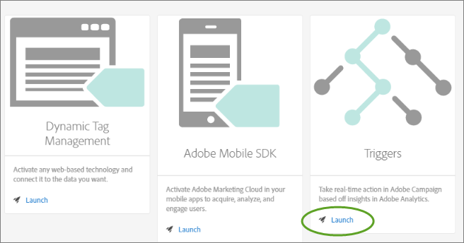
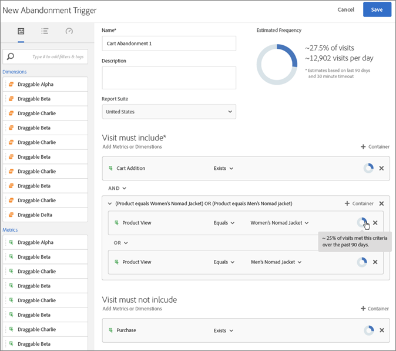
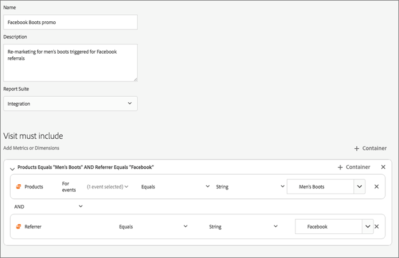

# Triggers

## Triggers {#topic_4F21FCE9A64E46E8B6D51F494FA652A7}

*`Triggers`* enables you to identify, define, and monitor key consumer behaviors, and then generate cross-solution communication to re-engage visitors. You can use triggers in real-time decisions and personalization. 

* Configure fast re-marketing for cart abandons or cart abandons with products removed
* Incomplete forms and applications
* Any actions or sequence of actions on site
 

**Types of Triggers** 

* **Abandonment:** You can create a trigger to fire when a visitor views a product but does not add anything to the cart. Configure [ Propensity Scoring](../activation/triggers.md#concept_A506150674AD45DB98D3CC07E560D334) to understand customers' tendency to not after abandoning a shopping cart.
* **Action:** You can create triggers, for example, to fire after newsletter sign-ups, email subscriptions, or applications for credit cards (confirmations). If you are a retailer, you can create a trigger for a visitor who signs up for a loyalty program. In media and entertainment, create triggers for visitors who watch a certain show, and perhaps you want to respond with a survey.
* **Session Start and Session End:** Create a trigger for session start and session end events.
>## Create a Experience Cloud trigger {#task_821F37183AC045E5AC8EED20317598FE}
>Create an abandonment trigger and configure the conditions for the trigger and propensity scoring. For example, you can specify the criteria for a trigger's rules during a visit, such as metrics like Cart Abandon, or dimensions like the product name. When the rules are met, the trigger runs.
<!-- t_create-trigger.xml -->

>[!NOTE]
>
>A technical limit of 100 triggers currently exists.

1. In the Experience Cloud, click  , then click **[!UICONTROL  Activation]**.
1. Locate the [!UICONTROL  Triggers] card, then click **[!UICONTROL  Launch]**.

        
1. Click **[!UICONTROL  New Trigger]**, then specify the type of trigger:

        
1. Configure the trigger by completing the following fields and dragging metrics and dimension items to the rule's containers:

    <table id="table_25DE808C07334AC4B9290A1B843C8258"> 
 <thead> 
  <tr> 
   <th colname="col1" class="entry"> Element </th> 
   <th colname="col2" class="entry"> Description </th> 
  </tr> 
 </thead>
 <tbody> 
  <tr> 
   <td colname="col1"> 
Name 
 </td> 
   <td colname="col2"> 
The friendly name for this trigger. 
 </td> 
  </tr> 
  <tr> 
   <td colname="col1"> 
Description 
 </td> 
   <td colname="col2"> 
The description of this trigger, how you will use it, and so on. 
 </td> 
  </tr> 
  <tr> 
   <td colname="col1"> 
Report Suite 
 </td> 
   <td colname="col2"> 
The Analytics <a href="https://marketing.adobe.com/resources/help/en_US/analytics/getting-started/report-suites.html" format="html" scope="external"> report suite</a> used for this trigger. This setting identifies the reporting data to use. 
 </td> 
  </tr> 
  <tr> 
   <td colname="col1"> 
Visit must include 
 
Visit must not include 
 
Trigger after no action 
 
Include meta data 
 </td> 
   <td colname="col2"> 
You can define criteria or visitor behaviors that you want to occur, and behaviors that you do not want to occur. 
 
For example, rules for a simple cart abandonment trigger might be: 
 
    <ul id="ul_2D72A5724530435B9075A69007D14736"> 
     <li id="li_15C835A5F12742F4860E7C9F642C250E">  Visit must include:  Cart Addition (metric) and  Exists. (You can further refine the rule with a specific product view or with dimensions like Browser Types.) </li> 
     <li id="li_B71E5F6101A74E239D84020749CAF829">  Visit must not include:  Checkout. </li> 
     <li id="li_32D94A8A00714D959ECC16B005C6ADC2">  Trigger after no action for:  10 minutes. </li> 
     <li id="li_B23DF9B529554ED19B40335294050558">  Include Meta Data: Lets you add a particular Campaign dimension or variables that are relevant to a visitor's behavior. This field can be useful for Adobe Campaign to build the correct re-marketing email. </li> 
    </ul> 
You can specify  Any,  And or  Or logic within or between containers, depending on the criteria you determine are important for the rule. 
 </td> 
  </tr> 
  <tr> 
   <td colname="col1"> Container </td> 
   <td colname="col2"> 
Containers are where you set and store rules, conditions, or filters that define a trigger. If you want events to occur at the same time, put them in the same container. Meaning, each container processes independently at the hit level. 
 
For example, if you have two containers joined by the  And operator, you can expect the rules to qualify when two hits meet the requirements. 
 </td> 
  </tr> 
  <tr> 
   <td colname="col1"> Start new session after </td> 
   <td colname="col2"> 
 Create a trigger for session start and session end events. 
 </td> 
  </tr> 
 </tbody> 
</table>

    
1. (Optional) In Abandonment triggers, you can apply [ Propensity Scoring](../activation/triggers.md#concept_A506150674AD45DB98D3CC07E560D334).

        
1. Click **[!UICONTROL  Save]**.
1. Use triggers for [ real-time remarketing](http://docs.campaign.adobe.com/doc/standard/en/EMA_Transactional_messaging_Marketing_Cloud_Triggers.html) in [!DNL  Adobe Campaign].
   Example triggers: 

   **Cart Abandonment Trigger** 

   For example, the following page shows rules you might use for a Cart Abandonment trigger, based on products viewed during a visit. 

    

   **Referrer Trigger** 

   The following trigger fires when a hit comes in with the product of Men's Boots and referrer of Facebook. For the two criteria ( *` products`* and *` referrer`*) to be evaluated in the same hit, they should be added to the same container. 

    

>## Propensity Scoring {#concept_A506150674AD45DB98D3CC07E560D334}
>Understand customers' tendency to return after abandoning a shopping cart.
<!-- propensity-scoring.xml -->
Propensity scoring is built into Experience Cloud Triggers and available for Abandonment triggers. 

 

For example, some customers abandon shopping carts to take advantage of email incentives to return to the cart. To reduce the loss of revenue, the Propensity Scoring algorithm helps identify the relevant cart abandoners who would likely not return without the incentive. 

You can: 

* Avoid over-exposing your customers to re-marketing.
* Identify the right cart-abandon customers and map their activity to the right message.
* Increase revenue by knowing which customers will and will not return.

## The Value of Propensity Scoring {#section_CA99874A25434CC0BF01D0DA61608889}

You can perform data discovery to identify hidden behaviors or patterns that exists across your data. Specifically, propensity scoring helps you identify clusters of similar customers using more focused and objective means rather than simple segmentation or filtering. In addition, propensity scoring lets you set up predictive capabilities to identify behavior for your company's high-value customer. 

Once you have identified the high-value audience, you can then engage them for the greatest effect. For example, if you are business-to-business company, you may have sales call leads that allow you to then score the leads and identify their likelihood to convert offline. Because every lead increases costs, creating an incentive to identify prospective customers with the highest likelihood of converting a sale is the most effective and the least expensive way to focus your resources. 

Propensity scoring provides the ability to identify those factors that are most predictive of a particular score or to increase the likelihood of an event taking place, but it can also be applied to answer specific questions: 

* Will the customer convert?
* Will the customer respond to an email?
* Will the customer repurchase?
Propensity scoring lets you answer these questions and identify visitors with an inclination for action that can then be set up and scored. 
