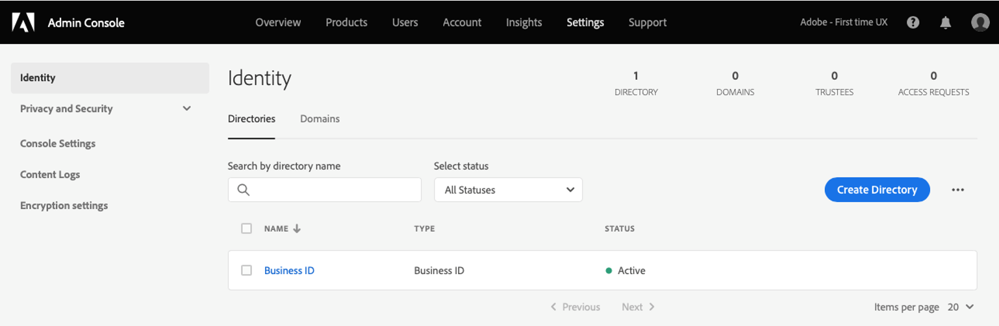
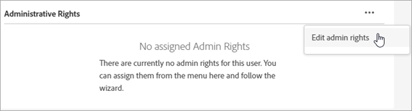
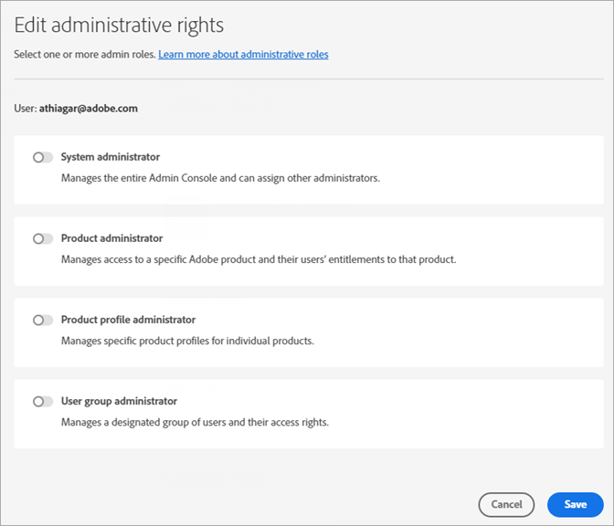

# Manage Experience Cloud users and products

Learn about signing in to the Admin Console, managing Experience Cloud user permissions and Product Profiles, and browser support.

>[!IMPORTANT]
>
>The following information is specifically for Experience Cloud applications. This information supplements the broader administrative information in the [Enterprise Administration User Guide](https://helpx.adobe.com/enterprise/admin-guide.html) for all Adobe cloud products.

You can view a sortable and filterable list of all Experience Cloud users and their details in the Admin Tool. See [View Experience Cloud users in the Admin Tool](admin-tool-experience-cloud.md).

## Experience Cloud user authentication (planned migration){#migration}

Beginning in February 2022, Adobe is updating its profile management system to allow organizations to better manage business entitlements to individual profiles. As such, all users with a Personal Profile, which corresponds to an individual Adobe ID (Type1), will be migrated to a new Business Profile. This profile corresponds to a _Business ID_ (Type2e).

See [Identity types on Adobe Admin Console](https://helpx.adobe.com/enterprise/using/identity.html) for information on identity types.

### Migration process

When it's time for your migration, organization administrators will receive a notification email 30 days prior to the migration. This email will include your migration date.

* Migration will be scheduled between 10 p.m. – 6 a.m., based on organization’s primary time zone or on the weekend.
* During the migration, Experience Cloud application may be inaccessible for up to 15 minutes and Admin Console may be inaccessible up to 30 minutes. Otherwise, this migration will be seamless.

### Changes after the migration

Admin Console

* Administrators with multiple accounts may see a profile selector when signing into [!UICONTROL Admin Console].
* Individual Adobe ID users will be updated to Business ID.
* The Business ID directory will be added in **[!UICONTROL Settings]** > **[!UICONTROL Identity]** > **[!UICONTROL Directories]**.

    

### Signing in after the migration

Your sign-in experience does not change with this update:

1. Sign-in at `experience.adobe.com` using the same credentials.

1. A new profile associated with the Business ID is created. You are prompted to **[!UICONTROL Join now]** or **[!UICONTROL Skip]**.

1. Taking one of the options leads to an existing landing page experience. 

1. An Adobe profile is associated with each business plan and provides the ability to organize assets created from additional Adobe Cloud offerings (Creative Cloud and Document Cloud).

For more information, see [Introducing Adobe Profiles](https://helpx.adobe.com/enterprise/kb/introducing-adobe-profiles.html).

## What is a Product Profile? {#section_AB50558124D541CF80A0D3D76D35A4BF}

_[!UICONTROL Product Profiles]_ are groups of products and services that you can assign to users. In Experience Cloud, permissions are based on a product's profile, not on the user. (However, you can delegate administrative rights to specific users.)

For example, in Analytics you can configure a collection of reporting tools, such as Analysis Workspace and Report Builder, along with report suites, metrics, and dimensions. You can grant permission to a Product Profile by adding users to the profile.

* See [Assign Analytics access permissions to a Product Profile](admin-getting-started.md#task_040673FE3E3E429B9531FBCB8B6A4391) on this page.
* See [Delegate administrative roles to users](#delegate-rights) on this page

## Manage Experience Cloud Product Profiles {#task_16335111C52D40E9BAC73D0699584DBF}

You can create a Product Profile and assign it to a permission group.

When you invite a user to an organization, you can give the user access to products and Product Profiles. You can also delegate limited administrative permissions to a user. Similarly, you can create user groups, then add the group to a Product Profile to enable access.

1. In the [Admin Console](https://adminconsole.adobe.com/enterprise/), select **[!UICONTROL Products]**.
1. Select your organization name.
1. Select **[!UICONTROL New Profile]**.
1. Configure the profile details, then select **[!UICONTROL Save]**.

For more information (and for help on Creative Cloud and Document Cloud product management), see [Identity](https://helpx.adobe.com/enterprise/admin-guide.html/enterprise/using/identity.ug.html) in the [Administration User Guide](https://helpx.adobe.com/enterprise/admin-guide.html/enterprise/using/users.ug.html).

**Related help**

* [Manage products and profiles](https://helpx.adobe.com/enterprise/admin-guide.html/enterprise/using/manage-products.ug.html) in the Administration User Guide.
* [Enterprise User Permissions](https://experienceleague.adobe.com/docs/target/using/administer/manage-users/enterprise/property-channel.html?lang=en) in Adobe Target help for more information.
* Video: [How to Configure Adobe Target Workspaces in Adobe Admin Console](https://helpx.adobe.com/target/kb/how-to-configure-target-workspaces-in-adobe-admin-console0.html)

## Delegate administrative roles to users {#delegate-rights}

In the Admin Console, you can delegate limited administrative rights to others in your organization. Delegated roles enable users to administer software access to end users, provide access deployment capabilities, and function as support delegates.

For example, you can:

* Allow your creative director to grant access to Creative Cloud.
* Allow your marketing director to grant access to the Experience Cloud.
* Keep these two roles separate so they cannot overstep each other's roles.

By using these roles, you can simultaneously delegate management to others without providing more capability than they need.

1. In the Admin Console, select **[!UICONTROL Users]**, then select the user's name.

    

1. Select **[!UICONTROL Edit admin rights]**.

    

1. Specify the user's admin rights.
1. Select **[!UICONTROL Save]**.

## Manage Analytics users and products {#section_97DE101F92CD494AB073893680992F1A}

You can assign Analytics report access permissions (report suites, metrics, dimensions, and so on) to a Product Profile.

For example, you can create a Product Profile that contains multiple Analytics tools ([!UICONTROL Analysis Workspace], [!UICONTROL Reports & Analytics], and [!UICONTROL Report Builder]). These profiles contain permission to specific metrics and dimensions (including eVars), and capabilities like segments or calculated metrics creation.

1. Sign in to the [Admin Console](https://adminconsole.adobe.com/enterprise), then select **[!UICONTROL Products]**.
1. On the [!UICONTROL Products] page, select your product, then select **[!UICONTROL Permissions]** (available only to administrators).
1. Configure the profile's permissions:

| Element | Description |
|--- |--- |
|Report Suites|Enable permissions to specific report suites.|
|Metrics|Enable permissions for traffic, conversion, custom events, application events, content aware, and so on.|
|Dimensions|Customize user access at a granular level, including eVars, traffic reports, application reports, and path reports.|
|Report Suite Tools|Enable user permissions for Web Services, Report Suite Management, Tools and Reports, and Dashboard Items.|
|Analytics Tools|Enable user permissions for General items (billing, logs, and so on), Company Management, Tools, Web Service Access, Report Builder, and Data Connectors integration. Company settings from the Customize Admin Console category have been moved to Analytics Tools.|

**User Account Migration**

An Analytics user ID migration tool is available to help Analytics administrators migrate user accounts from Analytics User Management to the [Adobe Admin Console](https://adminconsole.adobe.com/enterprise/).

The account migration is being rolled out to customers in phases. Adobe will notify and assist you when it is your time to migrate existing user accounts from **[!UICONTROL Admin Tools]** > **[!UICONTROL User Management]** to the Admin Console.

After the migration, users sign in using their Adobe ID (or Enterprise ID) and authenticate to their Experience Cloud applications and services at [experience.adobe.com](https://experience.adobe.com). If users attempt to sign in via legacy logins ([!DNL my.omniture.com], [!DNL sc.omniture.com] and [!DNL experiencecloud.adobe.com]) they are redirected to [!DNL experience.adobe.com].

**Related help**

For more information, see [Analytics User ID Migration](https://experienceleague.adobe.com/docs/analytics/admin/user-product-management/migrate-users/c-migration-tool.html?lang=en)

## Manage Adobe Target - Product Profiles vs. workspaces {#section_3860AF177C9E4C7E9C390D36A414F353}

In Adobe Target, a workspace is a Product Profile. It lets an organization assign a specific set of users to a specific set of properties. In many ways, a workspace is similar to a report suite in Adobe Analytics.

See:

* [Enterprise User Permissions](https://experienceleague.adobe.com/docs/target/using/administer/manage-users/enterprise/property-channel.html?lang=en)
* [Manage products and profiles](https://helpx.adobe.com/enterprise/admin-guide.html/enterprise/using/manage-products.ug.html)
* Video: [How to Configure Adobe Target Workspaces in Adobe Admin Console](https://helpx.adobe.com/target/kb/how-to-configure-target-workspaces-in-adobe-admin-console0.html)

## Manage Campaign Product Profiles, tenants, and security groups {#section_09CDF75366444CF5810CF321B7C712F3}

A *tenant* in Campaign displays as a *product* in the Admin Console Products page.

*Security group* displays as a Product Profile.

See [Managing groups and users](https://experienceleague.adobe.com/docs/campaign-standard/using/administrating/users-and-security/managing-groups-and-users.html?lang=en) for information about security groups and assigning users to security groups.

## Manage Experience Platform Data Collection (Launch) {#section_F2DA6778DD2D48AA8F794041971EE6B1}

Experience Platform [!UICONTROL Data Collection] ([!UICONTROL Launch]) displays on the [!UICONTROL Products] page in the [!UICONTROL Admin Console]. You can include other applications and services in a Launch Product Profile.

Invite users to [!UICONTROL Platform Launch] and assign user roles and rights.

See [User permissions](https://experienceleague.adobe.com/docs/experience-platform/tags/admin/user-permissions.html?lang=en) for information about user permissions in the Admin Console and about setting up Launch-specific options, including assigning rights to profiles.

## Experience Manager as a Cloud Service

Adobe Enterprise customers are represented as Organizations in the Adobe [!UICONTROL Admin Console]. Experience Manager customers can use the Adobe [!UICONTROL Admin Console] to manage product entitlements and IMS authentication to Experience Manager as a [!UICONTROL Cloud Service].

See [IMS Support for Experience Manager as a Cloud Service](https://experienceleague.adobe.com/docs/experience-manager-cloud-service/security/ims-support.html?lang=en).

## Audience Manager {#section_C31E3FA8A1E14463B1B3E07235F1983C}

Create Audience Manager users and assign them to groups. You can also view limits (traits, segments, destinations, and [!DNL AlgoModel]).

See [Administration](https://experienceleague.adobe.com/docs/audience-manager/user-guide/features/administration/administration-overview.html?lang=en) in Audience Manager help.

## Supported browsers in the Experience Cloud

* [!DNL Microsoft® Edge] (Microsoft® has [ended support](https://www.microsoft.com/en-us/WindowsForBusiness/End-of-IE-support) for Internet Explorer 8, 9, and 10. As such, Adobe does not fix issues reported against these specific versions of Internet Explorer.)
* [!DNL Google Chrome]
* [!DNL Firefox]
* [!DNL Safari]
* [!DNL Opera]

**Note:** Although the Experience Cloud interface supports these browsers, individual applications do not support every browser. (For example, [Analytics](https://experienceleague.adobe.com/docs/analytics/admin/sys-reqs.html?lang=en) does not support [!DNL Opera], and [Adobe Target](https://experienceleague.adobe.com/docs/target/using/implement-target/before-implement/supported-browsers.html?lang=en) does not support [!DNL Safari].)

### Solution and product requirements

* [Analytics](https://experienceleague.adobe.com/docs/analytics/admin/sys-reqs.html?lang=en)
* [Report Builder](https://experienceleague.adobe.com/docs/analytics/analyze/report-builder/report-builder-setup/system-requirements.html?lang=en)
* [Adobe Target](https://experienceleague.adobe.com/docs/target/using/implement-target/before-implement/supported-browsers.html?lang=en)
