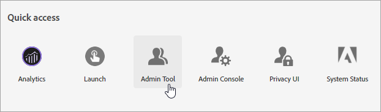
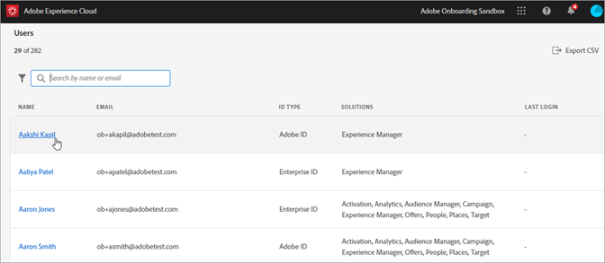
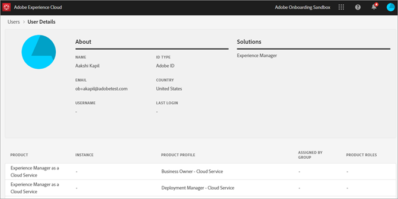

 
# Experience Cloud Admin Tool

The Experience Cloud Admin Tool enables administrators to view a sortable and filterable list of all Experience Cloud users. Each user detail page contains important details about a user’s product access, roles, and last accessed information.  

1. Log in to <https://experience.adobe.com/>.

   

1. From the Experience Cloud Home, click **[!UICONTROL Admin Tool.]** (Alternatively, in the home page URL you can replace _home_ with _admin._)

    The [!UICONTROL Users] page displays.

## Users page

This page displays complete list of users with access to Experience Cloud in your organization. It provides information about solution entitlement and last login. You can search, sort, and filter for custom views of the user list.

|Element | Description|
|---|---|
|[!UICONTROL Name] |The first and Last name of the user. You can sort this column from A to Z and Z to A.  Click a user's name to see more details about the user.|
|[!UICONTROL Email] |The email address associated with the user. Column can be sorted A->Z, Z->A.|
|[!UICONTROL ID Type] |The identity type for the user's account. Filter can be applied to view specific ID types. See [Manage identity types](https://helpx.adobe.com/enterprise/using/identity.html) for more information.|
|[!UICONTROL Solutions] |Summary of Experience Cloud solutions that the user can access. You can apply filters to narrow down list of users with specific solution access.|
|[!UICONTROL Last Login] |Time and Date of the most recent user login to the Experience Cloud. This column can be sorted by ascending or descending dates.   **Important:** As of January 13, 2020 a user’s last login data will be kept for 365 days. This information is intended to show current login activity in the Experience Cloud and not a recommendation to take action on inactive accounts prior to January 13th, 2020. |

## Customize the user list view

You can search, sort, or filter the columns to customize the user list.

* Search for users by Name or Email. Searches match the text string you type.
* Sort column by ascending or descending values. This applies to [!UICONTROL Name,] [!UICONTROL Email,] and [!UICONTROL Last Login] Columns.
* Click the **[!UICONTROL Filter By]** icon to apply multiple filters to list users with specific criteria. When multiple filter categories are applied, searches contain Email Domain `AND` ID TYPE `AND` Solution.

|Element | Description|
|---------|----------|
|[!UICONTROL Email Domain] filter | Search for character strings in the Email column to narrow results to one or multiple domains. Add multiple filters by pressing enter after each search term|
|[!UICONTROL ID Type] filter | Choose from available ID Types. Multiple ID types can be used as a filter.|
|[!UICONTROL Solution] filter | Choose from available solutions. Multiple solution filters search for results containing Solution 1 `OR` Solution 2.|

## View user details

On the [!UICONTROL Users] page, to view a user's details, click the user's email.

A detailed view of each user displays important details about the user’s solution access, admin and product roles, and last accessed information.

## About Section

This section displays a summary of the user account including:

* User Avatar and System Admin Badge (If applicable)
* Name
* Email
* Username (Federated ID accounts may have usernames differing from Email address)
* [ID Type](https://helpx.adobe.com/enterprise/using/identity.html)
* Country
* Last Login

## Solutions Summary

This section displays a summary of Experience Cloud solutions that the user can access. Includes the product admintrative role when applicable

## Detailed Product Access List

This section displays a complete list of all product profiles membership for the user.

|Element | Description|
|---------|----------|
|[!UICONTROL Product] | Name of the product associated with the product profile.|
|[!UICONTROL Instance] | Name of the instance (such as login company or tenant) associated with the product and product profile.|
|[!UICONTROL Product Profile] | Unique name of the product profile.|
|[!UICONTROL Assigned by Group] | Name of the User Group that associates the user to a product profile. Blank results indicate the user was assigned to the product profile directly, not through a group.|
|[!UICONTROL Product Roles] | Role assignment of the user within the product profile. Currently, this information applies only to Target product profiles.|
