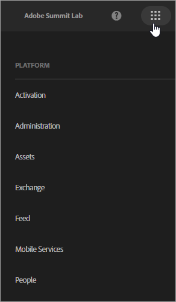
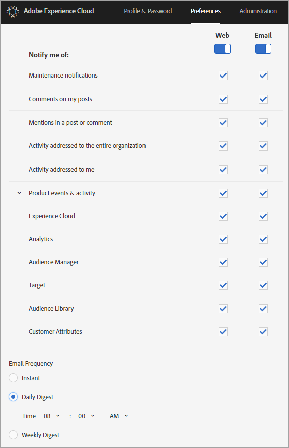

# Sign in and manage your Experience Cloud profile settings

Signing in to the Experience Cloud (rather than signing into a single solution) enables single sign-on to all the solutions and services that you own. This help describes how to sign in to the Experience Cloud, manage passwords and notifications, and specify a default landing page.

>[!IMPORTANT]
>
>Administrators, see [Administration](../admin-getting-started/admin-getting-started.md#topic_3FCB4099640647E3B2411ADBFCE81909) for information about updates to user and product management.

## Sign in to the Experience Cloud (administrators) {#task_034FC955031347F3B02B686A09801A08}

Sign in and verify that you are in the right [organization](../admin-getting-started/organizations.md#topic_C31CB834F109465A82ED57FF0563B3F1).

1. Click the Experience Cloud menu ( ), then click **[!UICONTROL Administration]**.

   If the **[!UICONTROL Administration]** link is not shown, you are not an Experience Cloud administrator for the displayed [organization](../admin-getting-started/organizations.md#topic_C31CB834F109465A82ED57FF0563B3F1). For assistance with becoming an administrator, contact Customer Care or an existing Experience Cloud administrator in your company.
1. Click **[!UICONTROL Administration]**.

1. Continue by clicking one of the following links:

| Element | Description |
|--- |--- |
|[Admin Console Basics](https://helpx.adobe.com/marketing-cloud/how-to/first-time-setup.html)|Learn about the initial steps you need to take to get started using Experience Cloud solutions.|
|[Set up Identity](https://helpx.adobe.com/enterprise/using/set-up-identity.html)|Define and set up an identity system against which your end users will be authenticated.|
|[User Management](https://helpx.adobe.com/enterprise/using/users.html)|Learn about signing in to the Admin Console and managing Experience Cloud user permissions and product profiles.|
|[Launch Admin Console](../admin-getting-started/admin-getting-started.md)|The Admin Console is the central location for managing your Adobe users and product entitlements across your entire organization. You can also sign in to the Admin Console using a [direct link](https://adminconsole.adobe.com).|
|[Manage Creative Cloud Users](../experience-cloud-assets/t-admin-add-cc-user.md)|Experience Cloud Assets allows marketers to share, sync and collaborate on folders with designers and other creative assets using the Creative Cloud. You can manage the Creative Cloud users approved to collaborate with your organization here.|
|[Map Your Report Suites](../core-services/core-services.md)|(Analytics only) Experience Cloud core services are associated with an organization instead of an individual report suite. To ensure that these services operate correctly, each Analytics report suite must be mapped to an organization. (This task is part of a broader workflow to [enable Analytics for core services](../core-services/core-services.md#concept_07ED1D5C64234E77976E6D572E78FB9C)).|
|[Organization ID](../admin-getting-started/organizations.md)|The *Organization ID* is found on the bottom of the Administration page. This ID is the associated ID with your provisioned Experience Cloud company. This ID is a 24-character alphanumeric string, followed by (and must include) @AdobeOrg.|

## Sign in to the Experience Cloud (users) {#task_1BFE87E20DCB44078CAC82F3CD44B985}

Help for non-administrative users signing in to the Experience Cloud.

1. Verify with your administrator that your [organization](../admin-getting-started/organizations.md) has been provisioned in the Experience Cloud.

1. Navigate to the [Adobe Experience Cloud](https://experiencecloud.adobe.com) ([!DNL experiencecloud.adobe.com]).
1. Click **[!UICONTROL Sign In With Adobe ID]**.

   Your Experience Cloud administrator can help you determine the type of account (Adobe ID or Enterprise ID). 

1. On your landing page, click the selector icon   to access the pull-down menu.

    

   The solutions and services that display in this menu depend on your application privileges defined by your [administrator](../admin-getting-started/admin-getting-started.md#topic_3FCB4099640647E3B2411ADBFCE81909). 

## Configure default personal account settings {#task_73CBCAE6C91749D19C95421E5AC311BA}

You can edit personal details and specify a default [organization](../admin-getting-started/admin-getting-started.md#concept_705C626560A54CA2A4215F1C870C42B2) and landing page to display after signing in to the Experience Cloud. 

1. Sign in to the Experience Cloud, then click your profile icon.

    
1. Click **[!UICONTROL Edit Profile]**.

    
1. Continue configuring and editing personal information, then click **[!UICONTROL Save Changes]**.

## Enable notifications {#concept_0105453AD71847B8BFCAF4A40915F157}

Get notified (via email or in-product) about system updates, maintenance notices, posts, mentions, and assets shared. You can also specify the products and solutions for which you want notifications, including the upload status for Customer Attributes.

To navigate to Notifications, click the **[!UICONTROL Notifications]** icon  , then click the **[!UICONTROL Settings]** icon  . 

You can sort the Notifications display based on the message types that are important to you, and search for notifications. You can also: 

* Sort by the message types that are important to you.
* Search for notifications.

**To enable notifications** 

 

<!-- 
 <b>Analytics</b> 
 
<ul id="ul_91BF597858124FA5BF338C36F6C5533F"> 
 <li id="li_FAD3E93CDE6242F58F14D55C8A6E23D7">Contribution analysis completed </li> 
 <li id="li_03D33D3228884CECA371B58656B2F3E7">Guided analysis shared </li> 
 <li id="li_DCF710F89317487B8DAA86CC05C694CA">Scheduled report failure </li> 
</ul> 

 <b>Adobe Target</b> 
 

Test started or stopped 
 

 <b>Media Optimizer</b> 
 

Performance alerts 
 

 <b>Dynamic Tag Manager</b> 
 
<ul id="ul_9ACDA418933E40918744D9C32A57DD4B"> 
 <li id="li_4DD0FFD3D9F84A428703611EF767D4D0">New web property created </li> 
 <li id="li_C6B923012E9D40BA91F4CBF7D2D72986">New user added </li> 
 <li id="li_EB0B9D1CFDE24E6987935CCCBFC7892A">Approvals - publishing and approval status for new rules, data elements, and tools </li> 
 <li id="li_17B0B176FF85435FB7EDD4317BC18201">Property has been published </li> 
</ul> -->

## Manage profiles and passwords {#task_7B89F4F38E5A4C4EB0FF842953856382}

You can edit your Experience Cloud profile, specify a default organization and landing page, and more. 

1. Sign in to Experience Cloud.

1. On Experience Cloud, click your profile picture.

    
1. Click **[!UICONTROL Edit Profile]**.

   On the Profile & Passwords page, complete the fields and options under Personal Details. 

## Recover your password {#task_46541A2806164CB1A4AE8239604E4EB1}

1. Navigate to your solution login page.
1. Click **[!UICONTROL Forgot Password]**.

   Resetting a solution password should resolve password linking issues for Experience Cloud. 

   For Adobe Analytics users, navigate to [https://sc2.omniture.com/password_recovery.html](https://sc2.omniture.com/password_recovery.html). 

## Configure solution sign-in using a direct link {#concept_8BE493A08786469B88B210E13F78FF2F}

Optionally, you can sign in to a specific page in a solution, using authentication provided by the Experience Cloud Interface.

### URL Template

`https://<tenantId>.experiencecloud.adobe.com/<solutionname>?destURL=<fullURL>`

Sample URL: 

`https://aem62tenant.experiencecloud.adobe.com/analytics?destURL=https%3A%2F%2Fsc.omniture.com%2Freports%2F11562.html`

>[!NOTE]
>
>You must encode any URL before passing it to the `destURL` parameter. (Encoder sites like [URL Decoder / Encoder](https://meyerweb.com/eric/tools/dencoder/) are available.) 

| Parameter | Description | Example | Required / Optional |
|--- |--- |--- |--- |
|tenantId|Name of the tenant the user should log into.|aem62tenant|Optional|
|destURL|The complete URL to the place where the user should be taken to.|https://sc.omniture.com/x/1_7xxzf|Optional|
|solutionname|Name of the MAC Solution that is the owner of destURL parameter. It is used to verify that the user has access to the solution which is the owner of the URL.  It is the responsibility of the solutions to make sure that the solutionname is in Sync with the destURL parameter.  For example : If the URL contains solutionname as social and the destURL provided is an analytics url, then the user would be redirected to the url even if he doesn't have access to analytics. MAC does NOT verify weather the owner of the destURL is in sync with the solution name.|analytics|Required if destURL param is used.|
