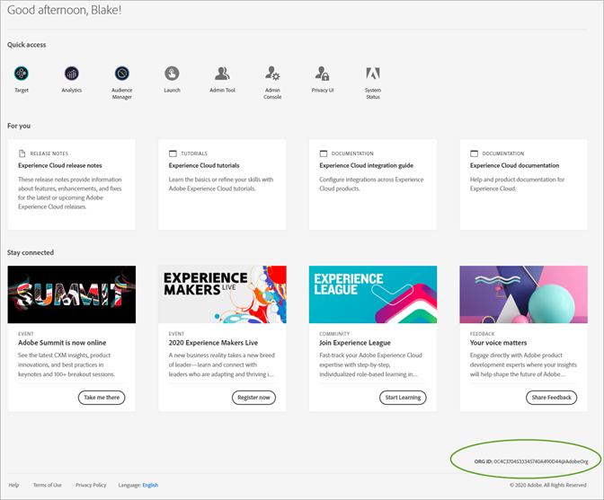
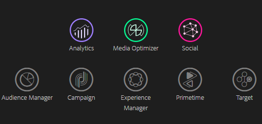

# Organizations and account linking

Learn about managing organizations and linking solution accounts to Experience Cloud.

## Identify your organization {#concept_384D169B0B724B799D573B8ECB5C39BF}

An *organization* is the entity that enables an administrator to configure groups and users, and to control single sign-on in the Experience Cloud. The organization functions like a log-in company that spans all the Experience Cloud products and solutions. Most often, an organization is your company name. However, a company can have many organizations. 

Also, you might need to locate your organization ID for support purposes. You can verify that you are in the correct organization, or switch between organizations, using the **[!UICONTROL Organization]** menu. 

 

## Find your Organization ID {#concept_EA8AEE5B02CF46ACBDAD6A8508646255}

The **organization ID** is the ID associated with your provisioned Experience Cloud company. This ID is a 24-character alphanumeric string, followed by (and must include) @AdobeOrg.

To view your Organization ID, navigate to the Experience Cloud landing page, or click ( ), then click **[!UICONTROL Administration]**. You can find the organization ID on the bottom of the [!UICONTROL Getting Started with the Experience Cloud] page, or the [!UICONTROL Administration] page.

 

## Link a solution account to an Adobe ID {#task_FD389E78640848919E247AC5E95B8369}

Typically, Experience Cloud administrators grant access to solutions and services. In rare circumstances, you may need to link solution credentials to an Adobe ID.

1. Follow the steps in your email invitation to the Experience Cloud.
1. Log in using your Adobe ID or Enterprise ID.
1. Click the solution selector. ( ).

   

   The solutions to which you have access are colored.
1. Click the desired solution.

   

   This type of message displays if you are part of the appropriate group (and have permission to the solution) but have not yet linked your account credentials to your Adobe ID.
1. Click **[!UICONTROL Link Account]**, then provide your credentials.

## Specify a default organization and landing page {#concept_6A191B42A9874A9780882903BA18F071}

You can specify a default organization and landing page to use when you log in.

In your profile, click **[!UICONTROL Edit Profile]**.

Under Default Organization & Landing Page, you can customize your log-in experience.

## Troubleshoot account linking issues {#concept_DFCB29A3B4834FC59AA29E0BBA301584}

Help on problems that arise from account linking.

Typically, account linking fails because the Adobe ID is linked to a previous user. When account linking fails, you can:

* [Contact Adobe Support](https://helpx.adobe.com/marketing-cloud/contact-support.html).
* Access your solution using the standard login while the issue is being solved.
