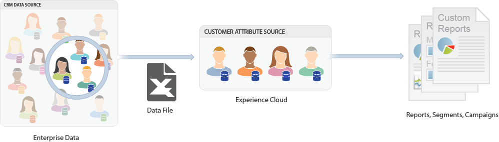

# Customer attributes

## Overview 

The [!UICONTROL customer attributes] feature in the Experience Cloud is found here.

  **[!UICONTROL People]** > **[!UICONTROL Customer Attributes]** 

If you capture enterprise customer data in a customer relationship management (CRM) database, you can upload the data into a customer attribute data source in the Experience Cloud. Once uploaded, leverage the data in [!DNL Adobe Analytics] and [!DNL Adobe Target]. 

 

## Prerequisites for uploading Customer Attributes {#section_BD38693AFBF34926BA28E964963B4EA0}

* **Solution enablement:** [Enable your solutions for core services](../core-services/core-services.md#concept_07ED1D5C64234E77976E6D572E78FB9C). 

* **Group membership:** To upload customer attribute data, users must be members of the [Customer Attributes group](../admin-getting-started/admin-getting-started.md#task_3295A85536BF48899A1AB40D207E77E9). You must also belong to either an Adobe Analytics group or an Adobe Target group. 

  To know whether your company has access to customer attributes, your [!DNL Experience Cloud] administrator should log into the [!DNL Experience Cloud]. Navigate to **[!UICONTROL Administration]** > **[!UICONTROL Launch Admin Console]** > **[!UICONTROL Groups]**. If *Customer Attributes* displays as one of the groups, you are ready to begin. 

  Users that are added to the Customer Attributes group will see the [!UICONTROL Customer Attributes] menu item on the left side of the Experience Cloud interface. 

* **Target mbox:** mbox.js version 58 or higher is required for customer attributes. 

  See [Mbox.js Implementation](https://marketing.adobe.com/resources/help/en_US/target/ov/t_mbox_download.html). 

* **at.js:** Any version.

## What Is enterprise customer data? {#section_6F34C29F11414842AA57D2B1248FA3C6}

Enterprise data resides in other systems. It can be complex and mean different things to different people. This data can include information such as memberships, loyalty level, age, gender, products owned, interests, and Lifetime Value. 

The following image is an example of a data file showing subscriber data for products, including member IDs, entitled products, most-launched products, and so on. 

 

After you create the data file, you can upload it to the customer attribute source that you create in **[!UICONTROL Experience Cloud]** > **[!UICONTROL Customer Attributes]**. 

See [Upload Customer Attribute Data](../attributes/t-crs-usecase.md#task_BCC327B2A0EF4A1BBB2934013AB92B78) to learn this workflow. 

## Solution use cases {#section_4E77650F6CEE4C4ABCD0B3221A5AE5D9}

After the data resides in the Experience Cloud, you can customize it and share it to solutions for reporting, segmentation, activities, and campaigns. 

For example: 

| Solution | Advantages and Use Cases |
|--- |--- |
|Adobe Analytics|Marketers and analysts can understand:<ul><li>The online campaigns that are most effective with your gold-level customers.</li><li>The products that gold-level customers search for versus products that platinum-level customers search for.</li><li>Whether your site redesign is having a positive impact on conversion rates for older customers.</li><li>Which products do customers with a low lifetime value tend to research on my site.</li></ul>|
|Adobe Target|Attribute data enables Target users to:<ul><li>Show loyalty club members special discounts and offers.</li><li>Recommend more expensive products to your luxury customers.</li><li>For customers who already receive emails, show an upsell offer in the space normally reserved for email signups</li></ul>|
