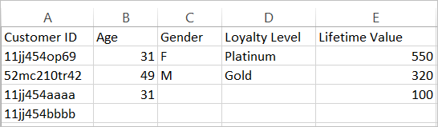

# About data file and data sources for customer attributes

Data file requirements and multiple data sources for uploading customer attributes to the Experience Cloud.

You will need access to CRM or similar data from your enterprise. The data you upload to the Experience Cloud must be a [!DNL .csv] file. If you upload via FTP or sFTP, you also upload a [!DNL .fin] file. 

<!-- <p>Articulate difference between this and SAINT. </p> -->

## Allowed file types and naming requirements {#section_6F64FA02ACCC4215B0862CB6A1821FBF}


<table id="table_C27955F6B52A45B28BEEAAF14FFC86D8"> 
 <thead> 
  <tr> 
   <th colname="col1" class="entry"> File Type </th> 
   <th colname="col2" class="entry"> Description </th> 
  </tr> 
 </thead>
 <tbody> 
  <tr> 
   <td colname="col1"> <p> <span class="filepath"> .csv </span> </p> </td> 
   <td colname="col2"> <p>A comma-separated values file (such as one created in Excel). This is the file that contains the customer attribute data. </p> <p> <b>Naming requirements:</b> Ensure that file name extensions do not contain white spaces. </p> </td> 
  </tr> 
  <tr> 
   <td colname="col1"> <p> <span class="filepath"> .fin </span> </p> </td> 
   <td colname="col2"> <p>(Required) The <span class="filepath"> .fin </span> file tells the system that you are finished uploading data. The name of the <span class="filepath"> .fin </span> file must match the name of the <span class="filepath"> .csv </span> file. </p> <p>Adobe recommends creating an empty text file with a <span class="filepath"> .fin </span> extension. An empty file saves space and upload time. </p> <p> <p>Note:  Renaming a <span class="filepath"> .fin </span> file is not allowed after it is uploaded. The <span class="filepath"> .fin </span> file must be uploaded separately and cannot be a renamed, previously uploaded file. </p> </p> <p>After you upload the <span class="filepath"> .fin </span> file in the customer attributes FTP, the system retrieves data quickly (within one minute). This differs from other Adobe FTP-based systems, which pick up data less frequently (around once per hour). </p> <p>The <span class="filepath"> .fin </span> file is not required when using the drag-and-drop upload method. </p> </td> 
  </tr> 
  <tr> 
   <td colname="col1"> <p> <span class="filepath"> .gz </span> or <span class="filepath"> .zip </span> </p> </td> 
   <td colname="col2"> <p> <span class="filepath"> .gz </span> (gzip) or <span class="filepath"> .zip </span> - for compressed files. A <span class="filepath"> .zip </span> file cannot contain more than one file in the archive. </p> <p> <b>Naming requirements:</b> The name of the <span class="filepath"> .zip </span> or <span class="filepath"> .gz </span> should match the name of the <span class="filepath"> .csv </span>. For example, if your <span class="filepath"> .csv </span> file is <span class="filepath"> crm_small.csv </span>, the <span class="filepath"> .zip </span> file should be <span class="filepath"> crm_small.csv.zip </span>. </p> <p>The .fin file must match the .csv. </p> </td> 
  </tr> 
 </tbody> 
</table>


## Requirements for the attribute data files {#section_169FBF5B7BBA47CE825B7A330CF3FE98}


**Example CSV** 

The CSV file must adhere to the following format: 

Sample CSV: 

 

The same file viewed in a text editor: 

 

**Guidelines** 

<table id="table_A9849CC9AA784763921DE057F0F61515"> 
 <thead> 
  <tr> 
   <th colname="col1" class="entry"> Item </th> 
   <th colname="col2" class="entry"> Description </th> 
  </tr> 
 </thead>
 <tbody> 
  <tr> 
   <td colname="col1"> <p>Drag-and-drop </p> </td> 
   <td colname="col2"> <p>The drag-and-drop file should be less than 100 megabytes. </p> <p>The <span class="filepath"> .fin </span> file is not required when using the drag-and-drop upload method. </p> </td> 
  </tr> 
  <tr> 
   <td colname="col1"> <p>Customer ID column </p> </td> 
   <td colname="col2"> <p> The first column must be a unique customer ID. The ID used should correspond to the ID that is being passed to the Experience Cloud ID Service. </p> <p>For Analytics, the ID being stored in a prop or eVar. </p> <p>For Target, the setCustomerID value. (See <a href="../core_services/core_services.md#section_AD473A6A21C1446498E700363F9A8437" format="dita" scope="local"> Analytics &amp; Target - synching the customer ID </a>) </p> <p> This customer ID is the unique identifier your CRM uses for each person in your database. The remaining columns are attributes that come from your CRM. You will choose how many attributes to upload. </p> <p>Friendly, readable names are recommended for the column headings, but not required. When you validate the schema after upload, you can map friendly names to the uploaded rows and columns. </p> <p> <b>About Customer IDs</b> </p> <p>Typically, an enterprise uses a customer ID from a CRM system. This ID is set using the <span class="codeph"> setCustomerIDs </span> call when a person logs in. This ID is also used as the key in the CRM file that is uploaded to the Experience Cloud. An <a href="../attributes/t_crs_usecase.md#task_09DAC0F2B76141E491721C1E679AABC8" format="dita" scope="local"> Alias ID </a> is a friendly name for a data store in Audience Manager, where the alias data is stored. The system sends aliases to this data store (via setCustomerIDs). The CRM file is applied to the data in that data store. </p> <p>For <span class="codeph"> setCustomerIDs </span> information, see <a href="https://marketing.adobe.com/resources/help/en_US/mcvid/?f=mcvid_customer_ids" format="https" scope="external"> Customer IDs and Authentication States </a>. </p> </td> 
  </tr> 
  <tr> 
   <td colname="col1"> <p>Subsequent headers and columns </p> </td> 
   <td colname="col2"> <p>Subsequent headers should represent the name of each attribute. </p> <p> These columns should contain customer attributes that come from the CRM. </p> </td> 
  </tr> 
  <tr> 
   <td colname="col1"> <p>Attribute limits </p> </td> 
   <td colname="col2"> <p>You can upload hundreds of <span class="filepath"> .csv </span> columns to the customer attribute service in the Experience Cloud. However, when configuring subscriptions and selecting attributes, the following limits apply depending on the solutions you own: </p> <p> 
     <ul id="ul_2BB85067918D4BB3B59394F3E3E37A6D"> 
      <li id="li_93703988B9934384B4B94A839D028380"> <b>Analytics Standard</b>: 3 total </li> 
      <li id="li_D1E5E7BD24C54591B14D15DE97447835"> <b>Analytics Premium</b>: 200 per report suite </li> 
      <li id="li_8C891FE3D1EF49FA9F81E2E32CD0B9CA"> <b>Target Standard:</b> 5 </li> 
      <li id="li_2B66D43023F34EA685CE2C38A9250CEA"> <b>Target Premium:</b> 200 </li> 
     </ul> </p> </td> 
  </tr> 
  <tr> 
   <td colname="col1"> <p>Row limits </p> </td> 
   <td colname="col2"> <p>There is no known limit to the number of rows. </p> </td> 
  </tr> 
  <tr> 
   <td colname="col1"> <p>Column limits </p> </td> 
   <td colname="col2"> <p>For practicality, limit the number of columns to around 200. </p> </td> 
  </tr> 
  <tr> 
   <td colname="col1"> <p>Character limits </p> </td> 
   <td colname="col2"> <p>When creating an Analytics subscription, field lengths for the uploaded files are truncated to 255. </p> </td> 
  </tr> 
  <tr> 
   <td colname="col1"> <p>FTP Guidelines and size limitations </p> </td> 
   <td colname="col2"> <p> 
     <ul id="ul_E157EE6F98914EADA0C103D1D1E705D3"> 
      <li id="li_84FBD455DD164A28AC16F4A5AB19E4B3">File size limit for FTP is 4 GB for each upload. </li> 
      <li id="li_B69A20C51D824727AA99C1F6F78537A4"> You should drop your <span class="filepath"> .csv </span> (and <span class="filepath"> .fin </span>) file in the root folder of the FTP site. </li> 
     </ul> </p> <p> <p>Important:  The total allowed space for the FTP account is 40 GB. It is your responsibility to delete processed files. </p> </p> </td> 
  </tr> 
  <tr> 
   <td colname="col1"> <p>File requirements </p> </td> 
   <td colname="col2"> <p> Each attribute source should contain the same number of comma-separated fields. </p> <p> Fields containing a line-break, double-quote, or commas must be quoted. </p> <p> Double-quote characters in a field must be escaped using a backslash (\). </p> <p> Blank columns are stored as <span class="term"> null </span>. </p> </td> 
  </tr> 
  <tr> 
   <td colname="col1"> <p>Multiple files </p> </td> 
   <td colname="col2"> <p>When uploading customer attribute data, if you have several files you want to upload in rapid succession, and especially if the files are large, make certain that the previous file has been processed before uploading the next file. You can monitor this by checking when the previous file has been moved to the processed or failed folder within your customer attributes FTP account. </p> <p> Breaking a large file into smaller files and submitting them in rapid succession may actually slow down processing unless you can ensure each file is completely processed before submitting the next. </p> </td> 
  </tr> 
  <tr> 
   <td colname="col1"> <p>Character Encoding </p> </td> 
   <td colname="col2"> <p>For Japan, UTF-8 is mandatory. </p> </td> 
  </tr> 
  <tr> 
   <td colname="col1"> <p>Character length </p> </td> 
   <td colname="col2"> </td> 
  </tr> 
  <tr> 
   <td colname="col1"> <p>Historical data </p> </td> 
   <td colname="col2"> <p> Customer attributes are tied to the underlying visitor profile in Analytics. As such, customer attributes are associated with the visitor for the entire life of that visitor profile in Analytics. This includes behavior that occurred before the customer logged in for the first time. </p> <p> If you use the data warehouse backfill method, the data is tied to a post_visid_high/low that is based on the Analytics ID (AID). If you are using the Experience Cloud ID service, the data is tied to a post_visid_high/low that is based on Experience Cloud ID (MID). </p> </td> 
  </tr> 
  <tr> 
   <td colname="col1"> <p>Data feeds </p> </td> 
   <td colname="col2"> <p>Customer attributes are not available in data feeds. </p> </td> 
  </tr> 
 </tbody> 
</table>


## Leveraging multiple data sources {#section_76DEB6001C614F4DB8BCC3E5D05088CB}

When creating, modifying, or deleting customer attribute sources, there is a delay around one hour before IDs begin synchronizing with the new data source. 

The Alias ID for each customer attribute source must be unique. If you have multiple data sources that leverage the same ID, they should be set up as follows: 

**In VisitorAPI.js or the Experience Cloud ID tool in dynamic tag management:** 

Set two customer IDs that will correspond to the appropriate data sources: 

```
Visitor.setCustomerIDs({ 
     "ds_id1”:"123456", 
     "ds_id2":"123456" 
});
```

(See [Customer IDs and Authentication States](https://marketing.adobe.com/resources/help/en_US/mcvid/?f=mcvid_customer_ids) for more information.) 

In the **[!UICONTROL Experience Cloud]** > **[!UICONTROL People]** > **[!UICONTROL Customer Attributes]**: 

Create two customer attributes sources using unique alias IDs corresponding to the customer IDs above. Using this method allows the same reference ID to be sent to multiple customer attribute sources 
