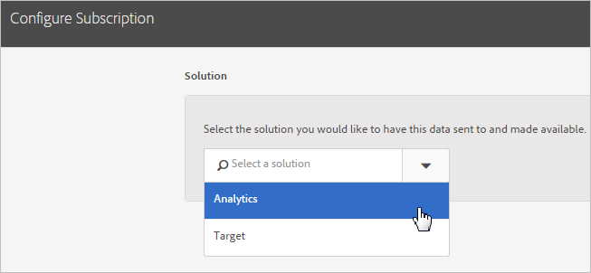

# Configure subscriptions

Learn about solution data sources and configuring subscriptions. Subscriptions enable the customer attribute data flow between the Experience Cloud and solutions (Analytics and Target).

For example, an Adobe Analytics subscription enables attribute data in reports. If you use Adobe Target, you can upload customer attributes for targeting and segmentation. 

` **[!UICONTROL Customer Attribute Source]** > **[!UICONTROL Create New Customer Attribute Source]** > **[!UICONTROL New]**` 

 

<table id="table_B034068AC49840D4A519AF5CD21EF47C"> 
 <thead> 
  <tr> 
   <th colname="col1" class="entry"> Element </th> 
   <th colname="col2" class="entry"> Description </th> 
  </tr> 
 </thead>
 <tbody> 
  <tr> 
   <td colname="col1"> 
Solution 
 </td> 
   <td colname="col2"> 
 <b>Adobe Analytics</b> 
 
Select  Analytics, specify the report suites to that you want to receive attribute data, and the attributes to include. 
 
 <b>Adobe Target</b> 
 
You can upload customer attributes for targeting and segmentation. This feature is useful if want to target a test based on attribute data, or make the data available for segmentation in Analytics. 
 
Uploaded customer attribute data for a visitor is available at login, in  Target &gt;  Audiences. 
 
Multiple data sources are supported. When you <a href="../core_services/core_services.md#section_AD473A6A21C1446498E700363F9A8437" format="dita" scope="local"> set customer IDs</a> on your website, verify that at least one of the aliases is subscribed to Target. 
 </td> 
  </tr> 
  <tr> 
   <td colname="col1"> 
Report Suite (Analytics) 
 </td> 
   <td colname="col2"> 
The report suites from Analytics. 
 
 You cannot add more than a total of 10 report suites to the Analytics subscriptions within a single attribute source. When choosing which report suites to include, consider the following suggestions: 
 
 
     <ul id="ul_25033FAF5A0E465592F3AA699157F99D"> 
      <li id="li_003F485C0A1840558946A8CE05DC36B3">Choose report suites that have a common set of authenticated customers. If the authenticated customers in one report suite do not overlap with the authenticated customers in another report suite, separate these report suites into different attribute sources. </li> 
      <li id="li_4230462B586D48E18E2BD6DDB74AAB5C"> If possible, the report suites included in an attribute source should have similar traffic volume. </li> 
     </ul> 
 
 If you have more than 10 report suites that have a common set of authenticated customers, you can configure additional customer attribute sources, each with up to 10 report suites. 
 </td> 
  </tr> 
  <tr> 
   <td colname="col1"> 
Attributes to Include (Analytics and Target) 
 </td> 
   <td colname="col2"> 
The attributes you want to send to the solution. 
 
When configuring subscriptions and selecting attributes, the following limits apply, depending on the solutions you own: 
 
 
     <ul id="ul_2BB85067918D4BB3B59394F3E3E37A6D"> 
      <li id="li_93703988B9934384B4B94A839D028380"> <b> Foundation</b>: 0 </li> 
      <li id="li_362E575342E741EB9E3AB04BC8788778"> <b>Select</b>: 3 </li> 
      <li id="li_0AE8AA0173E348278B9AD3A569AF4513"> <b>Prime</b>: 15 </li> 
      <li id="li_0B62621C76EB43B9903BAE5BA6903444"> <b>Ultimate</b>: 200 </li> 
      <li id="li_6A599F6D7DB44D978C42E7564985DC30"> <b>Standard</b>: 3 total </li> 
      <li id="li_D1E5E7BD24C54591B14D15DE97447835"> <b>Premium</b>: 200 per report suite </li> 
      <li id="li_8C891FE3D1EF49FA9F81E2E32CD0B9CA"> <b>Target Standard:</b> 5 </li> 
      <li id="li_2B66D43023F34EA685CE2C38A9250CEA"> <b>Target Premium:</b> 200 </li> 
     </ul> 
 
Note: When you upgrade to Analytics Premium, there is a 24-hour delay before additional attributes are available. You may see an <b>Attribute Subscription Max</b> error issued during this delay. 
 </td> 
  </tr> 
 </tbody> 
</table>

