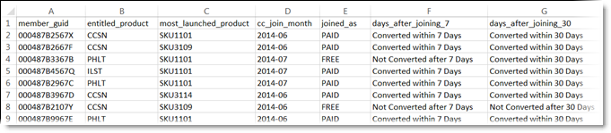
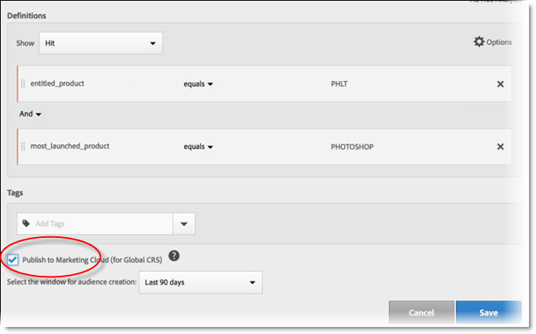
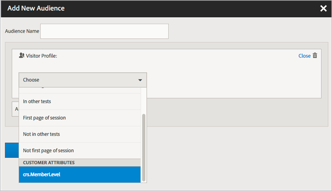

# Create a customer attribute source and upload the data file

Create the customer attribute source and upload the data. You can activate the data source when you are ready. After the data source is active, share the attribute data to Analytics and Target. 

## Customer attributes workflow {#concept_BF0AF88E9EF841219ED4D10754CD7154}

 

1. [Create a data file](../attributes/t-crs-usecase.md#task_B5FB8C0649374C7A94C45DCF2878EA1A)
1. [Create the attribute source and upload the data file](../attributes/t-crs-usecase.md#task_09DAC0F2B76141E491721C1E679AABC8)
1. [Validate the schema](../attributes/t-crs-usecase.md#task_09DAC0F2B76141E491721C1E679AABC8)
1. [Configure subscriptions and activate the attribute source](../attributes/t-crs-usecase.md#task_1ACA21198F0E46A897A320C244DFF6EA)


After the data source is active, you can: 

* [Use customer attributes in Adobe Analytics](../attributes/t-crs-usecase.md#task_7EB0680540CE4B65911B2C779210915D)
* [Use customer attributes in Adobe Target](../attributes/t-crs-usecase.md#task_FC5F9D9059114027B62DB9B1C7D9E257)


>[!IMPORTANT]
>
>To access this feature, users must be assigned to the Customer Attributes product profile (Customer Attributes - Default Access. ( **[!UICONTROL Administration]** > **[!UICONTROL Admin Console]** > **[!UICONTROL Users]** > ). Users that are added to the Customer Attributes group will see the [!UICONTROL Customer Attributes] menu item in [!UICONTROL Audiences], on the left side of the Experience Cloud interface. 
>
>Solution group membership is also required. 

To use the Customer Attributes feature, users must belong to the Adobe Customer Attributes group in user management, and to solution-level groups (Analytics or Target). 

See [Users and Groups](../admin-getting-started/admin-getting-started.md#task_3295A85536BF48899A1AB40D207E77E9). 

## Create a data file {#task_B5FB8C0649374C7A94C45DCF2878EA1A}

This data is enterprise customer data from your CRM. The data might include subscriber data for products, including member IDs, entitled products, most-launched products, and so on.


1. Create a [!DNL .csv].


   >[!NOTE]
   >
   >Later in this process, you will drag-and-drop the [!DNL .csv] to upload the file. However, if you [upload via FTP](../attributes/t-upload-attributes-ftp.md#task_591C3B6733424718A62453D2F8ADF73B), you also need a [!DNL .fin] file with the same name as the [!DNL .csv]. 


   Sample enterprise customer data file: 

    

1. Before continuing, review the important information in [Data File Requirements](../attributes/crs-data-file.md#concept_DE908F362DF24172BFEF48E1797DAF19), before you upload the file.
1. [Create a customer attribute source and upload the data](../attributes/t-crs-usecase.md#task_BCC327B2A0EF4A1BBB2934013AB92B78), described below.

## Create the attribute source and upload the data file {#task_09DAC0F2B76141E491721C1E679AABC8}

Perform these steps on the Create New Customer Attribute Source page in the Experience Cloud.


>[!NOTE]
>
>When creating, modifying, or deleting customer attribute sources, there is a delay of up to one hour before IDs begin synchronizing with the new data source.


1. In the [!DNL Experience Cloud], click the Menu   icon.
1. Click **[!UICONTROL People]**, then click **[!UICONTROL Customer Attributes]**.

   The [!UICONTROL Customer Attributes] page is where you can manage and edit existing attribute data sources. 

    
1. Click **[!UICONTROL New]**.

    
1. On the [!UICONTROL Edit Customer Attribute Source] page, configure the following fields:

    
    * **[!UICONTROL Name:]** A friendly name for the data attribute source. For [!DNL Adobe Target], attribute names cannot include spaces. If an attribute with a space is passed, [!DNL Target] ignores it. Other characters not supported include: `< , >, ', "`. 
    
    * **[!UICONTROL Description:]** (Optional) A description of the data attribute source. 
    
    * **[!UICONTROL Alias ID:]** Represents a source of customer attribute data, such as a specific CRM system. A unique ID that is used in your Customer Attribute Source code. The ID should be unique, lowercase, with no spaces. The value that is entered in the Alias ID field for a customer attribute source in the Experience Cloud UI should match the values that are being passed in from the implementation (whether via dynamic tag management or JavaScript of the Mobile SDK.) 
    
      The Alias ID corresponds to certain areas where you set additional Customer ID values. For example: 
    
        * **Dynamic tag management:** The Alias ID corresponds to the *Integration Code* value under [!UICONTROL Customer Settings], in the [Experience Cloud ID Service](https://marketing.adobe.com/resources/help/en_US/dtm/?f=macid) tool. 
        
        * **Visitor API:** The Alias ID corresponds to the additional [Customer IDs](https://marketing.adobe.com/resources/help/en_US/mcvid/?f=mcvid_customer_ids) that you can associate with each visitor. 
        
          For example, *"crm_id"* in: 
        
        
          ```
          "crm_id":"67312378756723456"
          ```

        
        * **iOS:** The Alias ID corresponds to *"idType"* in [visitorSyncIdentifiers:identifiers](https://marketing.adobe.com/resources/help/en_US/mobile/ios/?f=methods). 
        
          For example: 
               
          `[ADBMobile visitorSyncIdentifiers:@{@<`**`"idType"`**`:@"idValue"}];` 
 
        
        * **Android:** The Alias ID corresponds to *"idType"* in [syncIdentifiers](https://marketing.adobe.com/resources/help/en_US/mobile/android/?f=methods). 
        
          For example: 
        
          `identifiers.put(`**`"idType"`**`, "idValue");`
        
          See [Leveraging multiple data sources](../attributes/crs-data-file.md#section_76DEB6001C614F4DB8BCC3E5D05088CB) for additional information about data processing regarding the Alias ID field and Customer IDs. 
        
        
        
    
    * **[!UICONTROL File Upload:]** You can drag-and-drop the [!DNL .csv] data file, or upload the data via FTP. (Using FTP also requires a [!DNL .fin] file.) See [Upload the Data via FTP](../attributes/t-upload-attributes-ftp.md#task_591C3B6733424718A62453D2F8ADF73B). 
    

      >[!IMPORTANT]
      >
      >Specific data file requirements exist. See [Data File Requirements](../attributes/crs-data-file.md#concept_DE908F362DF24172BFEF48E1797DAF19) for more information. 

    
      After uploading the file, table data is displayed under the [!UICONTROL File Upload] heading on this page. You can validate the schema, configure subscriptions, or set up the FTP. 
    
    
    
       **File upload graphic** 
    
        
    
    * **[!UICONTROL Unique Customer ID:]** Displays how many unique IDs you have uploaded to this attribute source. 
    
    * **[!UICONTROL Customer-Provided IDs Aliased to Experience Cloud Visitor IDs:]** Displays how many IDs have been aliased to Experience Cloud Visitor IDs. 
    
    * **[!UICONTROL Customer-Provided IDs with High Alias Counts:]** Displays the count of customer-provided IDs with 500 or more aliased Experience Cloud Visitor IDs. These customer-provided IDs most likely do not represent individuals but rather some sort of shared login. The system distributes the attributes associated with these IDs to the 500 most recent aliased Experience Cloud Visitor IDs, until the alias count reaches 10,000. At that time, the system invalidates the customer-provided ID and no longer distributes associated attributes. 
    
    
    
    

## Validate the schema {#task_404AAC411B0D4E129AB3AC8B7BE85859}

The validation process lets you map display names and descriptions to uploaded attributes (strings, integers, numbers, and so on). You can also delete attributes by updating the schema.

See [Validate the schema](../attributes/validate-schema.md#concept_B3A01A15D04E4F998118E09B3A9B5043). 

To delete attributes, see [(Optional) Update the schema (deletes attributes)](../attributes/t-crs-usecase.md#task_6568898BB7C44A42ABFB86532B89063C). 

## (Optional) Update the schema (delete attributes) {#task_6568898BB7C44A42ABFB86532B89063C}

How to delete attributes and replace attributes in the schema.


1. On the [!UICONTROL Edit Customer Attribute Source] page, remove the **[!UICONTROL Target]** or **[!UICONTROL Analytics]** subscription (under [!UICONTROL Configure Subscriptions]).
1. [Upload a new data file with updated fields](../attributes/t-crs-usecase.md#task_09DAC0F2B76141E491721C1E679AABC8).

## Configure subscriptions and activate the attribute source {#task_1ACA21198F0E46A897A320C244DFF6EA}

Configuring a subscription sets up the data flow between the Experience Cloud and solutions. Activating the attribute source allows the data to flow to subscribed solutions. The customer records you have uploaded are matched up with incoming ID signals from your web site or application.

See [Configure subscriptions](../attributes/subscription.md#concept_ECA3C44FA6D540C89CC04BA3C49E63BF). 

**To activate an attribute source** 

On the [!UICONTROL Create New [or Edit] Customer Attribute Source] page, locate the [!UICONTROL Activate] heading, then click **[!UICONTROL Active]**.

    

## Use customer attributes in Adobe Analytics {#task_7EB0680540CE4B65911B2C779210915D}

With the data now available in solutions like 
<keyword>
  Adobe Analytics 
</keyword>, you can report on the data, analyze it, and take the appropriate action in your marketing campaigns.

The following example shows an [!DNL Analytics] segment based on the uploaded attributes. This segment shows Photoshop Lightroom subscribers whose most-launched product is Photoshop. 

 

When you publish a segment to the Experience Cloud, it becomes available in Experience Cloud audiences and Audience Manager. 

See [Customer Attributes Report](https://marketing.adobe.com/resources/help/en_US/reference/?f=reports_customer_attributes) in Analytics help for more information. 

## Use customer attributes in Adobe Target {#task_FC5F9D9059114027B62DB9B1C7D9E257}

In Target, you can select a customer attribute from the Visitor Profile section when creating an audience. All customer attributes will have the prefix [!DNL crs.] in the list. Combine these attributes as required with other data attributes to build audiences. 

 

See [Creating a New Audience](https://marketing.adobe.com/resources/help/en_US/target/target/?f=t_creating_a_new_audience) in Target help. 
