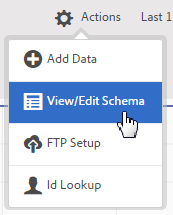

# Validate the schema

The validation process lets you map display names and descriptions to uploaded attributes (strings, integers, numbers, and so on). A schema is created based on these settings. The schema is used to validate all future data uploaded to this data source. This mapping process does not alter the original data.

**[!UICONTROL  Customer Attribute Source]** > **[!UICONTROL  Create New Customer Attribute Source]** > **[!UICONTROL  View/Edit Schema]** 

 

On the [!UICONTROL  Validate Schema] page, each row of the schema represents a column of the uploaded CSV file. 

 

* **[!UICONTROL  Add Data:]** Upload new attribute data to this data source. 

* **[!UICONTROL  View/Edit Schema:]** Map display names to the attribute data, as described in the next step. 

* **[!UICONTROL  FTP Setup:]** [ Upload the data via FTP](../attributes/t_upload_attributes_ftp.md#task_591C3B6733424718A62453D2F8ADF73B). 

* **[!UICONTROL  ID Lookup:]** Enter a Customer ID (CID) from your [!DNL  .csv] to look up Experience Cloud information for the ID. This feature is useful for troubleshooting why attribute data is not displaying for a visitor: 

    * **[!UICONTROL  MCID (Experience Cloud ID):]** Displays if you are using the latest Experience Cloud ID service. If you are on the MCID service but no IDs are listed here, the Experience Cloud has not received an alias for that CID. Meaning, the visitor has not logged in, or your implementation is not passing that ID through. 

    * **[!UICONTROL  CID (Customer ID):]** The attributes associated with this CID. If you are using a prop or eVar to upload CIDs (AVID), and you see attributes displayed but no AVID, this indicates that the visitor has not logged in to your site. 

    * **[!UICONTROL  AVID (Analytics visitor ID):]** Displays if you use a prop or eVar to upload CIDs. If those IDs are being passed to the Experience Cloud, any visitor IDs associated with the CID you entered are displayed here. 

You can also upload data via FTP after you create a customer attribute source and an FTP account in the Experience Cloud. You create one FTP account per attribute source. The uploaded files are stored in the root folder of that account. The data must be in .csv format, with a second .fin file to indicate the upload is complete 

The names you apply to strings, integers, and numbers are used to create [!DNL  Analytics] metrics. See [ Customer Attributes Report](https://marketing.adobe.com/resources/help/en_US/reference/?f=reports_customer_attributes) in [!DNL  Analytics] help for more information. 

* **[!UICONTROL  Attribute:]** Attribute data read from the uploaded [!DNL  .csv] file. 

* **[!UICONTROL  Type:]** The data type, such as: 

    * **String:** A sequence of characters. 

    * **Integers:** Whole numbers. 

    * **Numbers:** Can have up to two decimal places. 

* **[!UICONTROL  Display Name:]** A friendly name for the attribute. For example, you might change an attribute *` customer age`* to *` Customer Since`*. 

* **[!UICONTROL  Description:]** A friendly description of the attribute. 

