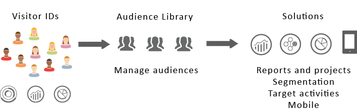

# Audiences {#topic_679810123CAA4E0CA4FA3417FB0100C7}

Audiences are collections of visitors (a list of visitor IDs). Adobe's audience services manage the translation of visitor data into audience segmentation. As such, creating and managing audiences is similar to creating and using segments, with the added ability to share the audience segment to the [!DNL Experience Cloud]. 

 

Audiences can be created or derived from various sources, such as: 

* New ones created in the [!DNL Experience Cloud]
* From [!DNL Analytics] segments published to the [!DNL Experience Cloud]
* From [!DNL Audience Manager]

**Real-Time vs. Historical Audiences**

All audiences, regardless of where they are sourced, are accessible for real-time targeting use cases. The system evaluates audiences in two ways: 

* Historical audiences are sourced from analytics are evaluated every 12 hours. Historical audiences always include return visitors.
* Real-time audiences are sourced in the Experience Cloud Audiences are evaluated real time.

## How solutions use audiences {#concept_01EB9345C5344597BC94A864EDD38EE1}

Short Description

The following table describes how audiences are used in Experience Cloud solutions: 

<table id="table_CC035305FD70485EBBB96EC10F924A78"> 
 <thead> 
  <tr> 
   <th colname="col1" class="entry"> Solution </th> 
   <th colname="col2" class="entry"> Description </th> 
  </tr> 
 </thead>
 <tbody> 
  <tr> 
   <td colname="col1"> 
Experience Cloud Audiences 
 </td> 
   <td colname="col2"> 
Create, manage, and share audiences natively using the <a href="../audience-library/audience-library.md#concept_3D52E1DED6D04ECC949B514E182C4655" format="dita" scope="local"> Audience Library</a> interface. You can: 
 
    <ul id="ul_8A5A5BC2FF2B45EE9039BAC55B1034B5"> 
     <li id="li_9E0825BD453A4F518AC2A274CB3DD826">Use real-time audiences using raw analytics attributes </li> 
     <li id="li_240A79C2D433456F94F1DD3E885BB17E">Combine audiences to create composite ones, joining real-time and historical data </li> 
     <li id="li_D558DCD666B04F0DAE343F8E0DC0D111">See graphical views of estimated audiences size </li> 
    </ul> 
For suggestions about what type of audience you want to create see: <a href="https://helpx.adobe.com/marketing-cloud-core/kb/People/Audience-Creation-Options.html" format="html" scope="external"> Experience Cloud Audiences</a>. 
 </td> 
  </tr> 
  <tr> 
   <td colname="col1"> 
Analytics 
 </td> 
   <td colname="col2"> 
In segmentation, you can build a segment, combine it with a report suite, and then <a href="../audience-library/audience-library.md#task_32FEEFE0B32E4E388CD4D892D727282A" format="dita" scope="local"> publish the segment to the Experience Cloud</a>. 
 
Publishing the segment displays it on the <a href="../audience-library/audience-library.md#concept_3D52E1DED6D04ECC949B514E182C4655" format="dita" scope="local"> Audiences</a> page. The audience is also available as a targeted audience for a campaign experience delivered by  Adobe Target, and in  Audience Manager. 
 
 Once an audience is shared from  Analytics, and selected for use in an active campaign, all the visitor profiles who met the segment definition criteria for the past 90 days are sent to the  Experience Cloud Audience Services platform. 
 
 
Important:  You must limit the number of audiences shared from Analytics to 20 to avoid additional processing delays. Audiences shared to the Experience Cloud from Analytics cannot exceed 20 million unique members. Also, due to caching, deleted report suites in Analytics require 12 hours before the deletion is shown in the Experience Cloud. 
 
 </td> 
  </tr> 
  <tr> 
   <td colname="col1"> 
Mobile Services 
 </td> 
   <td colname="col2"> 
Analyze mobile traffic using the sunburst visualization in the <a href="https://marketing.adobe.com/resources/help/en_US/mobile/?f=reports_devices" format="https" scope="external"> Device Types</a> report. 
 </td> 
  </tr> 
  <tr> 
   <td colname="col1"> 
Target 
 </td> 
   <td colname="col2"> 
The <a href="https://marketing.adobe.com/resources/help/en_US/mcvid/" format="https" scope="external"> ID service</a> unifies visitor IDs and data into a single, actionable profile for use across solutions. 
 
The <a href="../audience-library/audience-library.md#task_32FEEFE0B32E4E388CD4D892D727282A" format="dita" scope="local"> Publish to the Experience Cloud</a> checkbox during the segment creation process in  Adobe Analytics allows the segment to be available within the  Adobe Target's custom audience library. A segment created in  Analytics or  Audience Manager can be used for activities in  Target. 
 
For example, you can create campaign activities based on  Analytics conversion metrics and audience segments created in  Analytics. 
 </td> 
  </tr> 
  <tr> 
   <td colname="col1"> 
Audience Manager 
 </td> 
   <td colname="col2"> 
 Shared audiences are available in Audience Manager segmentation. All  Experience Cloud audiences are available natively in  Audience Manager, which provides: 
 
    <ul id="ul_266BFF7D988E4A3DB0A17D15296FC89E"> 
     <li id="li_2B6C845E286B456F8698C7BF8CA420AA">Built-in automation regarding how they are shared and consumed in solution workflows </li> 
     <li id="li_4EDB3F0D1C4F49DBAE4897894BBCAD6A">Offsite destinations </li> 
     <li id="li_B1B6F7EA9E754A6ABB2B0F5E957CD2A7">Look-alike modeling </li> 
    </ul> </td> 
  </tr> 
  <tr> 
   <td colname="col1"> 
Campaign 
 </td> 
   <td colname="col2"> 
    <ul id="ul_32749D6501FC471FB4FE0A458606D3AA"> 
     <li id="li_C682AD85CE1C4423BCEC5AAACD04299E">Import shared audiences from different Adobe Experience Cloud solutions into  Adobe Campaign. </li> 
     <li id="li_67C7BE8CC1B34E138D586B2917EA340A">Export recipient lists in the form of shared audiences. These shared audiences can be used in the different Adobe Experience Cloud solutions that you use. </li> 
    </ul> </td> 
  </tr> 
  <tr> 
   <td colname="col1"> 
Media Optimizer 
 </td> 
   <td colname="col2"> 
 Use the audience as targets. 
 </td> 
  </tr> 
 </tbody> 
</table>

>[!IMPORTANT]
>
>Once a visitor qualifies for the audience shared from Analytics, there is a 24 - 48 hour delay before that information is actionable in Target, Media Optimizer, and Campaign.

## More help - questions, guidance, and use cases {#section_C7F151644D8A45F7B6FC54F58845635D}

<table id="table_7A350FDED73E4F0CA41A0784FEB03957"> 
 <thead> 
  <tr> 
   <th colname="col1" class="entry"> Help with </th> 
   <th colname="col2" class="entry"> Resource </th> 
  </tr> 
 </thead>
 <tbody> 
  <tr> 
   <td colname="col1"> 
Cannot find Audiences? 
 </td> 
   <td colname="col2"> 
Ensure that you are provisioned. See <a href="../core-services/core-services.md#concept_07ED1D5C64234E77976E6D572E78FB9C" format="dita" scope="local"> Getting started - enable your solutions for core services</a>. 
 
Click <a href="https://adobe.com/go/audiences" format="http" scope="external"> here</a> to request access to Profiles and Audiences (integrations provisioning form). 
 </td> 
  </tr> 
  <tr> 
   <td colname="col1"> 
Use cases 
 </td> 
   <td colname="col2"> 
For more guidance on what solution to use, go to <a href="https://helpx.adobe.com/marketing-cloud-core/kb/People/Audience-Creation-Options.html" format="html" scope="external"> Audience Creation Options</a> in the Knowledge Base. 
 </td> 
  </tr> 
  <tr> 
   <td colname="col1"> 
Forum 
 </td> 
   <td colname="col2"> 
The <a href="https://forums.adobe.com/community/experience-cloud/platform/core-services/people-service/audiences" format="https" scope="external"> Audiences forum</a> is an additional resource to get help with audiences. 
 </td> 
  </tr> 
 </tbody> 
</table>

## Audience Library interface elements {#section_D04ACEF61CEF4B189AE6BA9F40D0DBF4}

The [!DNL Experience Cloud] provides a library for creating and managing audiences, with native, real-time audience identification. 

**[!UICONTROL Experience Cloud]** > **[!UICONTROL Audience Library]** 

 

<table id="table_50E240AE46424582A75400255515480C"> 
 <thead> 
  <tr> 
   <th colname="col1" class="entry"> Element </th> 
   <th colname="col2" class="entry"> Description </th> 
  </tr> 
 </thead>
 <tbody> 
  <tr> 
   <td colname="col1"> 
  New 
 </td> 
   <td colname="col2"> 
 <a href="../audience-library/audience-library.md#task_37F407F58BF9459493BB8E968CDFE737" format="dita" scope="local"> Create an audience</a>. 
 </td> 
  </tr> 
  <tr> 
   <td colname="col1"> 
  Title &amp; Description  
 </td> 
   <td colname="col2"> 
A column heading that identifies and describes the audience. 
 </td> 
  </tr> 
  <tr> 
   <td colname="col1"> 
  Author 
 </td> 
   <td colname="col2"> 
The person who created the audience segment. 
 </td> 
  </tr> 
  <tr> 
   <td colname="col1"> 
Source 
 </td> 
   <td colname="col2"> 
Identifies where the audience was created. 
 
 <b>Analytics</b>: A segment created in reports &amp; analytics or ad hoc analysis, then <a href="../audience-library/audience-library.md#task_32FEEFE0B32E4E388CD4D892D727282A" format="dita" scope="local"> published to the Experience Cloud</a>. 
 
 <b>Experience Cloud:</b> A new audience <a href="../audience-library/audience-library.md#task_37F407F58BF9459493BB8E968CDFE737" format="dita" scope="local"> created in Experience Cloud Audiences</a>. 
 
 <b>Audience Manager:</b> Audiences created  Audience Manager automatically display in the  Experience Cloud Audiences. 
 </td> 
  </tr> 
  <tr> 
   <td colname="col1"> 
Current Size 
 </td> 
   <td colname="col2"> 
The current audience size. 
 </td> 
  </tr> 
  <tr> 
   <td colname="col1"> 
Active 
 </td> 
   <td colname="col2"> 
The active status of the segment. 
 </td> 
  </tr> 
 </tbody> 
</table>

