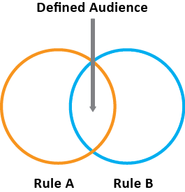
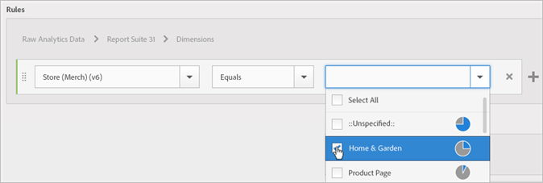
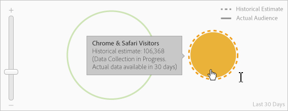

# Create an audience

Learn how to use attribute rules to create an audience and define a composite audience in the Experience Cloud.

This article helps you understand how to: 

* Create an audience
* Create a rule
* Use rules to define a composite audience

The following graphic represents two rules in a composite audience. 

 

Each circle represents a rule that defines audience membership. Visitors that qualify as members in both audience rules overlap to become the composite, defined audience. 

>[!NOTE]
>
>The audience is fully defined after data collection for the specified period completes.
The following example shows how to create the rules for a composite audience. This audience is comprised of: 

* Home & Garden section derived from page data, or raw analytics data.
* Chrome and Safari users derived from an [!DNL Adobe Analytics] segment [published](../audience-library/audience-library.md#task_32FEEFE0B32E4E388CD4D892D727282A) to the [!DNL Experience Cloud].

   

1. In the [!DNL Experience Cloud], click **[!UICONTROL People]** > **[!UICONTROL Audience Library]**.
1. On the [!UICONTROL Audiences] page, click **[!UICONTROL New]**. 

   

1. On the [!UICONTROL Create New Audience] page, specify a title and description.
1.  Under [!UICONTROL Rules], select an attribute source:

  * **[!UICONTROL Real-Time Analytics Data:]** (or Raw data) This is attribute data derived from real-time Analytics image requests, and includes data such as eVars and events. You must select a report suite when using this attribute source, and define the dimension or event to include. This report suite selection provides the variable structure used by the report suite. 

  >[!NOTE]
  >
  >Due to caching, deleted report suites in Analytics require 12 hours before the deletion is shown in the Experience Cloud.

  * **[!UICONTROL Experience Cloud:]** Attribute data derived from the [!DNL Experience Cloud] sources. For example, this can be data from audience segments you create in [!DNL Analytics], or data from [!DNL Audience Manager].
    
1.  Define audience rules.

  >[!NOTE]
  >
  >You should have an understanding of your implementation variables when defining audience rules.

  Under [!UICONTROL Rules], define the *`Home & Garden`* attribute selections: 
  
* **[!UICONTROL Attribute Source:]** Raw Analytics Data    
* **[!UICONTROL Report Suite:]** Report Suite 31    
* Dimension = **[!UICONTROL Store (Merch) (v6)]** > **[!UICONTROL Equals]** > **[!UICONTROL Home & Garden]** 
    
   
    
  The *Chrome & Safari Visitors* is an audience segment shared from Analytics: 
    
* **[!UICONTROL Attribute Source:]** Experience Cloud    
* **[!UICONTROL Dimension:]** Chrome & Safari Visitors
   
   
    
  For comparison, you might add an *OR* rule to see all visitors to a site section, such as Patio & Furniture. 
    
   
    
1. View the results.

  The resulting rule is a defined audience comprising Chrome & Safari users who visited Home & Garden. The Patio & Furniture segment provides additional insight into all visitors visiting that site section. 

   

  **Historical Estimate:** (Dotted circle) Represents rules created based on [!DNL Analytics] data. 
  
  **Actual Audience:** (Solid circle) Any rule created that has 30 days of data from Audience Manager. When the Audience Manager data reaches 30 days, the line becomes solid and represents actual numbers. 

  After the data collection completes for the specified period, the circles combine to show a defined audience. 

1. After defining the rules, click **[!UICONTROL Save]**.

  After the audience is saved, it is available for other solutions. For example, you can include a shared audience in a Target activity. 
