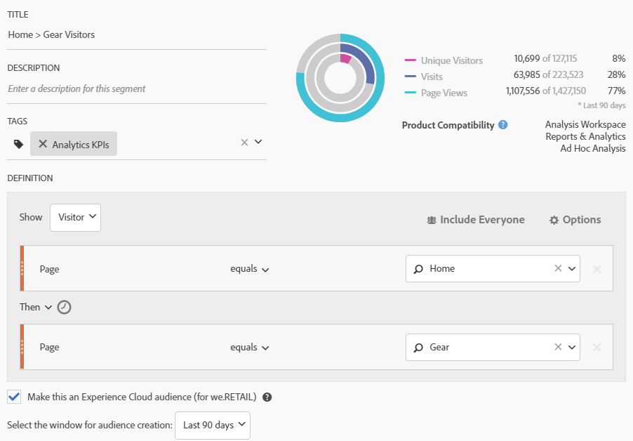

# Publish an Analytics audience segment

Publish an Analytics audience segment to the Experience Cloud and to Adobe Target, for audience marketing activities.

1.  In Analytics, [build a segment](https://marketing.adobe.com/resources/help/en_US/analytics/segment/seg_build.html).
1.  On the Segment Builder, enable the **[!UICONTROL Make this an Experience Cloud audience]** option.

     

    | Element | Description |
    |--- |---|
    |Make this an Experience Cloud audience (for &lt;report suite name&gt;)|Publishes this segment to the Experience Cloud. You can use the audience for marketing activities in Adobe Target and segmentation in Audience Manager. The Title and Description fields are required for the segment to be published. When this option is enabled, the title and audience segment definition are shared, but actual data is not. When that audience is associated with an activity in Target, Analytics begins sending IDs for visitors that qualify for that Experience Cloud and Target audience. At that point, the audience name and corresponding data begins displaying on the  Experience Cloud Audiences page. Audiences shared to the Experience Cloud from Analytics cannot exceed 20 million audience members. Due to caching, deleted report suites in Analytics require 12 hours before the deletion is shown in the Experience Cloud. In  Analytics, you can edit or delete a published segment. If the segment is in use, a warning message is issued when you edit a segment. You cannot delete a published segment that is in use by Adobe Target. Once a visitor qualifies for the audience shared from  Analytics, there is a 24 - 48 hour delay before that information is actionable in Target, Advertising Cloud, and Campaign. **Data Privacy** Audiences are not filtered based on the authentication state of a visitor. If a visitor can browse your site in un-authenticated and authenticated states, actions that occur when a visitor is un-authenticated can still cause a visitor to be included in an audience. Review [Analytics Privacy Overview](https://marketing.adobe.com/resources/help/en_US/reference/?f=c_Privacy_Overview) to understand the full privacy implications of audience sharing.|
    |Select the window for audience creation|Note that this is a **rolling** time window, not a fixed one.|

1.  Click **[!UICONTROL Save]**.
1.  Access [!DNL Adobe Target], then navigate to the [!UICONTROL Segment] list.
1.  On the [!UICONTROL Segment] page, click **[!UICONTROL Import Experience Cloud Audiences]**

    This option displays the [!DNL Analytics] segment for use in activities. 
