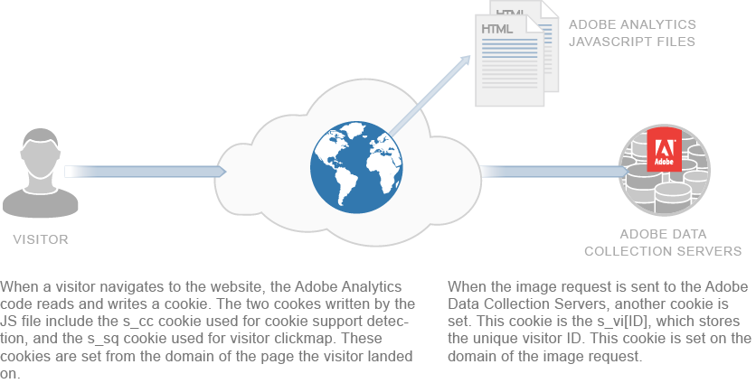

# About Cookies and Privacy{#about-cookies-and-privacy}

Maintaining customer privacy and data security are top priorities at Adobe. Adobe participates in multiple privacy organizations and cooperates with privacy regulators and self-regulatory principles. This cooperation includes the Digital Advertising Alliance AdChoices program to provide customers with information about how their information is used, and choices about its use.

Most of the cookies set by Experience Cloud products contain no personally identifiable information. These cookies and associated data are secure and used only for your company's reports, and to provide relevant content and advertisements. The data is not available to third parties or other Adobe customers, unless used in aggregated industry reports. For example, the [!DNL Digital Marketing Insight Report] analyzes aggregated and anonymous data across retailers.

Adobe does not merge browser-level information across companies. To protect the privacy and security of customers' data, some of the services within the Experience Cloud offer companies the ability to use a separate set of cookies for each site tracked. Some of the Suite offerings also offer customers the ability to use their own domain name as the owner of the cookie. This practice creates an extra layer of privacy and security, as it makes the Experience Cloud cookies *first party cookies*, belonging permanently to the company's site.

Cookies can store and provide only the information that was previously deposited in them. They are not able to execute code or access other information stored on the computer. Also, web browsers restrict access to cookie data. Browsers enforce a cookie security policy that makes all cookie data available only to the website that originally set the information.

For example, data contained in cookies set from the Adobe.com website cannot be viewed by any other website other than Adobe.com.

The following diagram illustrates cookie usage for a standard image request: 

The following diagram illustrates cookie usage for a straight image request (used in scenarios where a JS file is not loaded): 

