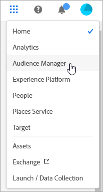

# Experience Cloud services {#topic_C1087DCC538F4F9A99D983C1BB29EBE0}

This documentation applies to features of the Experience Cloud unified header, such as the [!UICONTROL People] service (Audiences and Customer Attributes), user and product management for Experience Cloud, cookies, account preferences, notifications, and so on.

To access these services in Experience Cloud, select the **[!UICONTROL Application Selector]**
.

This help describes the following products and services:

| Core Service | Description |
|--- |--- |
|[Central interface components](experience-cloud.md)|Access account preferences, search for product help, and access applications and services.|
|[Enable your implementation for Experience Cloud services](core-services.md)|Existing customers can modernize their application implementations and implement Experience Cloud. Doing so enables you to use Customer Attributes and audience features across Adobe Analytics, Audience Manager, and Adobe Target. |
|[People - Audience Library](audience-library.md)|Audiences are collections of visitors (a list of visitor IDs). Adobe’s Audience Library lets you manage the translation of visitor data into audience segmentation. As |
|[People - Customer Attributes](attributes.md)| Build real-time orchestration use cases using contextual data stored in events or data sources. [!UICONTROL Journey Orchestration] is an application service integrated with the Experience Platform.|
|[Location Service](https://experienceleague.adobe.com/docs/places/using/home.html?lang=en)|Adobe [!UICONTROL Experience Platform Location Service] is a geo-location service. It enables mobile apps with location awareness to understand the location context by using rich and easy-to-use SDK interfaces accompanied by a flexible database of points of interests (POIs).  |
|[Activation](activation.md) |Activation includes the latest tag management product called Experience Platform Data Collection (Launch) and Experience Cloud Triggers. |
|[Assets](experience-cloud-assets.md)|Experience Cloud Assets provide a single, centralized repository of marketing-ready assets that you can share across applications.|
|[Administration](admin-getting-started.md)|Learn about signing in to the Admin Console, managing Experience Cloud user permissions and product profiles, and browser support.|
|[Cookies](cookies-privacy.md) |Maintaining customer privacy and data security are top priorities at Adobe. Adobe participates in multiple privacy organizations and cooperates with privacy regulators and self-regulatory principles. |

{style="table-layout:auto"}

>[!NOTE]
>
>Product documentation for Experience Platform is located [here](https://experienceleague.adobe.com/docs/experience-platform/landing/home.html?lang=en). Technical documentation for [!UICONTROL Experience Platform] developers is found on [Adobe Developer](https://developer.adobe.com/apis).
