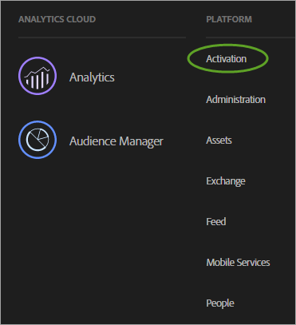

# Enable your solutions for core services

Implement the Experience Cloud and become an administrator. This process modernizes your solutions for core service features like customer attributes and audiences.

<!-- 
https://marketing-beta.adobe.com/resources/help/core/core_services.html 
 

https://adobe.sharepoint.com/sites/AGSConsulting/CoreServices/PA/_layouts/15/start.aspx#/ 
 -->

<!-- Core services architecture and data flow wiki: https://wiki.corp.adobe.com/pages/viewpage.action?pageId=1004285689 -->

## 1. Join the Experience Cloud and become an administrator {#section_2423F0BD3DF642658103310EE5EA6154}

What you need to do to join the Experience Cloud: 

 Ensure that you have the appropriate Adobe Analytics or Adobe Target SKUs. 

* **Adobe Analytics:** Standard or Premium (not the legacy SiteCatalyst SKU).
* **Adobe Target:** Standard or Premium.

>[!NOTE]
>
>For Target, [migrate to at.js from mbox.js](https://marketing.adobe.com/resources/help/en_US/target/ov2/t_target-migrate-atjs.html). 

 Modernize your implementation and get provisioned an administrator. 

1. Follow the steps below in [Deploy the Experience Cloud ID Service](../core_services/core_services.md#section_3C9F6DF37C654D939625BB4D485E4354).
1. Contact your Account Manager and start the provisioning process for the Experience Cloud.

 Manage users and products in the Admin Console. 

**Administrator Access** 

After you are an administrator, you can log in at [marketing.adobe.com](https://marketing.adobe.com). 

You will see the **[!UICONTROL Administration]** link in the Experience Cloud menu navigation. 

See [Experience Cloud user and product administration](../admin_getting_started/admin_getting_started.md#topic_3FCB4099640647E3B2411ADBFCE81909) for help. 

**User Access** 

To log in to the Experience Cloud, your users must: 

1. Have an Adobe ID.
1. Sign in at [!DNL marketing.adobe.com].
1. Belong to a solution group that is mapped to an enterprise group.
1. If necessary, link their solution accounts to their Adobe ID (described below).

 Optional: Link existing user accounts. 

Most likely, you have users who are already members of solution groups, such an Analytics group that you managed in Analytics > Admin Tools. 

When you map these groups to Experience Cloud enterprise groups, those users must manually link their solution account credentials to their Adobe ID. 

See [Link accounts in the Experience Cloud](../admin_getting_started/organizations.md#topic_C31CB834F109465A82ED57FF0563B3F1) 

> [!NOTE]
> 
> After enterprise and solution groups are mapped, new users are automatically linked. (Solution credentials are automatically created and linked to their Adobe ID.) 

The following sections describe how to modernize your implementation. Modernizing your implementation enables core services in the Experience Cloud. 

## 2. Implement the Experience Cloud ID service using Dynamic Tag Manager or Launch, by Adobe {#section_3C9F6DF37C654D939625BB4D485E4354}

The simplest method for enabling Experience Cloud core services is to activate it automatically for Analytics and Target via the [Experience Cloud ID service tool](https://marketing.adobe.com/resources/help/en_US/mcvid/mcvid-dtm-implement.html) in Dynamic Tag Manager. (Or Launch, by Adobe.) 

 

For complete Experience Cloud ID service (formerly, visitor ID), go [here](https://marketing.adobe.com/resources/help/en_US/mcvid/). 

Also, the next-generation tag management is [Launch, by Adobe](https://marketing.adobe.com/resources/help/en_US/experience-cloud/launch/) 

**Not Using Dynamic Tag Management or Launch?** 

If you are not using Dynamic Tag Management, manually implement the ID service via the JavaScript Deployment ( [!DNL VisitorAPI.js]), as follows: 

1. Perform the steps described in [Implement the Experience Cloud ID Service for Analytics](https://marketing.adobe.com/resources/help/en_US/mcvid/mcvid-setup-analytics.html). 

   Adobe also recommends setting additional [customer IDs](https://marketing.adobe.com/resources/help/en_US/mcvid/mcvid-authenticated-state.html). These IDs are associated with each visitor and enable current and future functionality in Experience Cloud core services. 

1. Update your existing [!DNL s_code] to version H.27.3 or later, or your existing [!DNL AppMeasurement.js] to version 1.4 or later. 

   These files are available for download in the [Code Manager](https://marketing.adobe.com/resources/help/en_US/reference/index.html?f=code_manager_admin) in Analytics Admin Tools. 

   (The [JavaScript Implementation](https://marketing.adobe.com/resources/help/en_US/sc/implement/js_implementation.html) guide is available if you need more information about [!DNL AppMeasurement.js].) 

1. Synchronize the customer ID for Analytics. See [Analytics - synching the customer ID](../core_services/core_services.md#section_AD473A6A21C1446498E700363F9A8437) (below). 

## Analytics & Target - synching the customer ID {#section_AD473A6A21C1446498E700363F9A8437}

As a part of setting up the Experience Cloud ID service, Adobe recommends for Analytics and Target that you synchronize your [customer IDs](https://marketing.adobe.com/resources/help/en_US/mcvid/mcvid-authenticated-state.html) with the Experience Cloud. 

In Target, the [!DNL mbox3rdpartyid] needs to get the customer ID and send it to Target. (See [Working with Customer Attributes](https://marketing.adobe.com/resources/help/en_US/target/target/c_working-with-customer-attributes.html) in Target.) 

When a visitor authenticates on your website, or otherwise identifies himself, your implementation must expose that person's CRM customer ID to the page or app. Then you can use the appropriate function call to synchronize your customer ID to the Experience Cloud. This synchronization stores the visitor's CRM customer ID in the Experience Cloud, and activates that customer's attributes for use in the Experience Cloud. 

For example, assume that Bob has Customer ID `52mc210tr42` in your CRM system. When Bob authenticates on your site, you must expose this ID on the page, and use the ID to synchronize it by one of two means: 

* Call `visitor.setCustomerIDs({"crm_id":"52mc210tr42"})` using the Visitor ID service. Or, 
* Populate the *`Customer ID (52mc210tr42)`* in a prop or eVar.

The Customer ID must be set on each [!DNL Analytics] server call where the Customer ID is known. 

**Mobile SDKs** 

See the *Experience Cloud ID service* section for syntax examples about how to set additional customer IDs in [Android](https://marketing.adobe.com/resources/help/en_US/mobile/android/?f=methods) and [iOS](https://marketing.adobe.com/resources/help/en_US/mobile/ios/?f=methods) Mobile applications. 

**Enabling Attributes for Historical Data** 

Customer attribute data is made available after visitors log in. If you have not yet implemented the latest Experience Cloud ID service, and if you have historically been tracking customer IDs in a prop or eVar, you can request a process that sends historical logins to the Experience Cloud. This process lets you begin using customer attributes immediately. 

Contact Customer Care to enable historical data. 

## 3. Map Report Suites to an Experience Cloud Organization {#section_7B08516B01BA421681DF03D0E86CE3BA}

Experience Cloud services (such as Experience Cloud ID service and People) are associated with an Experience Cloud organization instead of an individual report suite. To ensure that these services operate correctly, each Analytics report suite must be mapped to an Experience Cloud organization. 

See [Map report suites to an organization](map-report-suite.md). 

## 4. (Adobe Analytics) Modernize your Analytics AppMeasurement code {#section_1798D9D0F05C47E29816AC4EEB9A0913}

Verify that you are on regional data collection (RDC). If your data collection domain is [!DNL omtrdc.net], or if your CNAME is mapped to [!DNL omtrdc.net], you are on RDC. See [Transitioning to RDC](https://marketing.adobe.com/resources/help/en_US/whitepapers/rdc/?f=rdc_transition) for more information. If you are using first-party cookies, refer to [CNAME and the Visitor ID Service](https://marketing.adobe.com/resources/help/en_US/mcvid/?f=mcvid_cname) for information about data collection CNAMEs and cross-domain tracking. 

It is recommended that you modernize your Analytics implementation by updating your JavaScript libraries, including the Visitor API. The simple way to accomplish this is to add an [!DNL Adobe Analytics] tool in Dynamic Tag Management, specifying *`Automatic`* as the configuration method. 

In Dynamic Tag Management, click **[!UICONTROL <Web Property Name>]** > **[!UICONTROL Overview]** > **[!UICONTROL Add a Tool]** > **[!UICONTROL Adobe Analytics]**. See [Adobe Analytics Settings](https://marketing.adobe.com/resources/help/en_US/dtm/?f=analytics_dtm) in Dynamic Tag Management for deployment information. 

## 5. (Adobe Target) Modernize your Adobe Target implementation {#section_C2F4493C7A36406DAE2266B429A4BD24}

* It is recommended that you add an [Adobe Target tool](https://marketing.adobe.com/resources/help/en_US/dtm/target.html) in Dynamic Tag Management, so that your library retrieval is automatic. In Dynamic Tag Management, click **[!UICONTROL <Web Property Name>]** > **[!UICONTROL Overview]** > **[!UICONTROL Add a Tool]** > **[!UICONTROL Adobe Target]**. **Note:** You can also use Dynamic Tag Management to deploy the Experience Cloud ID service for Target (and other solutions). The Experience Cloud ID service update **is required** for Target to use core services.
* If you are not using Dynamic Tag Management, [update your mbox library](https://marketing.adobe.com/resources/help/en_US/target/ov/?f=t_mbox_download) manually.
* Request access to use Adobe Analytics as the reporting source for Adobe Target. Target and Analytics data are combined on the same server call during processing so that visitors are connected between the two solutions. See [Analytics for Target Implementation](https://marketing.adobe.com/resources/help/en_US/target/a4t/?f=a4t).
* 
  >[!IMPORTANT]
  >
  >All analytics customers are already provisioned for core services like customer attributes. If you are not an Analytics customer, contact Customer Care to request to be provisioned.

## 6. Verify the core services implementation {#section_E641782A0F4F44AF8C9C91216BE330D5}

Use the following process to ensure the Experience Cloud ID service is implemented correctly on your site. 

1. Clear cookies for your site so you can see the request to the Experience Cloud ID service (the request happens on the first visit, then approximately once per visitor per week).1. Using a packet analyzer or the network panel in a web browser debugger, look for a request going to [!DNL dpm.demdex.net].
1. Verify that the response contains `d_mid` and a value, for example: `_setMarketingCloudFields({"d_mid":"4235...`
1. Verify that the Analytics request contains the mid parameter (the Experience Cloud ID). During the grace period (if it is enabled), you should also see an aid parameter (the Analytics visitor ID).

Expected response containing the Experience Cloud ID: 

 

Analytics image request containing the Experience Cloud ID (mid): 

 

Experience Cloud ID in the mbox request: 

 

**What Is the Grace Period?** 

After you deploy the visitor ID service, new visitors no longer receive an Analytics visitor ID from your data collection server. If sections of your site have not yet implemented the visitor ID service, when visitors browse to these sections, the Experience Cloud ID is not recognized and visitors are assigned a legacy Analytics visitor ID. This can cause potential problems, including duplicate visits and incorrect attribution. 

For example, if the support section of your site is managed in a separate CMS, you might have a different Analytics JavaScript file for this section. If you deploy the visitor ID on your main site before you deploy the visitor ID service to the support site, new visitors will receive a legacy Analytics ID when they visit the support section, and visits that span both site sections will be reported as different visits. 

Deploying the visitor ID service on sites that are using multiple JavaScript files or other technologies (such as Flash) can cause coordination issues since you need to enable the visitor ID service on all portions of your site at the same time. By configuring a grace period, new visitors to continue to receive an Analytics visitor ID from the visitor ID service, so visitors can be consistently identified on sections of your site that have not been upgraded to use the visitor ID service. 

## 7. Manage users and products {#section_B6E95F4E0E12483CB9DA99CBC0C5A4AF}

Once you are up and running, navigate to **[!UICONTROL Administration]** > **[!UICONTROL Launch Admin Console]**, where you can manage users and product profiles. 

 

See [Experience Cloud user and product management](../admin_getting_started/admin_getting_started.md#topic_3FCB4099640647E3B2411ADBFCE81909). 

**Customer Attributes** 

<!-- 
 
 <note type="important">
  To use the Customer Attributes feature, users must belong to the 
   Adobe Customer Attributes group, and to solution-level groups (Analytics or Target). 
 </note> 
 
 -->
 
Users that are added to the Customer Attributes group will see the [!UICONTROL Customer Attributes] menu item on the left side of the Experience Cloud interface 

## 8. Start using core services {#section_960C06093623462E8EA247B3E97274A1}

Take advantage of the following core service features. 

 

**People > Customer Attributes** 

If you capture enterprise customer data in a customer relationship management (CRM) database, you can upload the data into a customer attribute data source in the Experience Cloud. Once uploaded, leverage the data in [!DNL Adobe Analytics] and [!DNL Adobe Target]. 

See [Customer Attributes](../attributes/attributes.md#concept_ACFEE7C8B8E94875BA0825CDF4913AF1) 

**People > Audience Library** 

Experience Cloud Audiences is the interface that lets you create audiences, combine existing audiences to create composite audiences, and view all shared audiences. 

See [Audiences](../audience_library/audience_library.md#topic_679810123CAA4E0CA4FA3417FB0100C7) 

<!-- aam_mc.xml -->
If you leverage real-time audience profiling and other core services within the Adobe [!DNL Experience Cloud], use of these services might impact which data center (and country) your data resides. Specifically, because the core services of the Adobe [!DNL Experience Cloud] leverage Adobe Audience Manager, data used within the People core service must reside within Audience Manager servers in the United States. 

When leveraging core services made available via the People core service, the types of data sent from other Adobe products to audience management are: 

* [!DNL Analytics] key/value pairs (props, eVars, list vars, and so on). By default, the log lines include IP address, including the last octet of the IP (assuming that the IP address was not modified by IP obfuscation settings within Adobe [!DNL Analytics]).
* Traits and segments that visitors qualify for based on rules set up in Audience Manager.
* (Optional) One or more of your IDs. Depending on your implementation of the ID service, you might also be sending in one or more of your IDs, such as CRM IDs or hashed email addresses. If this data is sent into Adobe [!DNL Analytics], it is transferred to Adobe audience management. Adobe recommends against providing personal data to Adobe [!DNL Analytics]. Rather, use a one-way hash to pseudonymize the data before it is sent to Adobe. 
* Segments originating in [!DNL Analytics] via the back-end segment sharing capability.
* The demdex.net cookie is set if third-party cookies are not blocked. The `AMCV_###@AdobeOrg` first-party cookie is always set with the Experience Cloud ID (formerly, Visitor ID service).

All these data elements are delivered to Adobe Audience Manager in the form of log files. Audience Manager processes and stores this data within the United States. Audience Manager does not provide an option to store or process this data outside of the United States. 

**Cookies and Opt-Outs** 

Use of real-time audience profiling leverages the Audience Manager cookie, in addition to the cookies used for [!DNL Analytics] and [!DNL Target]. 

If you want to provide the proper opt-out ability, visitors to your site must add the Audience Manager opt-out to your existing opt-out process. 

See [Adobe Experience Cloud - Implementing Adobe Opt-Outs](https://marketing.adobe.com/resources/help/en_US/sc/implement/opt_out.html) for instructions. 

See [Data Collection CNAMEs and Cross-Domain Tracking](https://marketing.adobe.com/resources/help/en_US/mcvid/?f=mcvid_cname) for enabling cross-domain tracking. 
