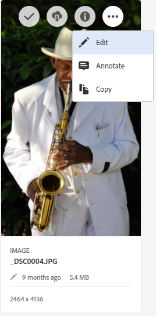
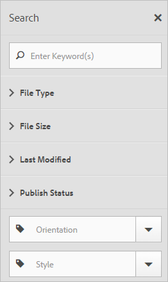

# Overview of Experience Cloud Assets

Experience Cloud Assets provide a single, centralized repository of marketing-ready assets that you can share across applications. An asset is a digital document, image, video, or audio (or part thereof) that can have multiple renditions and can have sub-assets (for example, layers in a [!DNL Photoshop] file, slides in a [!DNL PowerPoint] file, pages in a PDF, files in a ZIP).

Asset services include: 

* Asset storage, management interface, embedded selection interface (accessed through applications).
* Integrations with Creative Cloud, Experience Cloud collaboration, and Experience Cloud applications.

Using assets improves consistency and brand compliance, and speeds time to market. You can streamline workflows in applications: 

* **[!DNL Adobe Target]**: Create experiences for A/B and multivariate tests.
* **[!DNL Ad Cloud]**: Develop ad units across different channels and campaigns
* **[!DNL Adobe Campaign]**: Place assets into email newsletters and campaigns.

In [!UICONTROL Experience Cloud Assets], you can:

* [Navigate to Experience Cloud Assets](experience-cloud-assets.md#section_3657039DD3524F2AA88753BFF4781125)
* [Access the Toolbar](experience-cloud-assets.md#section_EC2E401D225148818F3753248556BE6B)
* [Edit assets](experience-cloud-assets.md#section_CD3C55A9D4574455B94D0955391C8FEC)
* [Search for Assets](experience-cloud-assets.md#section_50FE049010B446FC9640AA6A30E5A730)
* [Annotate Assets](experience-cloud-assets.md#section_67FE1DFAAB744DA5B1CD3AD3CCEABF7A)
* [View Full-Screen Assets, and Zoom](experience-cloud-assets.md#section_A9F50D7D6BE341A2AB8244A4E42A4EF7)
* [View Asset Properties](experience-cloud-assets.md#section_FED28711DAB14E1BBEEA7CA890EE9573)
* [Run Usage reports](experience-cloud-assets.md#section_15D782FFB8D74CF4A735116CC03AD902)
* [Asset Sharing with Experience Manager](experience-cloud-assets.md#section_45C1B72F4D274F54BC6CCB64D2580AC5)

## Navigate to Experience Cloud Assets {#section_3657039DD3524F2AA88753BFF4781125}

 

## Access the toolbar {#section_EC2E401D225148818F3753248556BE6B}

Navigate to an asset (or asset directory), then select **[!UICONTROL Select]**. 

The toolbar provides quick access to features, including Search, Timeline, Renditions, Edit, Annotate, and Download. 

 

>[!NOTE]
>
>Assets must be removed from Adobe Target activities before you can successfully delete them from [!DNL Target].

## Edit assets {#section_CD3C55A9D4574455B94D0955391C8FEC}

Editing an asset enables features, including: 

* Crop
* Rotate
* Flip

 

## Search for assets {#section_50FE049010B446FC9640AA6A30E5A730}

You can search by keyword, file type, size, last modified, publish status, orientation, and style. 

 

## Annotate assets {#section_67FE1DFAAB744DA5B1CD3AD3CCEABF7A}

Select **[!UICONTROL Annotate]** by drawing circles or arrows on an image, and annotate the asset for review by coworkers. 

 

## View full-screen assets, and zoom {#section_A9F50D7D6BE341A2AB8244A4E42A4EF7}

Select **[!UICONTROL Views]** > **[!UICONTROL Image]** to view the full asset image and enable zoom. 

 

## View asset properties {#section_FED28711DAB14E1BBEEA7CA890EE9573}

Choose between card view with properties, list view, and column view to more easily to find your assets. 

Select **[!UICONTROL Views]** > **[!UICONTROL Properties]** to view an asset's properties: 

 

## Run usage reports {#section_15D782FFB8D74CF4A735116CC03AD902}

See the number of users, storage used, and total assets. 

Select **[!UICONTROL Tools]** > **[!UICONTROL Reports]** > **[!UICONTROL Usage Report]** 

