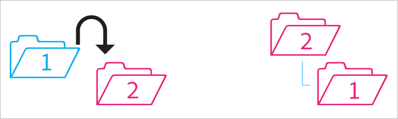
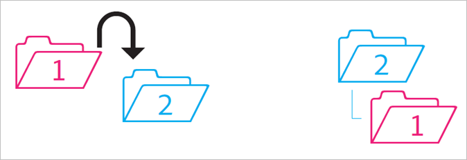
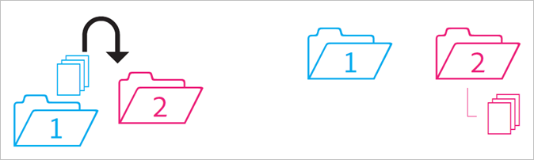
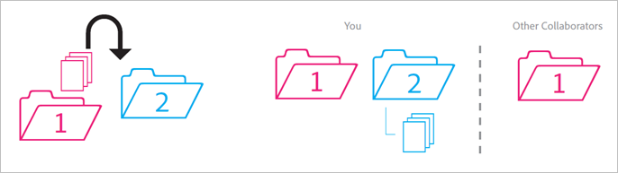
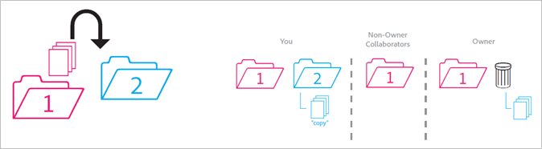
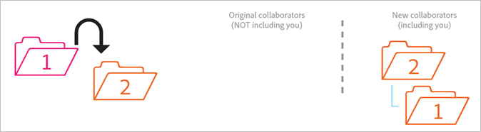
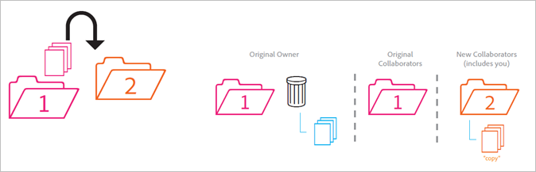

# Behavior of shared folders

* [ Unshared folder into shared folder](../experience-cloud-assets/asset_behavior.md#section_A9BAC1A244A246A984AC62660E61E0C0)
* [ Shared folder into unshared folder](../experience-cloud-assets/asset_behavior.md#section_8BA83001DCEC4CF084B980C4A660F59A)
* [ Content from unshared folder into shared folder](../experience-cloud-assets/asset_behavior.md#section_2941ED0DC52E4573AC1AB4C22313DD8E)
* [ Archived and deleted shared content](../experience-cloud-assets/asset_behavior.md#section_5210D5F4943A44D0BA675D8EB4EAE20F)
* [ Owned shared content to an unshared folder](../experience-cloud-assets/asset_behavior.md#section_3810A364B67E4B8C9CA244BC52BF91BB)
* [ Unowned content to an unshared folder](../experience-cloud-assets/asset_behavior.md#section_310766EBF0DC4C0BB4AB3E8A4DAEBE07)
* [ Archived or deleted owned folder](../experience-cloud-assets/asset_behavior.md#section_B314B13512A5409C87C49DFDB7602E14)
* [ Shared folder into another shared folder](../experience-cloud-assets/asset_behavior.md#section_0A3F203D048D4D1586E9850DC92C51E9)
* [ Shared content to another shared folder](../experience-cloud-assets/asset_behavior.md#section_69F6C312792A4CD2831BD14A340F850E)
* [ Restored content from archive](../experience-cloud-assets/asset_behavior.md#section_DEA990B3581741F89FBB81D18C2AB449)

>[!NOTE]
>
>Shared Experience Cloud folders and assets are mirrored to the Creative Cloud desktop in a 1:1 relationship. If an Experience Cloud user changes a folder (deletes, adds, or removes sharing), the action is mirrored in the Creative Cloud desktop and web. As such, if a folder is unshared, the folder and assets are deleted from your local machine. After sharing is removed, the folder and its contents are moved to the trash can on your local computer, where you can manually restore them to your machine.

## Unshared folder into shared folder {#section_A9BAC1A244A246A984AC62660E61E0C0}

You move an unshared folder into a shared folder: 

 

**Result**: Both folders become shared. 

## Shared folder into unshared folder {#section_8BA83001DCEC4CF084B980C4A660F59A}

You move a shared folder into an unshared folder. 

 

**Result**: The unshared folder remains unshared. The shared folder remains shared. 

## Content from unshared folder into shared folder {#section_2941ED0DC52E4573AC1AB4C22313DD8E}

You move content from an unshared folder into a shared folder. 

 

**Result:** The content is now shared and all collaborators can see it. Storage increases by the size of the content. 

## Archived and deleted shared content {#section_5210D5F4943A44D0BA675D8EB4EAE20F}

You archive or delete content that resides in a shared folder. 

 

**Result:** Content is archived for the owner of the folder. Collaborators who do not own the content can no longer access it. 

## Owned shared content to an unshared folder {#section_3810A364B67E4B8C9CA244BC52BF91BB}

You move content from a shared folder that you own into an unshared folder. 

 

**Result:** The content is now unshared. The collaborators of the shared folder no longer have access to the content. 

## Unowned content to an unshared folder {#section_310766EBF0DC4C0BB4AB3E8A4DAEBE07}

You move content from shared folder owned by someone else into an unshared folder. 

 

**Result:** The content appears in the unshared folder and is removed from the shared folder. The collaborators of the shared folder no longer have access to the content. The content is archived for the owner of the shared folder. 

Owners and editors can move content which they do not own, but viewers cannot. If owners and editors move content, it is not available in a shared folder for any user. 

## Archived or deleted owned folder {#section_B314B13512A5409C87C49DFDB7602E14}

You archive (via web) or delete (via desktop) a shared folder that you own. 

 

**Result:** The folder is unshared, then archived. The collaborators no longer have access to the folder. 

## Shared folder into another shared folder {#section_0A3F203D048D4D1586E9850DC92C51E9}

You move a shared folder that you own into another shared folder that you may or may not own. 

 

**Result:** As the folder is moved into Folder 2, it becomes shared with the new collaborators. 

## Shared content to another shared folder {#section_69F6C312792A4CD2831BD14A340F850E}

You move content from a shared folder into another shared folder. 

 

**Result:** The content appears in Folder 2 and is now shared with new collaborators. The content is removed from Folder 1 and the owner sees it as archived, while the other collaborators no longer have access to it. 

## Restored content from archive {#section_DEA990B3581741F89FBB81D18C2AB449}

You restore content from an archive that belonged to a shared folder. You owned the content at the time it was archived. 

 

**Result:** The content is restored to the shared folder and all collaborators can access it again. If the shared folder no longer exists, the content is put into an unshared copy of its original parent folder(s). 
