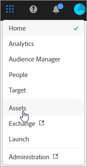
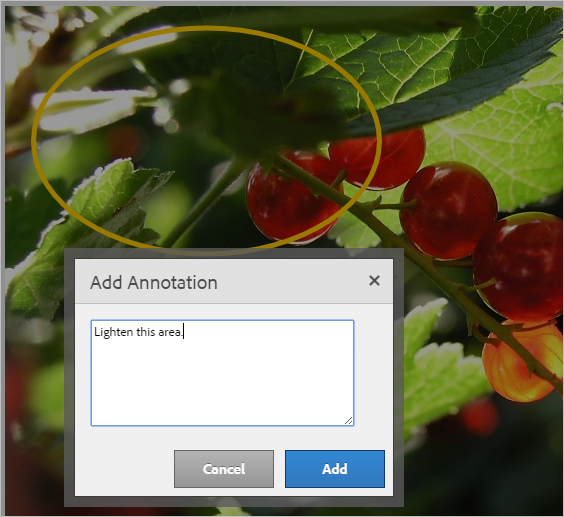
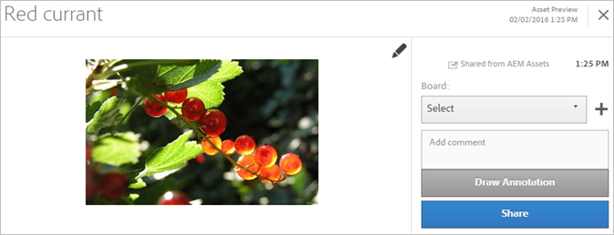
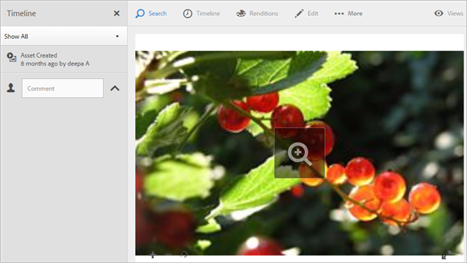
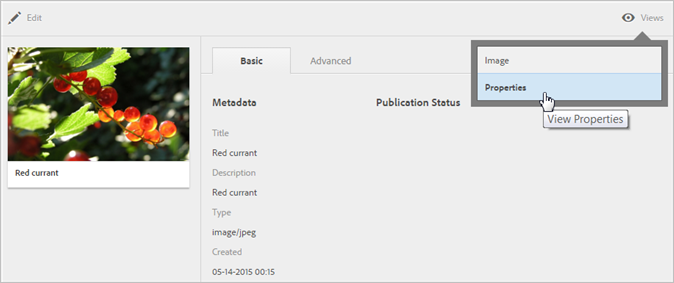
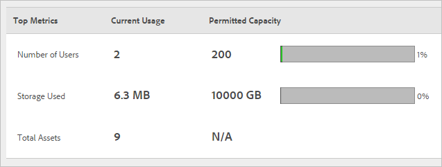

# Assets

Experience Cloud Assets provide a single, centralized repository of marketing-ready assets that you can share across solutions. An asset is a digital document, image, video, or audio (or part thereof) that can have multiple renditions and can have sub-assets (for example, layers in a Photoshop file, slides in a PowerPoint file, pages in a PDF, files in a ZIP).

<!-- asset.xml -->

Asset services include: 

* Asset storage, management interface, embedded selection interface (accessed through solutions).* Integrations with Creative Cloud, Experience Cloud collaboration, and Experience Cloud solutions.

Using assets improves consistency and brand compliance, and speeds time to market. You can streamline workflows in solutions: 

<<<<<<< HEAD
* ** [!DNL Social] **: Publish to social properties, Facebook, Twitter, LinkedIn, Google+
* ** [!DNL Target] **: Create experiences for A/B and multivariate tests.
* ** [!DNL Media Optimizer] **: Develop ad units across different channels and campaigns
* ** [!DNL Campaign] **: Place assets into email newsletters and campaigns.

In [!UICONTROL Experience Cloud Assets], you can: 

* [Navigate to Experience Cloud Assets](../experience-cloud-assets/experience-cloud-assets.md#section_3657039DD3524F2AA88753BFF4781125)
* [Access the Toolbar](../experience-cloud-assets/experience-cloud-assets.md#section_EC2E401D225148818F3753248556BE6B)
* [Edit assets](../experience-cloud-assets/experience-cloud-assets.md#section_CD3C55A9D4574455B94D0955391C8FEC)
* [Search for Assets](../experience-cloud-assets/experience-cloud-assets.md#section_50FE049010B446FC9640AA6A30E5A730)
* [Annotate Assets](../experience-cloud-assets/experience-cloud-assets.md#section_67FE1DFAAB744DA5B1CD3AD3CCEABF7A)
* [Share an Asset to your Feed](../experience-cloud-assets/experience-cloud-assets.md#section_2CD53A99600D4A3D9AA82C3CDA666E6B)
* [View Full-Screen Assets, and Zoom](../experience-cloud-assets/experience-cloud-assets.md#section_A9F50D7D6BE341A2AB8244A4E42A4EF7)
* [View Asset Properties](../experience-cloud-assets/experience-cloud-assets.md#section_FED28711DAB14E1BBEEA7CA890EE9573)
* [Run Usage reports](../experience-cloud-assets/experience-cloud-assets.md#section_15D782FFB8D74CF4A735116CC03AD902)
* [Asset Sharing with Experience Manager](../experience-cloud-assets/experience-cloud-assets.md#section_45C1B72F4D274F54BC6CCB64D2580AC5)

=======
* **[!DNL  Social]**: Publish to social properties, Facebook, Twitter, LinkedIn, Google+
* **[!DNL  Target]**: Create experiences for A/B and multivariate tests.
* **[!DNL  Media Optimizer]**: Develop ad units across different channels and campaigns
* **[!DNL  Campaign]**: Place assets into email newsletters and campaigns.

In [!UICONTROL  Experience Cloud Assets], you can: 

* [ Navigate to Experience Cloud Assets ](../experience-cloud-assets/experience-cloud-assets.md#section_3657039DD3524F2AA88753BFF4781125)
* [ Access the Toolbar ](../experience-cloud-assets/experience-cloud-assets.md#section_EC2E401D225148818F3753248556BE6B)
* [ Edit assets ](../experience-cloud-assets/experience-cloud-assets.md#section_CD3C55A9D4574455B94D0955391C8FEC)
* [ Search for Assets ](../experience-cloud-assets/experience-cloud-assets.md#section_50FE049010B446FC9640AA6A30E5A730)
* [ Annotate Assets ](../experience-cloud-assets/experience-cloud-assets.md#section_67FE1DFAAB744DA5B1CD3AD3CCEABF7A)
* [ Share an Asset to your Feed ](../experience-cloud-assets/experience-cloud-assets.md#section_2CD53A99600D4A3D9AA82C3CDA666E6B)
* [ View Full-Screen Assets, and Zoom ](../experience-cloud-assets/experience-cloud-assets.md#section_A9F50D7D6BE341A2AB8244A4E42A4EF7)
* [ View Asset Properties ](../experience-cloud-assets/experience-cloud-assets.md#section_FED28711DAB14E1BBEEA7CA890EE9573)
* [ Run Usage reports ](../experience-cloud-assets/experience-cloud-assets.md#section_15D782FFB8D74CF4A735116CC03AD902)
* [ Asset Sharing with Experience Manager ](../experience-cloud-assets/experience-cloud-assets.md#section_45C1B72F4D274F54BC6CCB64D2580AC5)
>>>>>>> f4f15dbf132bb389d09b8cd384328a2c98097f4a

## Navigate to Experience Cloud Assets {#section_3657039DD3524F2AA88753BFF4781125}

 

## Access the toolbar {#section_EC2E401D225148818F3753248556BE6B}

Navigate to an asset (or asset directory), then click **[!UICONTROL Select]**. 

The toolbar provides quick access to features, including Search, Timeline, Renditions, Edit, Annotate, and Download. 

 

## Edit assets {#section_CD3C55A9D4574455B94D0955391C8FEC}

Editing an asset enables features, including: 

<<<<<<< HEAD
* Crop* Rotate* Flip
=======
* Crop
* Rotate
* Flip
>>>>>>> f4f15dbf132bb389d09b8cd384328a2c98097f4a

 

## Search for assets {#section_50FE049010B446FC9640AA6A30E5A730}

You can search by keyword, file type, size, last modified, publish status, orientation and style. 

 

## Annotate assets {#section_67FE1DFAAB744DA5B1CD3AD3CCEABF7A}

Click **[!UICONTROL Annotate]** by drawing circles or arrows on an image, and annotate the asset for review by coworkers. 

 

## Share an asset to your feed {#section_2CD53A99600D4A3D9AA82C3CDA666E6B}

Click **[!UICONTROL Share]** from the toolbar to share the asset as [feed](../feed.md#concept_9256B8768A294009A777282DD8719213) to other Experience Cloud users. 

 

Sharing displays the image on your Feed page and with whomever you have shared the card. 

## View full-screen assets, and zoom {#section_A9F50D7D6BE341A2AB8244A4E42A4EF7}

Click **[!UICONTROL Views]** > **[!UICONTROL Image]** to view the full asset image and enable zoom. 

 

## View asset properties {#section_FED28711DAB14E1BBEEA7CA890EE9573}

Choose between card view with properties, list view, and column view to more easily to find your assets. 

Click **[!UICONTROL Views]** > **[!UICONTROL Properties]** to view an asset's properties: 

 

## Run usage reports {#section_15D782FFB8D74CF4A735116CC03AD902}

See the number of users, storage used, and total assets. 

Click **[!UICONTROL Tools]** > **[!UICONTROL Reports]** > **[!UICONTROL Usage Report]** 

 
<<<<<<< HEAD
=======

## Asset Sharing with Experience Manager {#section_45C1B72F4D274F54BC6CCB64D2580AC5}

You can share assets within Adobe Experience Manager (AEM) Assets with the [!DNL  Experience Cloud] and [!DNL  Adobe Creative Cloud]. Any changes to these assets are reflected in the shared copies of the assets in Experience Cloud and [!DNL  Creative Cloud]. Similarly, any changes you make to the shared copies of the assets from within [!DNL  Experience Cloud] and [!DNL  Creative Cloud] are reflected in the original assets in AEM Assets. 

See [Configuring AEM Assets Integration](https://helpx.adobe.com/experience-manager/6-3/sites/administering/using/configure-assets-cc-integration.html) for more information. 
>>>>>>> f4f15dbf132bb389d09b8cd384328a2c98097f4a
