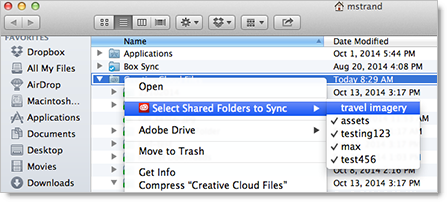

# Disable synchronization of shared folders

How to disable the synchronization of shared Experience Cloud folders within your Creative Cloud Files folder.

>[!NOTE]
>
>You can desynchronize only folders that you own.

 <b>Windows</b> 

1. Open Windows Explorer. 

1. Under Favorites, right click the **[!UICONTROL Creative Cloud Files]** folder, then click **[!UICONTROL Select Shared Folders to Sync]**. 

    

1. Deselect any folder that you do not want to synchronize. 

 <b>Mac OS</b> 

1. Open a Finder window. 

1. Navigate to your user folder. 

1. Control-click the **[!UICONTROL Creative Cloud Files]**, then click **[!UICONTROL Select shared folders to sync]**. 

    

1. Deselect any folder that you do not want to synchronize. 

   Synchronized folders have a checkmark next to the folder name. 

