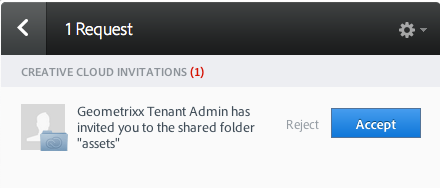
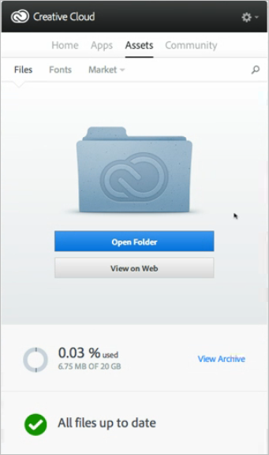
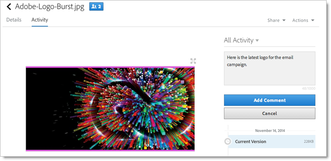

# Share an Experience Cloud asset folder

>1. On an Asset folder, click **[!UICONTROL  Share to Creative Cloud]**.

>        
>1. On the Share to Creative Cloud page, search for the user, then click **[!UICONTROL  Add]**.
>    
>
>1. Click **[!UICONTROL  Share]**.
>1. Launch the [!DNL  Creative Cloud] desktop (or navigate to the [!UICONTROL  Creative Cloud Files] page in a browser) and look for the request notification.

>        
>1. Open the request, then click **[!UICONTROL  Accept]**.

>        
>1. To access folder contents, click **[!UICONTROL  Open Folder]** (or **[!UICONTROL  View on Web]**).

>        
>1. Continue by adding comments on the shared asset:

>       In Creative Cloud, you can click into an image, then click **[!UICONTROL  Activity]** to add a comment on the image. Comments are synced on the assets in the [!DNL  Creative Cloud] and [!DNL  Experience Cloud]. 

>        

>       In the Experience Cloud, click into an image, then click the time-line icon to add a comment on the image. Comments are synced on the assets in the Creative Cloud and Experience Cloud. 

>        

>       <!-- 

 

You can unshare a folder. On Share to Creative Cloud, click Remove, then click Update. The blue creative cloud icon disappears. Tasks: Accept invitations, share, unshare, add comments. 
 

Turn assets into cards for annotation (tie into that MAC feature). 
 -->

>       <!-- 
Integrations: 
 

In <b>Social</b>, (Asset Selector) and publish a social post to FB or twitter, go to Publisher, the Import from Assets brings a page overlay of MAC assets. You can search for a particular folder, browse to it, and attach the asset to a post. 
 

 <b>Target integration</b>: Launch Target (bullseye), Create Activity, name it, click Continue, specify activity URL, then Swap Image, Target has a similar asset selector and replace an image in a Target Activity/experience. (Or Insert Element to load a shared/MAC asset to Target.) When creating activities in  Adobe Target, you can load or swap shared assets from the <a href="https://marketing.adobe.com/resources/help/en_US/target/target/c_manage_content.html" format="https" scope="external"> Content Library</a>. 
 -->
>1. To un-share a folder, click **[!UICONTROL  Share Using Creative Cloud]** (similar to [ Step 3](../experience-cloud-assets/t_share_creative_cloud.md#step_BA17CFA185284641A9B878BA29551996)), then remove users by clicking X, then click **[!UICONTROL  Share]**.

>        

>       Once you have removed all Creative Cloud Users, the folder is un-shared and the Creative Cloud users no longer has access. 
>[!MORE_LIKE_THIS]* * * 