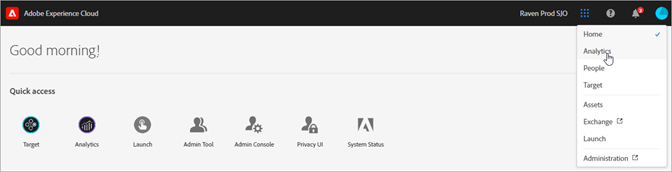

# Experience Cloud Services and Administration Guide

The Experience Cloud is Adobe's integrated family of digital marketing solutions and services. It's also an intuitive interface that lets you quickly access your cloud solutions and core services.

This guide provides access to help on Experience Cloud user and product administration in the Admin Console, enabling solutions for platform services. You can also access help on the Audience Library, Customer Attributes, Experience Cloud Assets, and more:

* [[!UICONTROL Audience Library]](audience-library/audience-library.md)
* [[!UICONTROL Customer Attributes]](attributes/attributes.md)
* [[!UICONTROL Triggers]](activation/triggers.md)
* [Experience Cloud [!UICONTROL Assets]](experience-cloud-assets/experience-cloud-assets.md)
* [Experience Cloud cookies](cookies/cookies-privacy.md)
* [User and product management](admin-getting-started/admin-getting-started.md) (Admin Console)
* [Enable your solutions for core services](core-services/core-services.md)
* [Frequently asked questions](admin-getting-started/admin-getting-started.md)
* [Organizations and account linking](admin-getting-started/organizations.md)
* [Integrations](marketing-cloud-integrations.md)
* [Integrating Adobe Target with the Experience Cloud](https://docs.adobe.com/content/help/en/target/using/integrate/a4t/a4t.html)
* [Experience Cloud privacy and security overview](assets/Adobe-Marketing-Cloud-Privacy-and-Security-Overview.pdf)
* [DNS prefetch](admin-getting-started/admin-getting-started.md#concept_6BC8C6856E3644F8956D7AD0A96383B7)

## Guides

Related Experience Cloud guides include:

* [Adobe Mobile](https://docs.adobe.com/content/help/en/mobile-services/using/home.html)
* [Experience Platform Co-op Graph](https://docs.adobe.com/content/help/en/device-co-op/using/home.html)
* [Exchange](https://experiencecloud.adobeexchange.com/)
* [Experience Cloud ID Service](https://docs.adobe.com/content/help/en/id-service/using/home.html)
* [Experience Platform Launch](https://docs.adobelaunch.com/)
* [Experience Cloud Debugger](https://docs.adobe.com/content/help/en/debugger/using/experience-cloud-debugger.html)
* [General Data Protection Regulation (GDPR) API](https://www.adobe.io/apis/experiencecloud/gdpr.html)
* [[!UICONTROL Dynamic Tag Management]](https://docs.adobe.com/content/help/en/dtm/using/dtm-home.html)

## Tutorials

Take advantage of self-help tutorials and quick how-tos in Experience League:

* [All tutorials in Experience League](https://experienceleague.adobe.com/?lang=en#quick-how-tos)
* [Experience Platform tutorials](https://experienceleague.adobe.com/docs/core-services-learn/tutorials/overview.html?lang=en)
* [Real-time Customer Data Platform](https://experienceleague.adobe.com/docs/platform-learn/tutorials/rtcdp/understanding-the-real-time-customer-data-platform.html?lang=en)

## Release notes and related Experience Cloud help

* [Product documentation for all Experience Cloud solutions](https://docs.adobe.com/content/help/en/experience-cloud/user-guides/home.html) - Browse for help at Experience Cloud Learn & Support
* [Release notes and product updates](https://docs.adobe.com/content/help/en/release-notes/experience-cloud/current.html) - What's new in the Experience Cloud, and subscribe to get updates
* [Tutorials for implementing core services](https://docs.adobe.com/content/help/en/core-services-learn/tutorials/overview.html) - Explore videos and tutorials about core services
* [Expert help at Experience League](https://landing.adobe.com/experience-league/) - Get guided learning from experts and the community
* [Education and training](https://helpx.adobe.com/learning.html?promoid=KAUDK) - Engage with Adobe to ensure that you get the most out of our products
* [Customer Experience Blog](https://theblog.adobe.com/customer-experience/) - Read the Experience Cloud blog
* [Customer Care](https://helpx.adobe.com/contact/enterprise-support.ec.html) - Contact Adobe Customer Care
