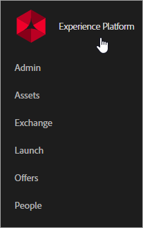

# Experience Cloud and Core Services help

The Experience Cloud is Adobe's integrated family of digital marketing solutions and services. It's also an intuitive interface that lets you quickly access your cloud solutions and core services.

 

## Core Services Product Documentation 

| Service | Description |
|--- |--- |
|[Activation](activation/activation.md)|Activation is the core service that enables you to implement and deploy Experience Cloud solutions. It includes:<ul><li>[Launch, by Adobe](https://docs.adobelaunch.com/) (the latest tag management solution)</li><li>[Dynamic Tag Manager](https://marketing.adobe.com/resources/help/en_US/dtm/)</li><li>[Triggers](activation/triggers.md)</li><li>[Auditor](https://marketing.adobe.com/resources/help/en_US/auditor/)</li><li>[Experience Cloud Debugger](https://marketing.adobe.com/resources/help/en_US/experience-cloud-debugger/)</li></ul>|
|[Administration](admin-getting-started/admin-getting-started.md)|Manage Experience Cloud user entitlements and product profiles.|
|[Assets](experience-cloud-assets/experience-cloud-assets.md)|Experience Cloud Assets provide a single, centralized repository of marketing-ready assets that you can share across solutions.|
|[Exchange](https://experiencecloud.adobeexchange.com/)|Expand your Adobe Experience Cloud functionality with the best extensions, scripts, and more. Explore with the search bar, or sort by product or app type.|
|[Feed](feed.md)|Share or post assets and Analytics reports directly with others using your Experience Cloud Feed.|
|[Mobile Services](https://marketing.adobe.com/resources/help/en_US/mobile/)|Mobile Services brings together mobile marketing capabilities for mobile applications from across the Adobe Marketing Cloud, which allows you to understand and improve user engagement with your mobile applications.|
|[People](audience-library/audience-library.md)|In the Audience Library, you can create audiences, combine existing audiences to create composite audiences, and view all shared audiences. In [Customer Attributes](attributes/attributes.md), you can also upload enterprise customer data to the Experience Cloud.|

## Administration & Enablement

* [User and product management](admin-getting-started/admin-getting-started.md) (Admin Console)
* [Enable your solutions for core services](core-services/core-services.md)
* [Frequently asked questions](admin-getting-started/admin-getting-started.md)
* [Organizations and account linking](admin-getting-started/organizations.md)
* [Experience Cloud ID service](https://marketing.adobe.com/resources/help/en_US/mcvid/)
* [Integrations](marketing-cloud-integrations.md)
* [Integrating Adobe Target with the Experience Cloud](https://marketing.adobe.com/resources/help/en_US/target/a4t/c_integrating_target_with_mac.html)
* [Experience Cloud privacy and security Overview](https://marketing.adobe.com/resources/help/en_US/xref/Adobe-Marketing-Cloud-Privacy-and-Security-Overview.pdf)
* [Profile Management in Adobe Experience Cloud](https://theblog.adobe.com/profile-management-adobe-marketing-cloud-comes-together/) (blog)
* [DNS prefetch](admin-getting-started/admin-getting-started.md#concept_6BC8C6856E3644F8956D7AD0A96383B7)

## Release Notes 

* [What's New in the Experience Cloud](marketing-cloud-interface/marketing-cloud-interface.md#concept_9A4370BD59744928BDC9F87E978798B3)
* [Release Notes - Cumulative Fixes](marketing-cloud-interface/release-notes.md#concept_F5C9FF69A5B44395BB5FA0552F4E9175)

## Community Resources & Blogs 

* [Experience Cloud Learn & Support](https://helpx.adobe.com/support/experience-cloud.html)
* [Experience League](https://landing.adobe.com/experience-league/)
* [Contact Support](https://helpx.adobe.com/contact/enterprise-support.ec.html)
* [Experience Cloud Community](https://forums.adobe.com/community/experience-cloud)
* [Adobe Training and Tutorials](https://helpx.adobe.com/learning.html?promoid=KAUDK)
* [Adobe Customer Experience Blog](https://theblog.adobe.com/customer-experience/) (blog)
* [Core Services Overview](https://theblog.adobe.com/part-2-capturing-leveraging-consumer-behavior-adobe-marketing-cloud/) (blog)
