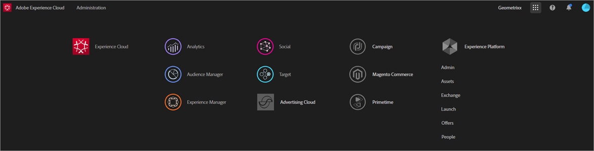

# Experience Cloud and Core Services Product Documentation

This page provides self help, support, and techical and product documentation for the Adobe Experience Cloud solutions and services. The Experience Cloud is Adobe's integrated family of digital marketing solutions and services. It's also an intuitive interface that lets you quickly access your cloud solutions and core services.

## What do you want to learn?

* [Release notes and product updates](https://docs.adobe.com/content/help/en/release-notes/experience-cloud/current.html) - What's new in the Experience Cloud, and subscribe to get updates
* [Tutorials for implementing core services](https://docs.adobe.com/content/help/en/core-services-learn/tutorials/overview.html) - Explore videos and tutorials about core services
* [Expert help at Experience League](https://landing.adobe.com/experience-league/) - Get guided learning from experts and the community
* [Education and training](https://helpx.adobe.com/learning.html?promoid=KAUDK) - Engage with Adobe to ensure that you get the most out of our products
* [Customer Experience Blog](https://theblog.adobe.com/customer-experience/) - Read the Experience Cloud blog
* [Product documentation for all Experience Cloud solutions](https://docs.adobe.com/content/help/en/experience-cloud/user-guides/home.html) - Browse for help at Experience Cloud Learn & Support
* [Customer Care](https://helpx.adobe.com/contact/enterprise-support.ec.html) - Contact Adobe Customer Care

## Core services product documetation

* [Core Services Overview](https://theblog.adobe.com/part-2-capturing-leveraging-consumer-behavior-adobe-marketing-cloud/) (blog)
* [Adobe Mobile](https://docs.adobe.com/content/help/en/mobile-services/using/home.html)
* [Audiences](https://docs.adobe.com/content/help/en/core-services/interface/audiences/audience-library.html)
* [Assets](experience-cloud-assets/experience-cloud-assets.md)
* [Customer attributes](https://docs.adobe.com/content/help/en/core-services/interface/customer-attributes/attributes.html)
* [Device Co-op](https://docs.adobe.com/content/help/en/device-co-op/using/home.html)
* [Dynamic Tag Management](https://docs.adobe.com/content/help/en/dtm/using/dtm-home.html)
* [Exchange](https://experiencecloud.adobeexchange.com/)
* [Experience Cloud ID Service](https://docs.adobe.com/content/help/en/id-service/using/home.html)
* [Experience Platform Launch](https://docs.adobelaunch.com/)
* [Experience Cloud Debugger](https://docs.adobe.com/content/help/en/debugger/using/experience-cloud-debugger.html)
* [Feed](feed.md)
* [General Data Protection Regulation (GDPR) API](https://www.adobe.io/apis/experiencecloud/gdpr.html)

## Administration & enablement

* [User and product management](admin-getting-started/admin-getting-started.md) (Admin Console)
* [Enable your solutions for core services](core-services/core-services.md)
* [Frequently asked questions](admin-getting-started/admin-getting-started.md)
* [Organizations and account linking](admin-getting-started/organizations.md)
* [Integrations](marketing-cloud-integrations.md)
* [Integrating Adobe Target with the Experience Cloud](https://docs.adobe.com/content/help/en/target/using/integrate/a4t/a4t.html)
* [Experience Cloud privacy and security Overview](assets/Adobe-Marketing-Cloud-Privacy-and-Security-Overview.pdf)
* [Profile Management in Adobe Experience Cloud](https://theblog.adobe.com/profile-management-adobe-marketing-cloud-comes-together/) (blog)
* [DNS prefetch](admin-getting-started/admin-getting-started.md#concept_6BC8C6856E3644F8956D7AD0A96383B7)
