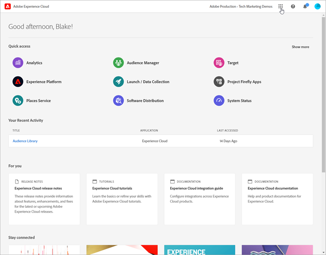
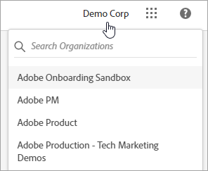
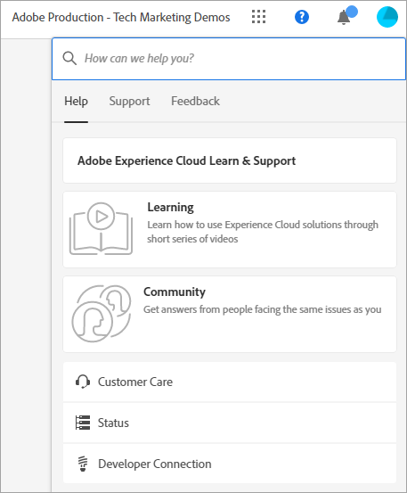
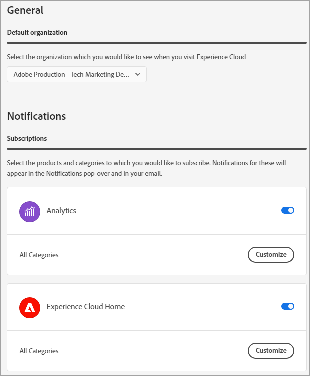
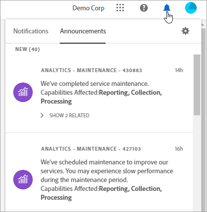

# Experience Cloud Central Interface Components Guide

[Experience Cloud](https://experience.adobe.com) is Adobe's integrated family of digital marketing applications, products, and services. From its intuitive interface, you can quickly access your cloud applications, product features, and services.

From Experience Cloud's header, you can:

* Access your applications and services
* Search for product documentation, tutorials, and community posts
* Globally search business objects using a global search (Experience Platform users only)
* Manage your account preferences (alerts, notifications, and subscriptions)

## Sign in to Experience Cloud {#signin}

Sign in and verify that you are in the right [organization](organizations.md).

1. Navigate to [Adobe Experience Cloud](https://experience.adobe.com).
1. Select **[!UICONTROL Sign in with an Adobe ID]**.
1. Verify that you are in the right organization.

    

    **Verify your organization**

    To verify that you have logged in to your correct [organization](organizations.md), click on your profile avatar to see organization name. If you have access to more than one organization, you can also view and switch to another organization right in the header bar. 

    If your organization uses Federated IDs, Experience Cloud allows you to sign in with your organization's single sign-on without the need to enter your email address and password. To do this, add `#/sso:@domain` to the Experience Cloud URL (`https://experience.adobe.com`). 
    
    For example, for an organization with Federated IDs and the domain `adobecustomer.com`, set your URL link to `https://experience.adobe.com/#/sso:@adobecustomer.com`. You can also go directly to a specific application by bookmarking this URL, appended with the application path. (For example, for Adobe Analytics, `https://experience.adobe.com/#/sso:@adobecustomer.com/analytics`.)

## Access Experience Cloud applications {#navigation}

After signing in to Experience Cloud, you can quickly access all your applications, services, and organizations from the unified header.

To access Experience Cloud applications and services provisioned for you within your organization, go the application selector .

## Browser support in Experience Cloud {#browser}

For the best performance, Experience Cloud is optimized for the most popular browsers, including the latest version, plus the two previous versions.

* Chrome
* Edge
* Firefox
* Opera
* Safari

If your browser is not listed, it may still be supported, but it is recommended that you use one of the listed browsers. 

>[!NOTE]
>
>Not all applications running on Experience Cloud domain support all browsers. If you're unsure, check the documentation of a specific application.

## Language support in Experience Cloud {#languages}

Experience Cloud supports preferred languages for each user, as set in your Adobe user account preferences. Supported languages currently are: 

* Chinese
* English
* French
* German
* Italian
* Japanese
* Korean
* Portuguese
* Spanish
* Taiwanese

While all application team are committed to global language support, not all applications are offered in all languages noted above. If your primary language is not supported in an Experience Cloud application, you can also set a secondary language to default to when applicable. This can be done in [Experience Cloud user preferences](https://experience.adobe.com/preferences).

## Get help and support {#support}

Access learning and help using the Help icon () in the header, including help content (documentation, tutorials, and courses) on [Experience League](https://experienceleague.adobe.com/#home), as well as additional resources for individual applications. You can also submit open-ended feedback and create prioritized support tickets.

The [!UICONTROL Help] menu also gives you access to:

* **[!UICONTROL Support]:** Create a support ticket or contact [!UICONTROL Support] using Twitter.
* **[!UICONTROL Feedback]:** Share feedback about your Experience Cloud experience. Your feedback is used to improve Adobe's products and services.
* **[!UICONTROL Status]:** Navigate to `https://status.adobe.com/experience_cloud` and check product operational status and [!UICONTROL Manage Subscriptions].
* **[!UICONTROL Developer Connection]:** Navigation to `adobe.io` and find developer documentation.

## Globally search for objects and entities {#search}

The global search enables you to find searchable business objects or entities in a seamless, consistent, one-click experience. This search surfaces your recently accessed objects.

>[!NOTE]
>
>The global search is not available within all Experience Cloud applications, but as more content is indexed, it will be added to relevant applications. Availability as of July 2021:

* Experience Platform
* Journey Optimizer

## User profile and account preferences {#preferences}

Experience Cloud preferences include notifications, subscriptions, and alerts. In the account preferences menu, you can:

* Specify a dark theme (not all applications support this theme)
* Search for [Organizations](organizations.md)
* Sign out
* Configure account preferences, notifications, and subscriptions

To manage preferences, select **[!UICONTROL Preferences]** from your account menu .

On [!UICONTROL Experience Cloud preferences], you can configure the following features:

| Feature | Description |
|--- |--- |
|Default [organization](organizations.md)|Select the organization that you want to see when you launch Experience Cloud. |
|[!UICONTROL Subscriptions]|Select the products and categories to which you would like to subscribe. Notifications in the [!UICONTROL Notifications] pop-over and in your email.|
|[!UICONTROL Priority]|Select the categories that you want to be considered high priority. These categories are marked with a High tag and can be configured for delivery like alerts.|
|[!UICONTROL Alerts]|Select the notifications for which you would like to see alerts displayed in your browser. Alerts appear in the top-right corner of your window for a few seconds.|
|Emails|Specify the frequency at which you would like to receive notification emails. (Not sent, instant, daily, or weekly.)|

{style="table-layout:auto"}

## Notifications and Announcements {#notifications}

Select **[!UICONTROL Notifications]** to be alerted about relevant and actionable updates, including product releases, maintenance notices, shared items, and approval requests.

## Experience Cloud domains {#domains}

Experience Cloud uses the following hosts to deliver the application, improve performance and product experience. Adobe recommends adding these domains to your firewall’s allowed list for an optimal experience. Additional domains may also be in use for specific Experience Cloud applications, such as Adobe Analytics. Check documentation for those applications for more information.

| Technology | Domains |
|--- |--- |
|Adobe Experience Cloud domains |`adobe.com`, `adobe.net`, `adobe.io` |
|Adobe Identity Management Service (IMS)|`adobelogin.com` |
|Experience Cloud fonts |`typekit.net` |
|Gainsight (for product guidance and help)|`esp.aptrinsic.com` |

## Get help on administration and cross-application services

This guide provides access to help on Experience Cloud user and product administration in the Admin Console, enabling solutions for platform services. You can also access help on the Audience Library, Customer Attributes, Experience Cloud Assets, and more:

* [[!UICONTROL Audience Library]](audience-library.md)
* [[!UICONTROL Customer Attributes]](attributes.md)
* [[!UICONTROL Triggers]](triggers.md)
* [Experience Cloud [!UICONTROL Assets]](experience-cloud-assets.md)
* [Experience Cloud cookies](cookies-privacy.md)
* [User and product management](admin-getting-started.md) (Admin Console)
* [Enable your solutions for core services](core-services.md)
* [Frequently asked questions](admin-getting-started.md)
* [Organizations and account linking](organizations.md)
* [Integrations](marketing-cloud-integrations.md)
* [Integrating Adobe Target with the Experience Cloud](https://experienceleague.adobe.com/docs/target/using/integrate/a4t/a4t.html?lang=en)
* [Experience Cloud privacy and security overview](assets/Adobe-Marketing-Cloud-Privacy-and-Security-Overview.pdf)
* [DNS prefetch](admin-getting-started.md#concept_6BC8C6856E3644F8956D7AD0A96383B7)

## Guides

Related Experience Cloud guides include:

* [Adobe Mobile](https://experienceleague.adobe.com/docs/mobile-services/using/home.html?lang=en)
* [Experience Platform Co-op Graph](https://experienceleague.adobe.com/docs/device-co-op/using/home.html?lang=en)
* [Exchange](https://exchange.adobe.com/experiencecloud)
* [Experience Cloud ID Service](https://experienceleague.adobe.com/docs/id-service/using/home.html?lang=en)
* [Experience Platform Data Collection/Launch](https://experienceleague.adobe.com/docs/launch.html?lang=en)
* [Experience Cloud Debugger](https://experienceleague.adobe.com/docs/debugger/using/experience-cloud-debugger.html?lang=en)
* [General Data Protection Regulation (GDPR) API](https://www.adobe.io/apis/experiencecloud/gdpr.html)
* [[!UICONTROL Dynamic Tag Management]](https://experienceleague.adobe.com/docs/experience-platform/tags/home.html?lang=en)

## Tutorials

Take advantage of self-help tutorials and quick how-tos in Experience League:

* [All tutorials in Experience League](https://experienceleague.adobe.com/?lang=en#quick-how-tos)
* [Experience Platform tutorials](https://experienceleague.adobe.com/docs/launch-learn/tutorials/overview.html?lang=en)
* [Real-time Customer Data Platform](https://experienceleague.adobe.com/docs/platform-learn/tutorials/application-services/rtcdp/understanding-the-real-time-customer-data-platform.html?lang=en)

## Release notes and related Experience Cloud help

* [Product documentation for all Experience Cloud solutions](https://experienceleague.adobe.com/docs/home.html?lang=en) - Browse for help at Experience Cloud Learn & Support
* [Release notes and product updates](https://experienceleague.adobe.com/docs/release-notes/experience-cloud/current.html?lang=en) - What's new in the Experience Cloud, and subscribe to get updates
* [Tutorials for implementing core services](https://experienceleague.adobe.com/docs/launch-learn/tutorials/overview.html?lang=en) - Explore videos and tutorials about core services
* [Expert help at Experience League](https://experienceleague.adobe.com/) - Get guided learning from experts and the community
* [Education and training](https://helpx.adobe.com/learning.html?promoid=KAUDK) - Engage with Adobe to ensure that you get the most out of Adobe's products
* [Customer Experience Blog](https://blog.adobe.com/en/topics/digital-transformation.html) - Read the Experience Cloud blog
* [Customer Care](https://experienceleague.adobe.com/?support-solution=General#support) - Contact Adobe Customer Care
