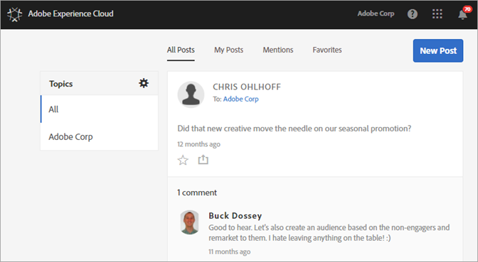
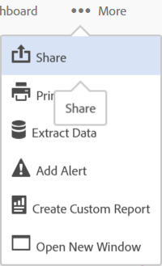

# Feed

Learn how to share or post assets and Analytics reports directly with others using your Experience Cloud Feed.

The Feed might be empty the first time you log in to the Experience Cloud. As you create posts and share things, and other users share content with you, the Feed will automatically populate to help you and your team members keep up to date. 

 

Settings in the Feed include: 

* **Topics: All \<organization name\>:** Shows all the posts that have been shared with you, and all the posts to which you have access.
* **Manage Topics:** Lets you follow, unfollow, or suggest topics. Additionally, administrators can approve, reject, deactivate, and create topics.
* **New Post:** Create posts that members of groups can see.
* **All Posts:** View all posts in your feed.
* **My Posts:** View only your posts.
* **Mentions:** View posts in which you or your group is mentioned.
* **Favorites:** View posts that you marked as favorites.

## Share an Analytics project to the Feed {#section_F2BDF9FEF4394686BAC5051CBE913EE5}

You can share reports from [!UICONTROL Reports & Analytics] to the Experience Cloud Feed. 

1. [Sign in](admin-getting-started/getting-started-experience-cloud.md#topic_AC564B6795334DE39359ADD87F52F2E0) to the Experience Cloud using your Adobe ID. 

1. Navigate to Reports & Analytics, then [create a project](https://marketing.adobe.com/resources/help/en_US/analytics/analysis-workspace/freeform_overview.html). 

1. Click **[!UICONTROL More]** > **[!UICONTROL Share]**. 

    

1. On the Share window, add recipients, then click **[!UICONTROL Share]**. 
