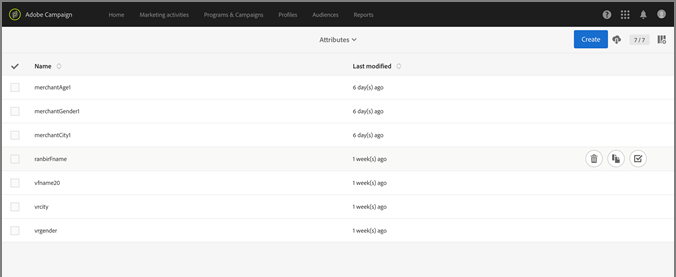
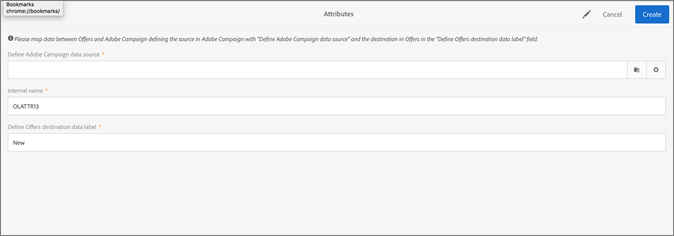
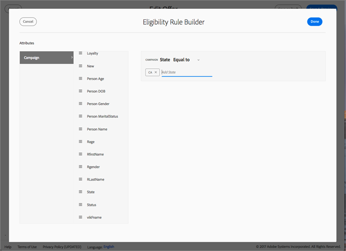
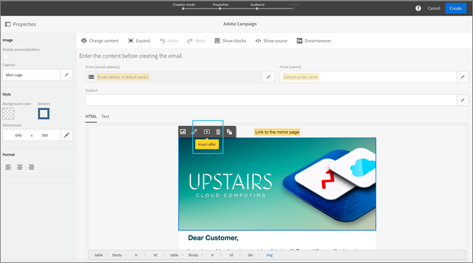
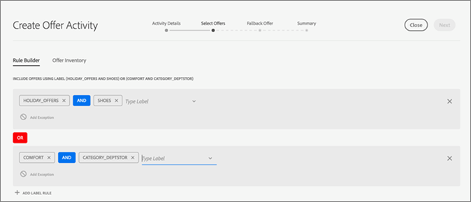
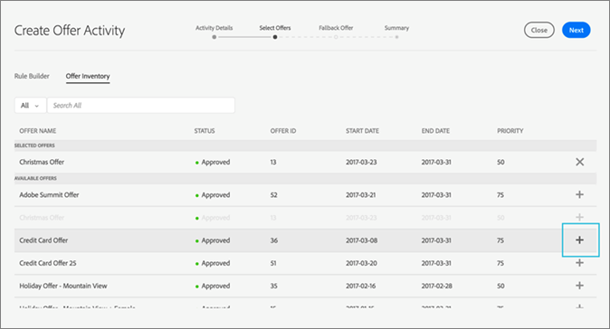

# Campaign{#campaign}

Learn how to use offers and share fields within Adobe Campaign Standard.

## Campaign {#concept_DA7A8A4F97514C1E89069BB4A8F71A75}

Learn how to use offers and share fields within Adobe Campaign Standard. 

After you create at least one fallback offer and one general offer, you can create an offer activity using an e-mail in Campaign Standard. An offer activity can be created only in a regular email campaign. It cannot be added to a transactional email campaign (for example, a recurring email triggered by an event, such as a cart abandonment email).

An offer activity will prompt you to select a group of offers and a fallback offer that could be shown in a location in an email template. The best offer to serve is selected from among those offers at email preparation time, based on the placement, date, offer status, and customer profile data. 

## Share attributes from Campaign to Offer Management {#task_4DFA9A20D7B04E1F9AFF4774D67B6EBC}

When creating an offer in Offer Management, you can set eligibility rules that restrict which profiles can receive certain offers. These eligibility rules can be set based on attributes (or fields) that exist in the Campaign profile. These fields must be shared from Campaign before they show in the Offer Management eligibility rule builder.

>[!NOTE]
>
>To share attributes, you must have administrator rights in Campaign.

1. Click the **[!UICONTROL Adobe Campaign]** logo in the upper left-hand corner of the screen to access Navigation.
1. Navigate to **[!UICONTROL Administration]** > **[!UICONTROL Instance Settings]** > **[!UICONTROL Offer Management]** and click on **[!UICONTROL Attributes]**.

   This page shows attributes that have already been shared. You can edit or delete these attributes.

   

   >[!NOTE]
   >
   >If an attribute is currently in use by Offer Management in an eligibility rule, it can not be deleted.

1. Click **[!UICONTROL Create]** in the upper right-hand corner of the screen.
1. Click the folder icon to define the Campaign data source and select the element you want to share.

   

1. Select a destination data label.

   This is the name for the attribute that will show in the eligibility rule builder in Offer Management. 1. Click **[!UICONTROL Create]**.

   The attribute will now show in the Offer Management eligibility rule builder when creating and editing offers.

   

## Create an offer activity {#task_F63ADDA52BD949779DB491E4D56E664E}

Insert an offer activity into any image or text block within an email template in Campaign Standard.

1. To insert an offer activity in an image location, click once on the image to bring up the Insert Offer icon.

   

1. (Alternative): To insert an offer activity in a text block, click twice on the text block to bring up the Insert Offer icon.
1. Fill in the details in the [!UICONTROL Activity Details] tab on the [!UICONTROL Create Offer Activity] screen:

   |  Field  | Description  |
   |---|---|
   |  Activity name  | Give your activity a name. You cannot enter an activity name that has already been used in another offer activity.  |
   |  Placement  | Select the placement that will be used for this location. This is to ensure that only offers with a content representation matching that placement are served to a user. Only offers with this placement are shown in the offer lists throughout the remainder of the activity creation.  |

1. In the [!UICONTROL Select Offers] tab, select the offers you want to include in the activity.

   You can select groups of offers using labels or individual offers one by one.

    * **Selecting groups of offers using labels:**

      To select groups of offers using labels, click the **[!UICONTROL Rule Builder]** tab, then click **[!UICONTROL Add Label Rule]**. To create rules to determine which offers to include in the offer activity, select the label. An AND operator will appear between the labels. To change the operator from AND to OR, click on the operator.

      

    * **Selecting individual offers:**

      To select individual offers, click the **[!UICONTROL Offer Inventory]** tab. A user can search within the offer list by offer name, offer ID, or labels that have been added to the offer.

      Click the plus sign to add the offers to the Selected Offers section of the list.

      

       For an offer to be available in both rule builder and your offer inventory, it must:

    * Match today's date. 
    * Have a status of approved. 
    * Have a content representation with a placement matching the one selected in Step 1.

       >[!NOTE]
       >
       >The offers listed in the Offer Inventory tab are filtered by placement and approval status only. They have not been filtered to match the targeting criteria set for the email in Adobe Campaign.

1. On the [!UICONTROL Fallback Offer] tab, select a fallback offer. The fallback offer is sent only to a customer if they are not eligible for other offers. You can select only one fallback offer from the list.
1. View the summary of your offer activity and click **[!UICONTROL Done]**.

   The best offer to serve each user will be determined at email preparation time by evaluating the following:

* **Placement check: **All offers must have a content representation that matches the placement selected as part of the offer activity. If a placement for an offer is deleted between activity creation time and preparation time (if time is greater than three minutes), that offer is not considered. 
* **Date check: ** All offers must be valid for the current date (this is **not** the offer send date). The date when you prepare the email campaign is the date that determines which offer to serve. For example, if you prepare an email campaign on 1/15/17, and one of the offers selected is not valid until 1/16/17, the offer is not served. 

* **Eligibility rule check: ** All offers must satisfy the [eligibility rules](offers.md#task_6C4AE487377D424FA133ACCA6AF741D4). 

* **Priority check: ** If a user is eligible for multiple offers, Offer Management uses the user-set priority to determine which offer to show each user.

   Your email is now ready to be sent. Select the [!UICONTROL Reports] tab on the [!DNL Adobe Campaign] homepage to check how your offers performed.

   For additional information on using Adobe Campaign, see the following guides:

* [Creating an email](https://docs.campaign.adobe.com/doc/standard/en/CHA_Email_messages_Creating_an_email.html) 
* [Sending an email](https://docs.campaign.adobe.com/doc/standard/en/SEN_Sending_and_tracking_messages_Confirming_send.html) 
* [About dynamic reports](https://docs.campaign.adobe.com/doc/standard/en/RPT_About_reporting_About_dynamic_reports.html)

