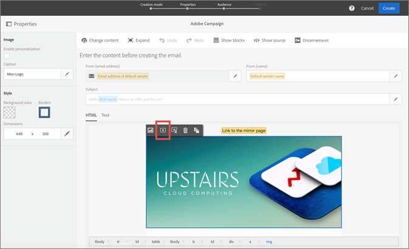

# Adobe Offer Management {#section_07CBD4C01F4049A5A19781737D2DCD35}

[!UICONTROL Offer Management] provides offer creation, management, and decisioning across all channels in the Experience Cloud. It serves as a central offer catalog where you can associate eligibility rules and multiple pieces of content with each offer _object._ You can publish those offers across channels and locations, and serve the best offer for each customer at each interaction. These features enable you to continuously deliver the best offer to your customers in a way that is consistent and coordinated across their experience.

Benefits include:

* Improved e-mail campaign performance by delivering more personalized offers in your emails.
* Improved workflow: Instead of creating multiple deliveries or campaigns, marketing teams can improve the workflow by creating a single delivery and vary the offers in different parts of the template.
* Enables you to create, manage, and approve offers outside of the Adobe Campaign Standard e-mail campaign workflow.
* Control over the number of times an offer is shown across e-mail campaigns and customers.

## Accessing Offers {#task_DEB6F6A4B6E04E15AD3E1817D700688E}

Learn how to access Offer Management.

1. Contact Adobe for provisioning.

   An Experience Cloud organization must have an instance of Campaign Standard. Adobe can also enable a feature in Campaign that lets you create offer activities within e-mails. 

1. From the Experience Cloud navigation menu, click the solution selector, then click **[!UICONTROL Offers]**.

   

   To access Offers in Campaign Standard, click the **[!UICONTROL Offers]** icon within an email template.

   

   Once you see both of these items in the Marketing Cloud, and within your Adobe Campaign account, you have been setup with the necessary functionality to get started. 

## Users and Permissions {#concept_81F0ABB07ACC49E099EDCD87AA0436E1}

Administrators can add users to [!UICONTROL Offer Management] in the Admin Console. An email invitation is sent to the new user with instructions on accessing the product. Once a user is added, you can adjust their permissions, giving them access to different functionalities throughout [!UICONTROL Offer Management].

For more information ion using the Admin Console, see the [HelpX Admin Console documentation](https://helpx.adobe.com/enterprise/help/aedash.html).

In Campaign, standard users automatically have the right to embed offer activities in an email template.

>[!NOTE]
>
>For beta, there are no permissions in place. Every user that has been added to Offers will have full access to all functionality within [!UICONTROL Offer Management].

## Create a product profile for Offer Management

A product profile is a set of permissions that can be combined to create a user role within a product. Product profiles must be created and users or groups are then assigned to them.

1. Navigate to the Adobe [Admin Console](https://adminconsole.adobe.com/).

1. Click your proct (**[!UICONTROL Offers]**, for example).

1. On the [!UICONTROL Product Pofiles] page, click **[!UICONTROL New Profile]**.

1. Type a name and description for the product profile, then click **[!UICONTROL Done]**.

1. Click **[!UICONTROL Save]**.

### Permissions - definitions

A description of [!UICONTROL Offer Management] permissions available for product profiles in the [!UICONTROL Admin Console].

| Element | Description |
|--- |--- |
|Create and edit offers| Gives users access to create and edit offers in [!UICONTROL Offer Management]. If a user has this permission but not the _Approve offers_ permission, the user can only create an offer and submit it for approval. It cannot be used in an offer activity until it has been approved.|
|Delete offers|Gives users access to delete offers. |
|Approve offers|Gives users the ability to approve an offer. Users with this permission will see a notification when logging in to Offer Management if any offers need approval. If a user has both this permission and the _create and edit offers_ permission, he can create and approve offers in a single workflow. |
|Archive offers|Gives users the ability to archive an offer. |
|Create labels|Gives users the ability to create labels, both in the Label tab and in-line in the offer creation screen. Without this permission, a user will only be able to select pre-created offers when creating an offer. |
|Edit labels| Gives user the ability to edit labels in the Labels tab.|
|Delete labels|Gives user the ability to delete labels in the Labels tab. |
|Create placements|Gives user the ability to create placements in the Placements tab. |
|Edit placements|Gives user the ability to edit placements in the Placements tab. |
|Delete placements|Gives user the ability to delete placements in the Placements tab. **Note:** Only placements not used in an offer activity can be deleted. |