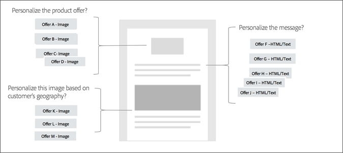
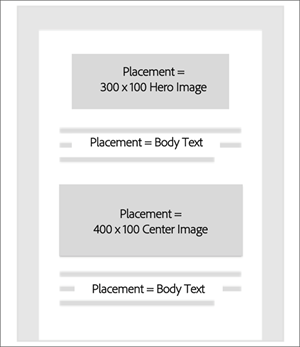
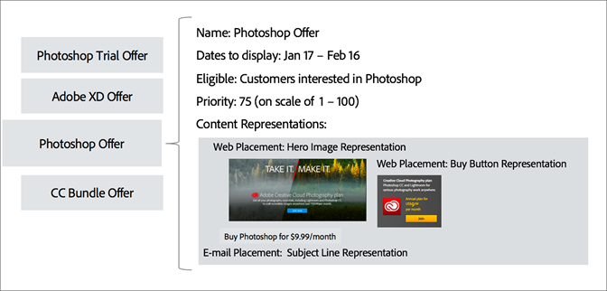
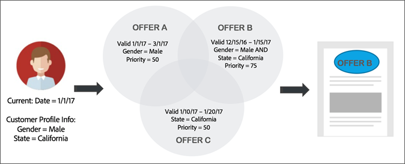

# Offer Management Workflow{#offer-management-workflow}

Learn the high-level workflow of Offer Management, including placement and offer creation, inserting offer activities, and viewing reports.

## Step 1 - Determine where in your email templates you need personalized offers {#section_F184E589428B403EA8EB921BF230CF87}

Identify in which email campaigns you would like to insert personalized offers. From there, determine the locations within your email template to insert these offers. For example, you might want to modify the product offer based on the customer's industry or persona, change the message based on the same criteria, and vary the image based on the customer's geography.

## Step 2 - Determine which attributes from Campaign you wish to target and share them with Offer Management {#section_1461F1FAC0B943E5BBDED6B3B00E9D5C}

When creating an offer in Offer Management, you can set eligibility rules that restrict which profiles can receive certain offers. These eligibility rules can be set based on attributes (or fields) that exist in Adobe Campaign. These fields must be shared from Campaign by an admin-level user before they show in the Offer Management eligibility rule builder.

For information on sharing these attributes, see [Share attributes from Campaign to Offer Management](campaign.md#task_4DFA9A20D7B04E1F9AFF4774D67B6EBC).

## Step 3 - Enter required placements in Offer Management {#section_71619756A86F4DB58B8200D8A1CE1B87}

A placement helps ensure that the right offer content shows up in the right location within your email template. When you add content to an offer, you will be asked to select a placement in which that content can be shown.

You can have multiple locations with the same placement. In the following example, there are two placements for two different size images and a single placement for the text that displays at the top and bottom of the template.

After you determine the placements that you need, you can add them to the [!UICONTROL Placement] tab.

## Step 4 - Create your offers {#section_C4F9732B0596425EB0BD5AE76E4BA6EF}

Create the offers that you will use in your email campaign. There is data and content that can be added to the offer to determine the best offer to serve and determine what content to show. When you create a content representation, associate it with one of the placements defined in [Placements](placements.md#topic_A412442D4168497D981DE1C3AA1C9B61). Once you create and submit an offer, it will be available for use in an offer activity.

## Step 5 - Create your email campaign and insert an offer activity {#section_6FD36404759B4C6E9FD3A65ACABB26C8}

Now that you've created your offers, you can use them in an email campaign. On the content editor, you can select a block and insert an offer activity. An offer activity allows you to select a group of offers from your offer inventory, from which the decision engine will determine the best offer to serve each user.

## Step 6 - Prepare and send your email campaign {#section_EDD8EA4696664130A678D7C4483DA806}

Now, when you prepare your email campaign, Offer Management will determine the best offer to serve each visitor based on the current date, profile attributes, and priority. It also determines whether there is a content representation available for that location's placement.

In the following example, assume you have setup an email campaign with an offer activity containing 3 offers (A, B, C). You can determine which offer to serve in one of the locations in our email. At preparation time, Offer Management will:

1. Analyze the current date, profile data of each user, and priority. 
1. Compare that information against the data on the offers. 
1. Determine the best offer to serve.

## Step 7 - View reports {#section_2104BAACAE154DE29B6EEB967C46F226}

You can view a report on what offers were served and how they performed in an offer activity. This report can be viewed by selecting the reports tab in Adobe Campaign Standard homepage. 
