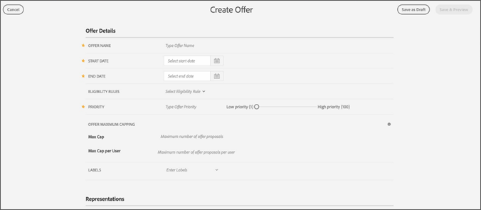

# Offers

Create and manage offers to be used in Adobe Campaign.

There are two types of offers in [!UICONTROL Offer Management]: 

|  Type  | Description  |
|---|---|
|  General offer |Enables you to fill out the complete offer data model (eligibility rules, start and end dates, and content).  |
|  Fallback offer |The last resort offer if a customer is not eligible for any of the other offers selected. You cannot associate any eligibility rules or start and end dates with fallback offers.  |

>[!NOTE]
>
>In an offer activity, you will always be asked to select a fallback offer. Thus, you must have at least one fallback offer in your offer inventory before you can create an offer activity.

## Create an offer {#task_6C4AE487377D424FA133ACCA6AF741D4}

Create an offer to add to your offer inventory.

1. From the [!UICONTROL Inventory] tab in [!UICONTROL Offer Management], click **[!UICONTROL Create New Offer]**, then select **[!UICONTROL Create Offer]**.

   

1. Complete the following fields:

    <table id="table_60A4001CE9F34422ACB59FB62C9CBDCD"> 
 <thead> 
  <tr> 
   <th colname="col1" class="entry"> Field </th> 
   <th colname="col2" class="entry"> Description </th> 
  </tr>
 </thead>
 <tbody> 
  <tr> 
   <td colname="col1"> 
Offer name 
 </td> 
   <td colname="col2"> 
The name that is associated with the offer. You cannot have two offers in your inventory with duplicate names. 
 </td> 
  </tr> 
  <tr> 
   <td colname="col1"> 
Start date 
 </td> 
   <td colname="col2"> 
The date on which the offer can be shown. If a start date of 1/15/17 is selected, the offer can be shown starting at 12:00 a.m. on 1/15/17. 
 
Offer Management operates on the UTC time standard. This means that: 
 
 
     <ul id="ul_A9D49B4405F34E6DA8FB52A13437F799"> 
      <li id="li_9490D092B235479A981FC2D5DD0B17B4">Offers become valid at 00:00 UTC on the day that the offer is set to start. </li> 
      <li id="li_C28BB1FEB9E1495593826403CF5F67A9">Offers expire at 00:00 UTC on the day following the end date. For example, if an offer is set to have an end date of 5/14, the offer will expire at 00:00 UTC on 5/15. The offer is then archived. </li> 
      <li id="li_D3F7DCD1BF75410A8F4F5BC468B667AB">When emails are prepared in Adobe Campaign, only offers that are valid at that point in time will be shown. </li> 
     </ul> 
 </td> 
  </tr> 
  <tr> 
   <td colname="col1"> 
End date 
 </td> 
   <td colname="col2"> 
The date on which the offer ends. If an end date of 1/20/17 is selected, the offer is no longer shown after 11:59PM on 1/20/17. When an offer passes its end date, it is automatically archived. 
 
Offer Management operates on the UTC time standard. See the row above for more information. 
 </td> 
  </tr> 
  <tr> 
   <td colname="col1"> 
Eligibility rules 
 </td> 
   <td colname="col2"> 
You can create offer eligibility rules based on data available in the  Campaign database. Eligibility rules determine to whom and when an offer can be shown. 
 
For example, you can specify that you only want a 'Women's Winter Clothing Offer' to be shown when (Gender = 'Female') and (Region = 'Northeast'). The attributes used to build these rules come from the Campaign Standard profile. 
 
 
Note:  When you first access Offer Management, there are no attributes available in the rule builder. You must share attributes from the Campaign UI. Once shared, those attributes are available. 
 
 </td> 
  </tr> 
  <tr> 
   <td colname="col1"> 
Max cap 
 </td> 
   <td colname="col2"> 
The maximum times that an offer can be proposed. 
 
 
Note:  The number of times an offer is proposed is calculated at email preparation time. For example, if you prepare an email with a number of offers, those numbers count towards your max cap regardless of whether or not the email is sent. 
 
 </td> 
  </tr> 
  <tr> 
   <td colname="col1"> 
Max cap per user 
 </td> 
   <td colname="col2"> 
The maximum times that an offer can be proposed to a given user. 
 
 
Note:  The number of times an offer is proposed to a given user is calculated at email preparation time. For example, if you prepare an email with a number of offers, those numbers count towards your max cap per user regardless of whether or not the email is sent. 
 
 </td> 
  </tr> 
  <tr> 
   <td colname="col1"> 
Labels 
 </td> 
   <td colname="col2"> 
Add labels to an offer to group them together. You can type and press enter to create a new label or start typing and select an existing offer from the drop-down. 
 </td> 
  </tr> 
 </tbody> 
</table>

1. Fill in the representations details.

   |  Field  | Description  |
   |---|---|
   |  Channel  | The channel in which this content representation can be delivered. Campaign Standard emails is the only channel currently available.  |
   |  Placement  | Select the placement in which this content representation can be delivered. Placements are pre-populated from the Placements tab. You must associate each content representation with a placement from the drop-down menu. You cannot create multiple content representations with the same placement in the same offer.  |
   |  Content type  | Select a content type of an image, image URL, text, or HTML.  |
   |  Redirect link  | This field is displayed if you select a content type of image or image URL. This is the link that the user will get re-directed to if they click on that offer in an e-mail.  |

1. Click **[!UICONTROL Save & Preview]** to review the details of your offer before submission.
1. Click **[!UICONTROL Approve]** to approve the offer. Once the offer is in the approved state, it can be used in an offer activity.

   If you do not have the required permissions to approve an offer, you will instead click **[!UICONTROL Submit]**. The offer will then show in the offer library with a pending status. Once a user with approval rights approves it, it will be available for use in an offer activity.
