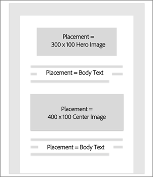
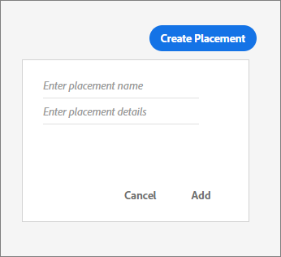

# Placements{#placements}

Create and manage Placements for your Offer Activities.

## Placements {#topic_A412442D4168497D981DE1C3AA1C9B61}

Create and manage Placements for your Offer Activities. 

Before creating offers, you must create placements. When you add content to an offer, specify in which placement that content representation can be shown. Placements let you control that the right pieces of content show up in the right locations across your e-mail campaigns (for example, ensuring that a square image doesn't show up in a rectangular placement).

In the example below, there are two placements for two different size images and a single placement for the text that shows up at the top and bottom of the template.

## Create a placement {#task_89CD5692D86243A2B2E9BD5F7BAF52FB}

1. On the [!UICONTROL Placements] tab, click **[!UICONTROL Create Placement]**.

   

1. Enter a placement name and placement details.

   You can define placements in multiple ways (such as by content size or based on a position in an e-mail). 

1. Click **[!UICONTROL Add]**.
