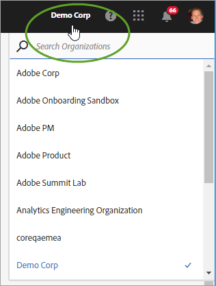
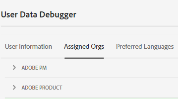
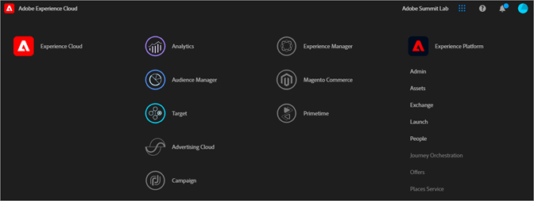
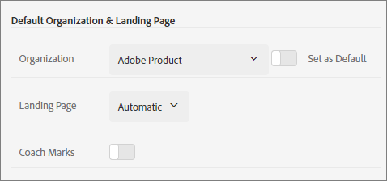

# Organizations in Experience Cloud

Learn about managing and switching organizations in Experience Cloud.

## Identify your organization {#concept_384D169B0B724B799D573B8ECB5C39BF}

An *organization* (Org ID) is the entity that enables an administrator to configure groups and users, and to control single sign-on in the Experience Cloud. The organization functions like a log-in company that spans all the Experience Cloud products and applications. Most often, an organization is your company name. However, a company can have many organizations. 

To verify that you have logged in to your correct organization, click on your profile avatar to see organization name. If you have access to more than one organization, you can also view and switch to another organization right in the header bar. 

If your organization uses Federated IDs, Experience Cloud allows you to sign in with your organization's single sign-on without the need to enter your email address and password. To do this, add `#/sso:@domain` to the Experience Cloud URL (`https://experience.adobe.com`). 
    
For example, for an organization with Federated IDs and the domain `adobecustomer.com`, set your URL link to `https://experience.adobe.com/#/sso:@adobecustomer.com`. You can also go directly to a specific application by bookmarking this URL, appended with the application path. (For example, for Adobe Analytics, `https://experience.adobe.com/#/sso:@adobecustomer.com/analytics`.)

 

## View your organization ID {#concept_EA8AEE5B02CF46ACBDAD6A8508646255}

You might need to locate your assigned organization ID for support purposes. You can verify that you are in the correct organization, or switch between organizations, using the **[!UICONTROL Organization]** menu.

The organization ID is the ID associated with your provisioned Experience Cloud company. This ID is a 24-character alphanumeric string, followed by (and must include) `@AdobeOrg`.

You can view your organization ID, along with other account information, using a the keyboard shortcut **Ctrl+i** from any page at `https://experience.adobe.com`.

**To view your organization ID**

1. In [Experience Cloud](https://experience.adobe.com.), press **Ctrl+i** on your keyboard.

    

1. Under **[!UICONTROL User Information]**, look for **[!UICONTROL Current Org ID]**, and you will see the organization ID.

   Alternatively, administrators can log into the Admin Console (Navigate to [https://adminconsole.adobe.com](https://adminconsole.adobe.com)) and view your organization ID in the URL. 

   For example, in the following URL: 

   `https://adminconsole.adobe.com/C538193582390300A495CC9@AdobeOrg/overview` 

   The ID is: 

   `C538193582390300A495CC9@AdobeOrg`

## Link an application account to an Adobe ID {#task_FD389E78640848919E247AC5E95B8369}

Typically, Experience Cloud administrators grant access to applications and services. In rare circumstances, you may need to link application credentials to an Adobe ID.

1. Follow the steps in your email invitation to the Experience Cloud.
1. Log in using your Adobe ID or Enterprise ID.
1. Select the application selector. ( ).

   

   The applications to which you have access are colored.
1. Select the desired application.

   

   This type of message displays if you are part of the appropriate group (and have permission to the application) but have not yet linked your account credentials to your Adobe ID.
1. Select **[!UICONTROL Link Account]**, then provide your credentials.

## Specify a default organization and landing page {#concept_6A191B42A9874A9780882903BA18F071}

You can specify a default organization and landing page to use when you log in.

In your profile, select **[!UICONTROL Edit Profile]**.

Under Default Organization & Landing Page, you can customize your log-in experience.

## Troubleshoot account linking issues {#concept_DFCB29A3B4834FC59AA29E0BBA301584}

Help on problems that arise from account linking.

Typically, account linking fails because the Adobe ID is linked to a previous user. When account linking fails, you can:

* [Contact Adobe Support](https://experienceleague.adobe.com/?support-solution=General#support).
* Access your application using the standard login while the issue is being solved.
