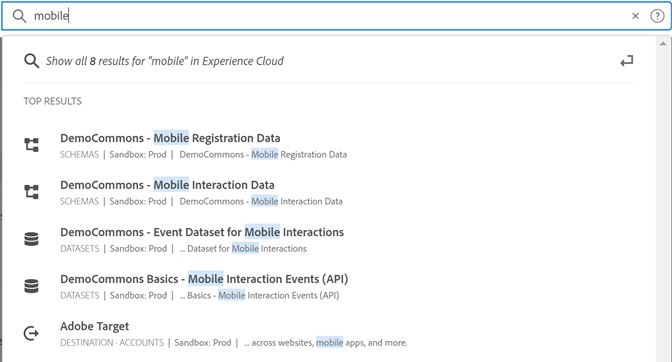

# [!UICONTROL Unified Search] for objects and entities {#globally-search}

The [!UICONTROL Unified Search] search enables you to find searchable business objects or entities in a seamless, consistent, one-click experience. This search surfaces your recently accessed objects, too.

## Accessing Unified Search

Unified Search is available on every page in the Experience Cloud header at the top of the page. You can also use the keyboard shortcut `command /` or `ctrl /` to access the search.

This feature is available only for supported products, which currently are:

* Experience Platform (AEP)
* Journey Optimizer (AJO)

As more content is indexed, this feature is added to relevant applications.

## Searchable objects and fields

As you type, the matching top results from the Objects you have access to display.

Our algorithms show the most relevant records first. The order of results depends on several factors, such as:

Your capability and object permissions
Matching percentage
Whether there is an exact match

Searchable business objects include:

* Segments (Name, Description, ID)
* Schema (Name, Description, ID)
* Datasets (Name, Description, ID)
* Sources (Name, Description, ID)
* Destinations (Name, Description, ID)
* Queries (Name, Description, ID)
* Messages (Name, Description, ID)
* Offers (Name, Description, ID)
* Components (Name, Description, ID)
* Journeys (Name, Description, ID)

If a keyword matches a navigation page, you can get quick access link to the navigation page example datasets. The top results section shows the Top 30 results.

You also find the help articles from Experience League and Communities. Natural languages queries are supported. 

For example, _How to create a schema_ produces results from Experience League under _[!UICONTROL Learning]_:

Search algorithms display the most relevant records first. The order of results depends on several factors, such as:

* User permissions to access objects
* Matching percentage
* Exact matches
* The _[!UICONTROL Top Results]_ section shows the Top 30 results. 

To refine your search, click one of the following:

* **[!UICONTROL All Learning]**: Opens the search in Experience League.
* **[!UICONTROL Show all...]**: Lets you further refine and filter results.

## Unified Search features

The following features are available in Unified Search.

| Feature | Description |
| ------- | ------- |
| Global language support | Global search understands queries and produces results for German, Spanish, French, Italian, Japanese, Korean, Portuguese, and Chinese. |
| Typo-tolerance | Unified search provides robust typo-tolerance using advanced algorithms. These algorithms compute edits and provide appropriate results. |
|Highlighting | Search response highlights the matching keyword from the search query so that you can easily find the section and words that match your query. Highlighting also works for misspelled words.|
| Snippets | In the search response, you can see a snippet of the result. Snippets return the matching words and some content around the matching keywords. |
| Stop Words | Some commonly used words in English are defined as _stop words_. If stop words are included in search query, less weight is given to them.  Stop words include: _a, an, and, are, as, at, be, but, by, for, if, in, into, is, it, no, not, of, on, or, such, that, the, their, then, there, these, they, this, to, was, will, with_.  Stop words are not supported in other global languages. |
| Natural Language Queries | When you search for a help article or discussion from Experience League Communities, you can type your question using natural language and get the response. Example search: "How do I create a schema?" |
| Exact Search in quotes | You can do an exact search by using quotation marks in the query. No typo correction is done on exact mach queries. For example: "Luma Journey 2022". |
| Filters | You can apply filters like _Object type_ and other object-specific filters on the full search results pop-up. When you press Enter after tying the search query, a full page pop-up opens that includes the filters.|

{style="table-layout:auto"}

## Can't find it?

Try these tips:

* Enter a more specific search term
* Check the spelling
* Try to write the complete search term
* Make sure you have the permissions to objects you search for
