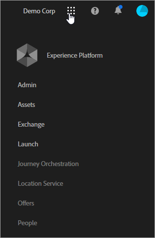

# About the new cloud names in Experience Cloud {#topic_BD726D3A649E4FC49063029E86B70C62}

Learn about latest branding updates for the clouds, how to navigate the interface, and where to find help for solutions and core services.

## New cloud names {#concept_3D567681C3C94989AD1A30A1C5C41609}

The latest cloud names and the solutions in each cloud:

[Experience Cloud](https://www.adobe.com/experience-cloud.html?promoid=FZPQZ2HS&mv=other)

Replaces *Marketing Cloud* as the parent cloud name for all Adobe's digital experience solutions and services.

>[!NOTE]
>
>You might continue to see references to *Marketing Cloud* in its previous, broader context until all the solution interfaces are re-branded to *Enterprise Cloud.* 

[Marketing Cloud](https://www.adobe.com/marketing-cloud.html) 

Includes the following solutions:

* Adobe Experience Manager
* Adobe Campaign
* Adobe Target
* Adobe Primetime
* Adobe Social

[Analytics Cloud](https://www.adobe.com/data-analytics-cloud.html)

Includes the following solutions:

* Adobe Analytics
* Adobe Audience Manager

[Advertising Cloud](https://www.adobe.com/advertising-cloud.html)

Includes Media Optimizer and TubeMogul.

## What are the solutions? {#concept_4F52341A45DC49B2B216824B14D54FDA}

The following information briefly describes the solutions and provides links to help. [Use case recipes](https://helpx.adobe.com/marketing-cloud/how-to/use-cases.html) are also available to help you with digital marketing workflows.

[Adobe Analytics](https://docs.adobe.com/content/help/en/analytics/landing/home.html)

To get started in Analytics:

1. Create your first Analytics report suite (data repository) using the steps described in [Getting Started with Adobe Analytics](https://docs.adobe.com/content/help/en/analytics/analyze/analysis-workspace/home.html).
1. Then, deploy Analytics code using [Experience Platform Launch](https://docs.adobe.com/content/help/en/launch/using/intro/get-started/quick-start.html).

Experience Platform Launch is the next-generation of tag management and gives you a simple way to deploy and manage all the analytics, marketing, and advertising tags.

See also:

* [Which Analytics products should I use?](https://docs.adobe.com/content/help/en/analytics/admin/admin-overview/which-analytics-tool.html)
* [Analytics product comparison and requirements](https://docs.adobe.com/content/help/en/analytics/admin/admin-overview/analytics-product-comparison.html)

[Adobe Target](https://docs.adobe.com/content/help/en/target/using/target-home.html)

Adobe Target integrates with Analytics and other Experience Cloud core services. Useful getting started topics:

* [Setting up Target](https://docs.adobe.com/content/help/en/target/using/administer/administrating-target.html)
* [How Adobe Target works](https://docs.adobe.com/content/help/en/target/using/introduction/how-target-works.html)
* [Administrator first steps](https://docs.adobe.com/content/help/en/target/using/administer/start-target.html)
* [Use Analytics as the reporting source for Adobe Target](https://docs.adobe.com/content/help/en/target/using/integrate/a4t/a4t.html)

[Adobe Experience Manager](https://helpx.adobe.com/support/experience-manager/6-5.html)

As a content management solution, Adobe Experience Manager makes it easy to manage your assets and content for your websites, mobile apps, communities, and forms.

See [Adobe Experience Manager 6.5](https://helpx.adobe.com/support/experience-manager/6-5.html) for help.

[Adobe Audience Manager](https://docs.adobe.com/content/help/en/audience-manager/user-guide/aam-home.html)

As a data management platform, Adobe Audience Manager helps you build unique audience profiles, so you can discover and target your most valuable customer segments on every channel.

[Adobe Advertising Cloud](https://docs.adobe.com/content/help/en/release-notes/experience-cloud/current.html#adcloud)

Adobe Advertising Cloud is a programmatic ad-buying solution. It helps you find and forecast the best mix of ad channels based on your budget, then automates the delivery of content right to your audience.

[Adobe Campaign](https://docs.adobe.com/content/help/en/campaign-standard/using/getting-started/about-adobe-campaign/campaign-orchestration.html) 

Adobe Campaign lets you plan, deliver, and measure campaigns across all your online and offline channels. It helps increase your productivity and deliver relevant experiences to your customers.

[Adobe Primetime](https://help.adobe.com/en_US/primetime/)

Adobe Primetime is a multi-screen TV platform that helps broadcasters create engaging TV and film experiences that are personalized for any audience.

## What are core services? {#concept_38AC4888C3F84694AE4F60311C21B9C2}

[Core services](https://docs.adobe.com/content/help/en/core-services/interface/about-core-services/core-services-landing.html) include features that simplify product implementation and enable cross-solution workflows, such as audience segmentation, customer attribute uploading, and collaboration tools.

