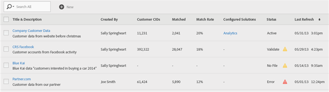
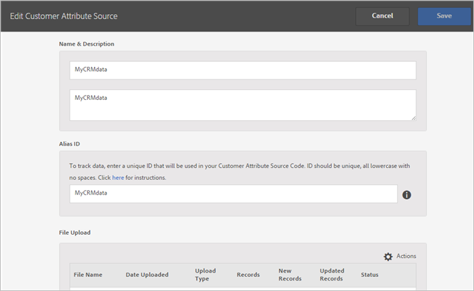
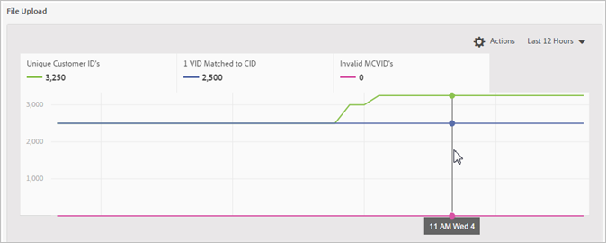
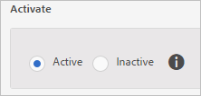

# Create a Customer Attribute source and upload the data file

Create the Customer Attribute source (CSV and FIN files) and upload the data. You can activate the data source when you are ready. After the data source is active, share the attribute data to Analytics and Target. 

## Customer Attributes workflow {#concept_BF0AF88E9EF841219ED4D10754CD7154}

 

1. [Create a data file](t-crs-usecase.md#task_B5FB8C0649374C7A94C45DCF2878EA1A)
1. [Create the attribute source and upload the data file](t-crs-usecase.md#task_09DAC0F2B76141E491721C1E679AABC8)
1. [Validate the schema](t-crs-usecase.md#task_09DAC0F2B76141E491721C1E679AABC8)
1. [Configure subscriptions and activate the attribute source](t-crs-usecase.md#task_1ACA21198F0E46A897A320C244DFF6EA)

After the data source is active, you can: 

* [Use Customer Attributes in Adobe Analytics](t-crs-usecase.md#task_7EB0680540CE4B65911B2C779210915D)
* [Use Customer Attributes in Adobe Target](t-crs-usecase.md#task_FC5F9D9059114027B62DB9B1C7D9E257)

>[!IMPORTANT]
>
>To access this feature, users must be assigned to the Customer Attributes product profile (Customer Attributes - Default Access. Navigate to **[!UICONTROL Administration]** > **[!UICONTROL Admin Console]** > **[!UICONTROL Products]**. If *Customer Attributes* displays as one of the [!UICONTROL Product Profiles], you are ready to begin. Users that are added to the Customer Attributes group sees the [!UICONTROL Customer Attributes] menu on the left side of the Experience Cloud interface. 
>
>To use the Customer Attributes feature, users must also belong to application-level groups (Analytics or [!DNL Target]). 

See [Manage Experience Cloud users and products](admin-getting-started.md#task_3295A85536BF48899A1AB40D207E77E9). 

## Create a data file {#task_B5FB8C0649374C7A94C45DCF2878EA1A}

This data is enterprise customer data from your CRM. The data might include subscriber data for products, including member IDs, entitled products, most-launched products, and so on.

1. Create a `.csv`.

   >[!NOTE]
   >
   >Later in this process, you drag-and-drop the `.csv` to upload the file. However, if you [upload via FTP](t-upload-attributes-ftp.md#task_591C3B6733424718A62453D2F8ADF73B), you also need a `.fin` file with the same name as the `.csv`. 

   Sample enterprise customer data file: 

    

1. Before continuing, review the important information in [Data File Requirements](crs-data-file.md#concept_DE908F362DF24172BFEF48E1797DAF19), before you upload the file.
1. [Create a Customer Attribute source and upload the data](t-crs-usecase.md#task_BCC327B2A0EF4A1BBB2934013AB92B78), described below.

## Create the attribute source and upload the data file {#task_09DAC0F2B76141E491721C1E679AABC8}

Perform these steps on the Create New Customer Attribute Source page in the Experience Cloud.

>[!IMPORTANT]
>
>When creating, modifying, or deleting Customer Attribute sources, there is a delay of up to one hour before IDs begin synchronizing with the new data source. You must have administrative rights in Audience Manager to create or modify Customer Attribute sources. Contact Audience Manager Customer Care or consulting to obtain administrative rights.

1. In the [!DNL Experience Cloud], select the Menu   icon.
1. Under **[!DNL Experience Platform]**, select **[!UICONTROL People]** > **[!UICONTROL Customer Attributes]**.

   The [!UICONTROL Customer Attributes] page is where you can manage and edit existing attribute data sources. 

    
1. Select **[!UICONTROL New]**.

    
1. On the [!UICONTROL Edit Customer Attribute Source] page, configure the following fields:

    * **[!UICONTROL Name:]** A friendly name for the data attribute source. For [!DNL Adobe Target], attribute names cannot include spaces. If an attribute with a space is passed, [!DNL Target] ignores it. Other characters not supported include: `< , >, ', "`. 
    
    * **[!UICONTROL Description:]** (Optional) A description of the data attribute source. 
    
    * **[!UICONTROL Alias ID:]** Represents a source of Customer Attribute data, such as a specific CRM system. [!UICONTROL Alias ID] is a unique ID that is used in your Customer Attribute Source code. The ID should be unique, lowercase, with no spaces. The value that is entered in the [!UICONTROL Alias ID] field for a Customer Attribute source in Experience Cloud should match the values that are being passed in from the implementation (whether via Data Collection (Launch), Dynamic Tag Management, or JavaScript of the Mobile SDK.) 
    
      The Alias ID corresponds to certain areas where you set additional Customer ID values. For example: 
    
        * **Dynamic tag management:** The Alias ID corresponds to the *Integration Code* value under [!UICONTROL Customer Settings], in the [Experience Cloud ID Service](https://experienceleague.adobe.com/docs/experience-platform/tags/home.html?lang=en) tool. 
        
        * **Visitor API:** The Alias ID corresponds to the additional [Customer IDs](https://experienceleague.adobe.com/docs/id-service/using/reference/authenticated-state.html?lang=en) that you can associate with each visitor. 
        
          For example, *"crm_id"* in: 
        
          ```
          "crm_id":"67312378756723456"
          ```
       
        * **iOS:** The Alias ID corresponds to *"idType"* in [visitorSyncIdentifiers:identifiers](https://experienceleague.adobe.com/docs/mobile-services/ios/overview.html?lang=en). 
        
          For example: 
               
          `[ADBMobile visitorSyncIdentifiers:@{@<`**`"idType"`**`:@"idValue"}];` 
        
        * **Android™:** The Alias ID corresponds to *"idType"* in [syncIdentifiers](https://experienceleague.adobe.com/docs/mobile-services/android/overview.html?lang=en). 
        
          For example: 
        
          `identifiers.put(`**`"idType"`**`, "idValue");`
        
          See [Leveraging multiple data sources](crs-data-file.md#section_76DEB6001C614F4DB8BCC3E5D05088CB) for additional information about data processing regarding the Alias ID field and Customer IDs. 
        
    * **[!UICONTROL File Upload:]** You can drag-and-drop the `.csv` data file, or upload the data via FTP. (Using FTP also requires a `.fin` file.) See [Upload the Data via FTP](t-upload-attributes-ftp.md#task_591C3B6733424718A62453D2F8ADF73B). 
    
      >[!IMPORTANT]
      >
      >Specific data file requirements exist. See [Data File Requirements](crs-data-file.md#concept_DE908F362DF24172BFEF48E1797DAF19) for more information. 

    
      After uploading the file, table data is displayed under the [!UICONTROL File Upload] heading on this page. You can validate the schema, configure subscriptions, or set up the FTP. 
    
      **File upload graphic** 
    
       
    
    * **[!UICONTROL Unique Customer ID:]** Displays how many unique IDs you have uploaded to this attribute source. 
    
    * **[!UICONTROL Customer-Provided IDs Aliased to Experience Cloud Visitor IDs:]** Displays how many IDs have been aliased to Experience Cloud Visitor IDs. 
    
    * **[!UICONTROL Customer-Provided IDs with High Alias Counts:]** Displays the count of customer-provided IDs with 500 or more aliased Experience Cloud Visitor IDs. These customer-provided IDs most likely do not represent individuals but rather some sort of shared login. The system distributes the attributes associated with these IDs to the 500 most recent aliased Experience Cloud Visitor IDs, until the alias count reaches 10,000. Then, the system invalidates the customer-provided ID and no longer distributes associated attributes.
    
## Validate the schema {#task_404AAC411B0D4E129AB3AC8B7BE85859}

The validation process lets you map display names and descriptions to uploaded attributes (strings, integers, numbers, and so on). You can also delete attributes by updating the schema.

See [Validate the schema](validate-schema.md#concept_B3A01A15D04E4F998118E09B3A9B5043). 

To delete attributes, see [(Optional) Update the schema (deletes attributes)](t-crs-usecase.md#task_6568898BB7C44A42ABFB86532B89063C). 

## (Optional) Update the schema (delete attributes) {#task_6568898BB7C44A42ABFB86532B89063C}

How to delete attributes and replace attributes in the schema.

1. On the [!UICONTROL Edit Customer Attribute Source] page, remove the **[!UICONTROL Target]** or **[!UICONTROL Analytics]** subscription (under [!UICONTROL Configure Subscriptions]).
1. [Upload a new data file with updated fields](t-crs-usecase.md#task_09DAC0F2B76141E491721C1E679AABC8).

## Configure subscriptions and activate the attribute source {#task_1ACA21198F0E46A897A320C244DFF6EA}

Configuring a subscription sets up the data flow between the Experience Cloud and applications. Activating the attribute source allows the data to flow to subscribed applications. The customer records you have uploaded are matched up with incoming ID signals from your web site or application.

See [Configure subscriptions](subscription.md#concept_ECA3C44FA6D540C89CC04BA3C49E63BF). 

**To activate an attribute source** 

On the [!UICONTROL Create New [or Edit] Customer Attribute Source] page, locate the [!UICONTROL Activate] heading, then select **[!UICONTROL Active]**.

    

## Use Customer Attributes in Adobe Analytics {#task_7EB0680540CE4B65911B2C779210915D}

With the data now available in applications like Adobe Analytics, you can report on the data, analyze it, and take the appropriate action in your marketing campaigns.

The following example shows an [!DNL Analytics] segment based on the uploaded attributes. This segment shows [!DNL Photoshop Lightroom] subscribers whose most-launched product is Photoshop. 

 

When you publish a segment to the Experience Cloud, it becomes available in Experience Cloud Audiences and Audience Manager. 

## Use Customer Attributes in Adobe Target {#task_FC5F9D9059114027B62DB9B1C7D9E257}

In [!DNL Target], you can select a Customer Attribute from the [!UICONTROL Visitor Profile] section when creating an audience. All Customer Attributes have the prefix `crs.` in the list. Combine these attributes as required with other data attributes to build audiences.

 

See [Creating a New Audience](https://experienceleague.adobe.com/docs/target/using/audiences/create-audiences/audiences.html?lang=en) in [!DNL Target] help.
