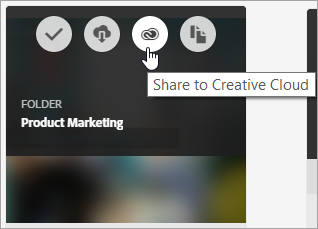
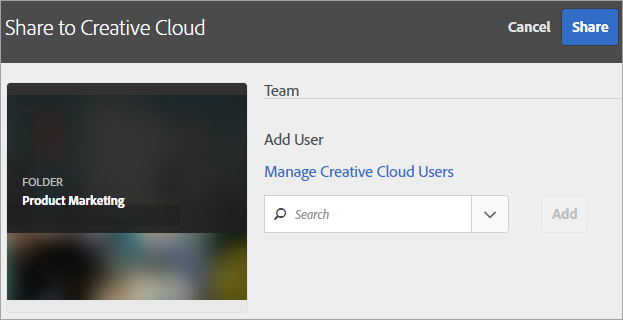
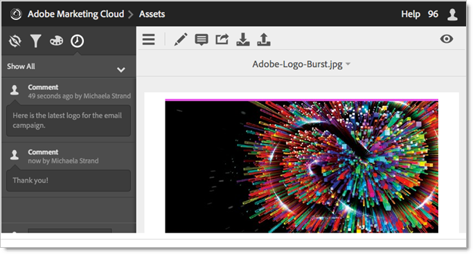
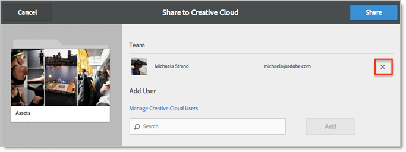

# Share an Experience Cloud asset folder

Share an Experience Cloud asset folder with Creative Cloud users.

1. On an Asset folder, click **[!UICONTROL Share to Creative Cloud]**.

    
1. On the Share to Creative Cloud page, search for the user, then click **[!UICONTROL Add]**.

    

1. Click **[!UICONTROL Share]**.
1. Launch the [!DNL Creative Cloud] desktop (or navigate to the [!UICONTROL Creative Cloud Files] page in a browser) and look for the request notification.

    
1. Open the request, then click **[!UICONTROL Accept]**.

    
1. To access folder contents, click **[!UICONTROL Open Folder]** (or **[!UICONTROL View on Web]**).

    
1. Continue by adding comments on the shared asset:

   In Creative Cloud, you can click into an image, then click **[!UICONTROL Activity]** to add a comment on the image. Comments are synced on the assets in the [!DNL Creative Cloud] and [!DNL Experience Cloud]. 

    

   In the Experience Cloud, click into an image, then click the time-line icon to add a comment on the image. Comments are synced on the assets in the Creative Cloud and Experience Cloud. 

    

 1. To unshare a folder, click **[!UICONTROL Share Using Creative Cloud]** (similar to [Step 3](t-share-creative-cloud.md#step_BA17CFA185284641A9B878BA29551996)), then remove users by clicking X, then click **[!UICONTROL Share]**.

    

   Once you have removed all Creative Cloud Users, the folder is unshared and the Creative Cloud users no longer has access. 

More ways to use a shared asset include: 

* Use assets in the [!UICONTROL Asset Selector] in [!DNL Adobe Social] for social posts.
* Load or swap assets in the [Offers Library](https://experienceleague.adobe.com/docs/target/using/experiences/offers/manage-content.html?lang=en) in [!DNL Adobe Target] for images in activities.

After you share a folder to the Creative Cloud, you will see the Creative Cloud logo on the folder. 

 

Related help:

* [Creative Cloud Help - Manage and sync files](https://helpx.adobe.com/creative-cloud/help/sync-creative-cloud-files.html)
* [Creative Cloud Help - Collaborate with others](https://helpx.adobe.com/creative-cloud/help/collaboration.html)
* [Creative Cloud Help - Collaboration FAQ](https://helpx.adobe.com/creative-cloud/help/collaboration-faq.html)
