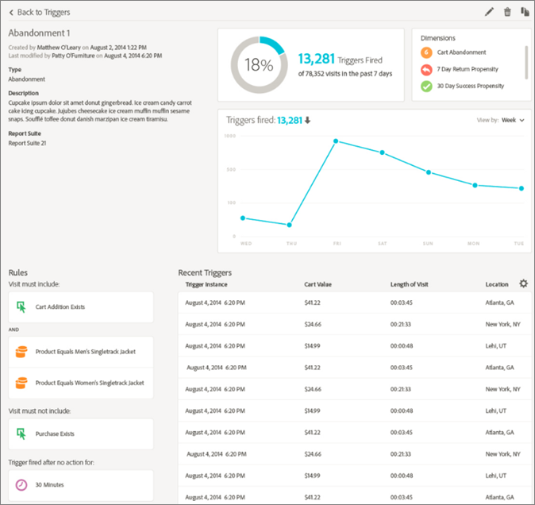
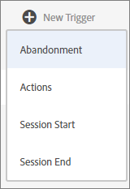

# Experience Cloud Triggers

[!UICONTROL Triggers] in Experience Cloud enables you to identify, define, and monitor key consumer behaviors, then generate cross-solution communication to re-engage visitors. 

## Triggers Overview {#topic_4F21FCE9A64E46E8B6D51F494FA652A7}

You can use triggers in real-time decisions and personalization. For example:

* Configure fast re-marketing for cart abandons or cart abandons with products removed
* Incomplete forms and applications
* Any actions or sequence of actions on site

>[!NOTE]
>
>More information about using [!UICONTROL Triggers] is available in [Campaign Standard](https://experienceleague.adobe.com/docs/campaign-standard/using/integrating-with-adobe-cloud/working-with-campaign-and-triggers/using-triggers-in-campaign.html?lang=en).

### Types of Triggers

Generally, a trigger can take 15-90 minutes to launch a marketing campaign. This delay varies depending on the implementation of data collection, load on the pipeline, custom configuration of the defined trigger, and the workflow in Adobe Campaign.

* **Abandonment:** You can create a trigger to fire when a visitor views a product but does not add anything to the cart.
* **Action:** You can create triggers, for example, to fire after newsletter sign-ups, email subscriptions, or applications for credit cards (confirmations). If you are a retailer, you can create a trigger for a visitor who signs up for a loyalty program. In media and entertainment, create triggers for visitors who watch a certain show, and perhaps you want to respond with a survey.
* **Session Start and Session End:** Create a trigger for session start and session end events.

## Create an Experience Cloud trigger {#task_821F37183AC045E5AC8EED20317598FE}

Create a trigger and configure the conditions for the trigger. For example, you can specify the criteria for a trigger's rules during a visit, such as metrics like Cart Abandon, or dimensions like the product name. When the rules are met, the trigger runs.

>[!NOTE]
>
>A technical limit of 100 triggers currently exists.

1. In the Experience Cloud, click , then click **[!UICONTROL Data Collection/Launch]**.
2. On the [!UICONTROL Triggers] card, click **[!UICONTROL Manage Triggers]**.
3. Click **[!UICONTROL New Trigger]**, then specify the type of trigger:

   

4. Configure the trigger by completing the following fields and dragging metrics and dimension items to the rule's containers:

    | Element | Description |
    |--- |--- |
    |[!UICONTROL Name]|The friendly name for this trigger.|
    |[!UICONTROL Description]|The description of this trigger, how you use it, and so on.|
    |[!UICONTROL Report Suite]|The Analytics [report suite](https://experienceleague.adobe.com/docs/analytics/admin/manage-report-suites/report-suites-admin.html) used for this trigger. This setting identifies the reporting data to use.|
    |Visit must include Visit must not include Trigger after no action Include meta data|You can define criteria or visitor behaviors that you want to occur, and behaviors that you do not want to occur. For example, rules for a simple cart abandonment trigger can be:<ul><li>Visit must include: [!UICONTROL Cart Addition] (metric) and  [!UICONTROL Exists]. (You can further refine the rule with a specific product view or with dimensions like Browser Types.)</li><li>Visit must not include:  [!UICONTROL Checkout].</li><li>Trigger after no action for:  10 minutes.</li><li>[!UICONTROL Include Meta Data]: Lets you add a particular [!DNL Campaign] dimension or variables that are relevant to a visitor's behavior. This field can be useful for Adobe Campaign to build the correct re-marketing email.</li></ul> You can specify  [!UICONTROL Any],  [!UICONTROL And] or  [!UICONTROL Or] logic within or between containers, depending on the criteria you determine are important for the rule.|
    |[!UICONTROL Container]|[!UICONTROL Containers] are where you set and store rules, conditions, or filters that define a trigger. If you want events to occur at the same time, put them in the same container. Meaning, each container processes independently at the hit level. For example, if you have two containers joined by the  And operator, you can expect the rules to qualify when two hits meet the requirements.|
    |Start new session after|Create a trigger for session start and session end events.|

    {style="table-layout:auto"}

5. Click **[!UICONTROL Save]**.
6. Use triggers for [real-time remarketing](https://experienceleague.adobe.com/docs/campaign-standard/using/integrating-with-adobe-cloud/working-with-campaign-and-triggers/about-adobe-experience-cloud-triggers.html?lang=en) in [!DNL Adobe Campaign].

### Example triggers

Examples of Experience Cloud Triggers:

#### Cart Abandonment Trigger

For example, the following page shows rules that you might use for a [!UICONTROL Cart Abandonment] trigger, based on products viewed during a visit.

#### Referrer Trigger

The following trigger fires when a hit comes in with the product of Men's Boots and referrer of Facebook. For the two criteria (*products* and *referrer*) to be evaluated in the same hit, they should be added to the same container.

